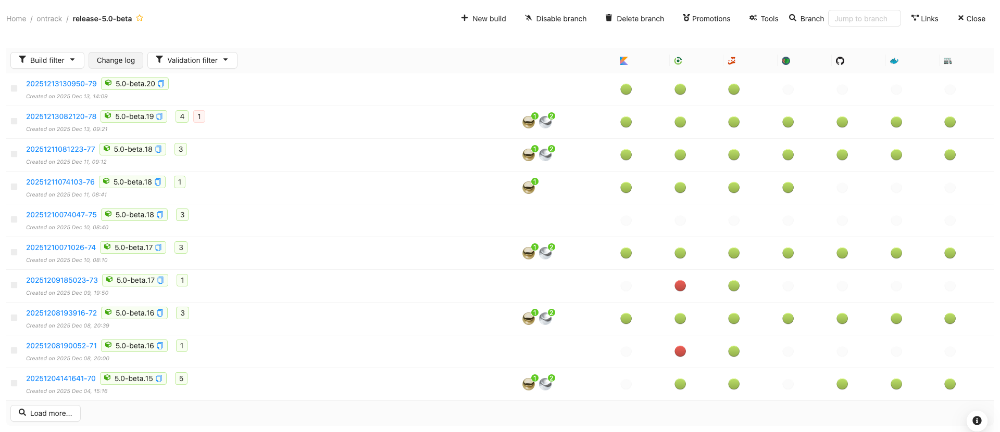
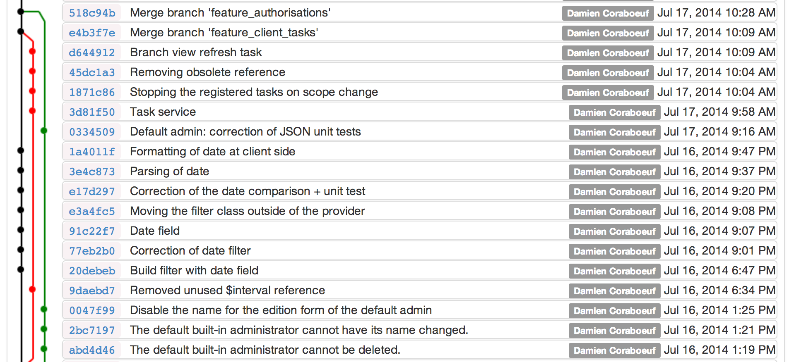
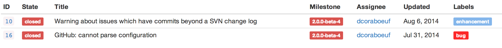

ontrack
=======

[Continuous delivery monitoring](https://nemerosa.github.io/ontrack).

Store all events which happen in your CI/CD environment: branches, builds,
validations, promotions, labels, commits. Display this information in
dashboards. Search for builds based on statuses, issues, commits, etc. Use
this information as a powerful tool to drive your pipelines into new
directions!

Track your changes using
[logs](https://nemerosa.github.io/ontrack/release/latest/doc/index.html#changelogs)
between builds/releases:

([Git](https://nemerosa.github.io/ontrack/release/latest/doc/index.html#usage-git)
and
[Subversion](https://nemerosa.github.io/ontrack/release/latest/doc/index.html#usage-subversion)
are supported)

Issue change logs are of course available:

Ontrack can communicate with many tools:
[GitHub](https://nemerosa.github.io/ontrack/release/latest/doc/index.html#usage-github),
[BitBucket](https://nemerosa.github.io/ontrack/release/latest/doc/index.html#usage-bitbucket),
JIRA, Jenkins, Artifactory.

And if this is not enough, you can add your own
[extensions](https://nemerosa.github.io/ontrack/release/latest/doc/index.html#extending).

Full documentation available in the
[Ontrack web site](https://nemerosa.github.io/ontrack/release/latest/doc/index.html) or as
[PDF](https://nemerosa.github.io/ontrack/release/latest/index.pdf).

[Contributions](https://nemerosa.github.io/ontrack/release/latest/doc/index.html#contributing) are welcome!
