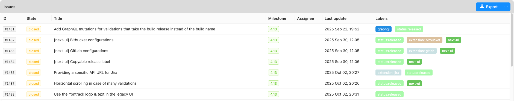

Yontrack
========

# [Continuous delivery monitoring](https://yontrack.com).

* [Quick start](#quick-start)
* [Documentation](#documentation)
* [Contributions](#contributions)

Store all events which happen in your CI/CD environment: branches, builds,
validations, promotions, labels, commits. Display this information in
dashboards. Search for builds based on statuses, issues, commits, etc. Use
this information as a powerful tool to drive your pipelines into new
directions!

Track your changes using [logs](https://docs.yontrack.com) between builds/releases:

Yontrack can integrate with many tools: GitHub, GitLab, Jira, Artifactory, Bitbucket, Jenkins, etc.

You can feed information into Yontrack using:

* a REST / GraphQL API
* a [CLI](https://github.com/nemerosa/ontrack-cli)
* a [Jenkins pipeline library](https://github.com/nemerosa/ontrack-jenkins-cli-pipeline/)
* a [GitHub action](https://github.com/nemerosa/ontrack-github-actions-cli-config)

## Quick start

See the [official documentation](https://docs.yontrack.com/yontrack/ref/latest/content/start/getting-started.html).

## Documentation

Documentation is hosted at https://docs.yontrack.com

## Contributions

[Contributions](CONTRIBUTING.md) are welcome!
