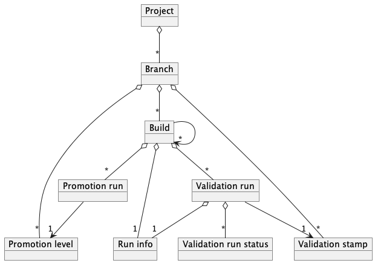

# Core model of Ontrack

At the core of the model of Ontrack lie the _project entities_.

This is a set of classes starting at _project_ level:

* project - this is the top-level object in Ontrack.
