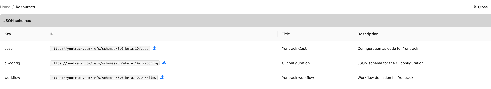

# JSON Schemas

Several configuration files for Yontrack are YAML files that can be validated against JSON schemas. Inside an IDE, these schemas can help editing and designing these configuration files.

All Yontrack JSON schemas are available in the UI in the user menu, under _User information_ > _Resources_ in the _JSON schemas_ section:

!!! note

    All schemas are versioned, using the version of the Yontrack instance
    you're downloading them from.

Once downloaded, you can use them in your favorite editor.

## Jetbrains Intellij

* in the _Settings_, select _Languages & Frameworks_ > _Schema & DTDs_ > _JSON Schema Mappings_
* in _Schema file or URL_, click on the folder icon and select the downloaded JSON schema file
* apply and save the settings

Open a YAML file.

To associate it with the Yontrack JSON schema, click on the _Schema_ component in the bottom right corner of the file and select the name of the schema.

You should now have auto-completion and validation.
