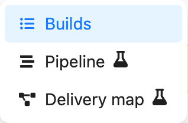
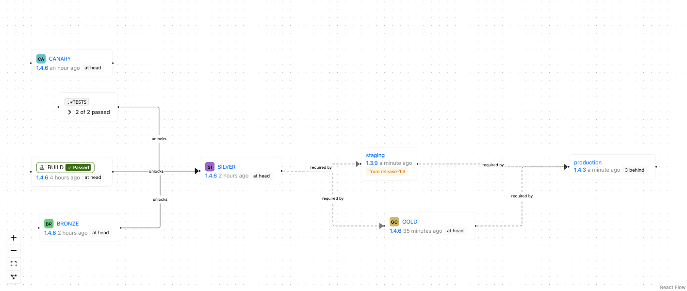
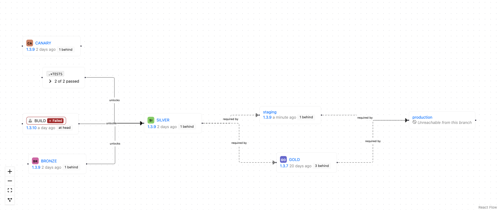
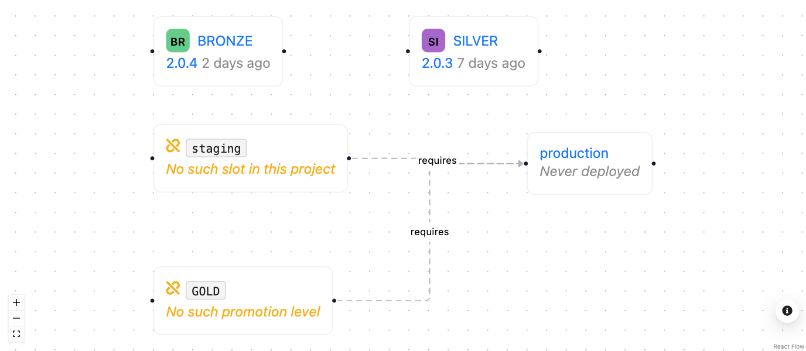

# Branch views

A branch holds the same information whatever you came to it for, but not every question is best
answered by the same layout. Yontrack therefore offers several *content views* for a branch -
interchangeable readings of the branch, sharing the same page, the same filters and the same
permissions, and differing only in how they arrange what they show.

| View                                  | Reads the branch as                                                     |
|---------------------------------------|-------------------------------------------------------------------------|
| [Builds](#the-builds-view)            | a list of builds, most recent first                                     |
| [Pipeline](#the-pipeline-view)        | a promotion pipeline - what is release-ready right now                  |
| [Delivery map](#the-delivery-map-view) | a map of what a build still has to pass through to reach an environment |

They are peers: one is never reached from inside another, and none is a sub-mode of another.
**Builds** is the default, and remains so for existing users.

## Switching between views

The view is chosen from the **View** menu in the branch command bar.

Three things follow from picking a view:

* the choice is **remembered**, so the next branch you open uses the same view;
* the choice is **linkable** - the address gains a `?view=` parameter, and a link carrying it opens
  on that view whatever the recipient's own preference is;
* an unknown or stale `?view=` value falls back to the Builds view rather than failing.

The [build filter](../build-filtering/index.md) and the validation stamp filter sit *above* the
view, not inside it. A filter you set in one view is still in force when you switch to another.

## The Builds view

The Builds view is the historical reading of a branch: one row per build, most recent first, with
the promotions reached by each build and a column per validation stamp.

It is the view to use when the build list itself is the subject - looking for a particular build,
comparing validation results across many builds, or selecting two builds for a
[change log](../../integrations/changelogs/changelogs.md).

## The Pipeline view

!!! warning "Experimental"

    The Pipeline view is experimental and still being refined. It is marked as such in the product,
    with a flask icon next to its entry in the View menu and a dismissible banner on the view
    itself. Feedback is welcome in
    [GitHub Discussions](https://github.com/yontrack/yontrack/discussions).

    

The Pipeline view answers a different question: not *what has been built lately*, but *what is
release-ready right now, and what does a release still have to go through*.

It has four regions, in the order they answer that question.

### Branch facts

The total number of builds on the branch, the latest version, and when the branch was last built.

These are facts about the **branch**, outside any filter - the total does not move when you narrow
the build filter, because a number that changes with the filter is a readout of the filter rather
than a fact about the branch.

The *latest version* is the [display name](../build-filtering/index.md#filtering-on-the-build-display-name)
of the most recent build - its release label when it has one. It is deliberately not "the most
recent build carrying a release": that is a different, more expensive question whose answer goes
stale as soon as an unlabelled build lands. On a project which does not use release labels, the
figure is omitted rather than repeating the build name shown just below.

### The promotion band

One card per [promotion level](../model/index.md) of the branch, in promotion order: how many builds
have reached it, and which build reached it last.

A level nobody has ever reached is still shown, dimmed and marked *Never reached* - the band
describes what a release has to go through, not only what has already happened. Clicking the build
named on a card selects it in the inspector below, loading further pages of builds if that build is
older than the ones currently shown.

The band is hidden entirely on a branch with no promotion levels, and on a branch with no builds:
a full row of never-reached stages above an empty timeline states the obvious loudly.

### The build timeline

The builds of the branch, most recent first, as cards rather than rows: version, build name,
promotions reached, and how many of the validations selected by the validation filter have passed.

The timeline obeys the same [build filter](../build-filtering/index.md) as the Builds view, and
loads further builds on demand. Clicking a card selects that build.

Builds can also be selected in **pairs** here, with the same checkboxes as in the Builds view, to
produce a [change log](../../integrations/changelogs/changelogs.md) between them.

### The build inspector

Everything that is true of the one build currently selected: its promotions, with the button to
promote it further, and its validations with their status.

The selected build is part of the address, as a `?build=` parameter, so a build worth showing
someone can be linked to directly. Opening such a link selects the build it names even when that
build is old enough not to be in the first page of the timeline.

When no build is named, the most recent one is selected.

## The Delivery map view

!!! warning "Experimental"

    The Delivery map view is experimental and still being refined. It is marked as such in the
    product, with a flask icon next to its entry in the View menu and a dismissible banner on the
    view itself. Feedback is welcome in
    [GitHub Discussions](https://github.com/yontrack/yontrack/discussions).

The Delivery map answers a third question: *what does a build on this branch still have to pass
through on its way to an environment, and what depends on what*.

It is **configuration with progress painted onto it**, not a history. Every checkpoint on it is
something a build has to reach, and every line between two of them is a dependency someone
configured. Nothing on it is inferred from what has happened; a map with no lines is a project
whose promotion and deployment rules have not been written down, not a project with no history.

### Checkpoints

A *checkpoint* is one of the things the map is made of. There are three kinds, and each one names
the latest build to have **arrived** at it and when.

| Checkpoint       | Arrived at by            | The build it names                                    |
|------------------|--------------------------|-------------------------------------------------------|
| Promotion level  | being promoted           | the latest build of this branch promoted there        |
| Validation stamp | a run of *any* outcome   | the latest build of this branch run there, with its status |
| Slot             | a deployment             | the most recently deployed build, **whatever its branch** |
| Unresolved       | nothing, ever            | none - see [when a rule points at nothing](#when-a-rule-points-at-nothing) |

Arriving is not the same as succeeding, which is why only the validation stamp shows a status: a
build can arrive at a stamp and fail there, while a build cannot be promoted and fail.

Every promotion level of the branch is on the map, connected or not - a level with no configuration
behind it is exactly the thing you want to see. Validation stamps are the opposite: only the ones
taking part in a dependency are drawn, because an unconnected stamp teaches nothing on a map whose
subject is dependencies, and a branch with forty of them would have no readable layout. A promotion
whose [auto promotion](../model/auto-promotion.md) selects stamps *by pattern* gets one
*aggregate checkpoint* labelled with the pattern, standing for all of them; click it to see the
stamps it covers.

### Dependencies

Lines run from the prerequisite to the thing that depends on it, and come in two kinds, drawn
differently:

| Kind         | Means                                                    | Comes from                                        |
|--------------|-----------------------------------------------------------|---------------------------------------------------|
| **unlocks**  | reaching the source grants the target by itself           | auto promotion                                    |
| **requires** | the target cannot be reached until the source has been    | promotion dependencies, slot admission rules      |

The distinction matters because the two are configured in ways with opposite effects. Auto
promotion *acts*: pass the validations and the promotion happens. A promotion dependency or an
admission rule only *constrains*: it permits, and something else still has to do the promoting or
the deploying.

### Slots on the map

The map draws every [slot](../../integrations/environments/environments.md) of the branch's
project, and joins them to the rest from the slot's own admission rules:

* a **promotion** admission rule draws a *requires* line from that promotion level to the slot. The
  promotion is resolved by name **on this branch**, so the same slot configuration produces a
  different line on every branch - which is exactly why slots belong on a branch view at all;
* an **environment** admission rule - "must already be deployed in *staging*" - draws a *requires*
  line from that slot to this one.

A rule naming something that does not exist still draws its line, into an
[unresolved checkpoint](#when-a-rule-points-at-nothing).

Slot-to-slot lines come **only** from that rule. The map deliberately does not fall back to the
order of the environments, the way the project's slot graph does. Ordering says which environment
comes first; it never says that one deployment requires another. Where nobody configured the rule
there is no line, and the slots hang off their promotion checkpoints without joining up to each
other.

That makes the map look sparser than the chain drawn on the project's environments page, and the
sparseness is the point: it is the reading which shows you a slot nobody wired up, rather than one
which invents a dependency you never declared. Adding the environment admission rule to the slot
both fixes the deployment and fills in the line.

Two things about a slot are unlike every other checkpoint.

**A slot may name a build from another branch.** A slot shows what is deployed in it, and what is
deployed in production is a fact about the project rather than about the branch you happen to be
reading. When that build is not of this branch, the map says so beside it. The alternative - showing
nothing - would read as *nothing is in production*, which is the most damaging thing the map could
get wrong.

**A slot this branch can never reach is marked unreachable, and names no build.** If an admission
rule excludes the branch by name or pattern, no build of it can ever deploy there however far it is
promoted. Such a slot is still drawn, because "you cannot get there from here" is the most important
answer the map can give; leaving it out silently would leave you wondering why production is missing.

Both pictures above are the same two slots, read from two branches of one project: the main branch
reaches production and finds a maintenance build occupying staging, while the maintenance branch
cannot reach production at all.

### When a rule points at nothing

Both slot admission rules name their target **by name**: "requires the *GOLD* promotion", "requires
a deployment in *staging*". Nothing checks that the name matches anything. A rule can name a
promotion level the branch does not have, or an environment the project has no slot in, and the
configuration will be saved and will look perfectly healthy on the slot's own page.

Until somebody tries to deploy. Then the deployment refuses, with *Promotion not existing*, and that
is the first anyone hears of it.

The map draws such a rule as an **unresolved checkpoint**, carrying the name the rule asked for and
marked as matching nothing, with the rule's line running out of it as usual.

Drawing nothing at all was the alternative, and it is the wrong one - the map would then quietly
agree with the broken configuration. This is arguably the strongest reason to look at the map: it
turns a misconfiguration nobody can see into something visible on a page people already open.

An unresolved checkpoint is **never** what a checkpoint you are not allowed to see looks like.
Something hidden by permissions is left out of the map entirely, together with every line touching
it - it does not become an unresolved checkpoint, and it never will. The two would otherwise be
impossible to tell apart, people would read "unresolved" as "probably just permissions", and the map
would stop being trustworthy for exactly the case it exists to catch.

The fix is never on the map, which is a reading of the configuration and not the configuration
itself: either create what the rule names, or change the rule on the slot to name what exists.

### Filters, and what the map does with them

The map obeys the validation stamp filter, which sits above the view switch like every other filter
and follows you from one view to the next. The filter touches validation stamps only: hiding a
promotion level or a slot because of a *validation* filter would be a different claim entirely. An
aggregate checkpoint disappears when the filter leaves it standing for nothing, and any line left
with a missing end goes with it.

Checkpoints can be dragged about; nothing on the map can be edited from it. It is a reading of the
configuration, and the configuration is changed where it lives - on the promotion level, on the
branch, or on the slot the checkpoint links to.

## Not to be confused with

The word *pipeline* is used for two unrelated things in Yontrack:

* the **Pipeline view** described here, which is a way of reading a branch, and changes nothing;
* the **deployment pipeline** of the [environments](../../integrations/environments/environments.md)
  feature, which is a real object with a lifecycle - created, deploying, deployed - representing one
  attempt to deploy a build into an environment slot.
