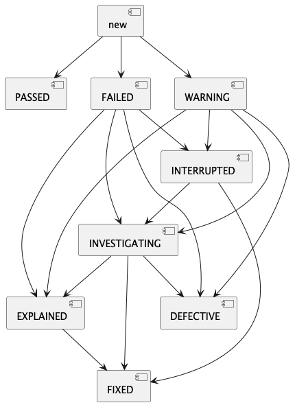

# Yontrack model

At the core, Yontrack collects information using an information model composed of the following entities:

* [projects](#projects)
* [branches](#branches)
* [branches](#builds)

Branches are configured with a list of [validation stamps](#validation-stamps)
and [promotions levels](#promotion-levels)
that builds can be associated with [validation runs](#validation-runs) and [promotions](#promotions).

Finally, each entity in Yontrack can be associated with [properties](#properties), which enrich the model with
additional information.

## Projects

Projects are at the root of the model hierarchy of Yontrack. They can be linked to each other (typically
by [links between builds](build-links.md)).

In most cases, a project is linked to a SCM repository. But there are situations where creating a project independently
of a repository is useful.

## Branches

One project can have several branches. They are usually linked to an actual SCM branch.

## Builds

One build represents ... one build in a given branch. These builds are typically linked to an actual build
(or workflow run, or pipeline execution, etc.) in a CI system. Depending on your setup, relaunching a build
in your CI can lead to a unique or several builds in Yontrack.

A build would be associated with a commit in the SCM repository.

[Links between builds](build-links.md) are used to define the dependency between builds, across branches, across
projects.

## Validation stamps

When a build is being built by the CI engine, it is tested, scanned, probed, deployed, etc. This can happen in the
same pipeline (or workflow run, etc.) or in several pipelines, which can be run asynchronously, nightly, etc.

These pipelines represent different quality probes on a given build. We call them _validation stamps_ in Yontrack,
because they are like actual stamps we would put on a given package, the [build](#builds).

The validation stamps can be typed but not necessarily. For example, we can wish to represent a validation as a test
summary, with the number of failed tests, skipped tests, passed tests, etc.

## Promotion levels

While validation stamps are linked to a specific kind of check, test, scan result, etc., _promotion levels_ are used to talk more generally about the quality of a given build.

They can typically group several validation stamps together, rely on other promotion levels. They can also be granted independently.

Promotion level names can be anything, but you have to agree at your organization level on their meanings. They will often be used to talk about quality throughout all your projects. Something often used is to use abstract names, like medal names, like gold, silver, bronze, etc. But again, this is up to you.

## Validation runs

When linked to a [build](#builds), a [validation stamp](#validation-stamps) can be passed, failed, in warning, etc. It
has a complete lifecycle linked to a given build.

This is called a _validation run_. In some cases, a validation will be run several times for a given validation stamp
and build: several _validation runs_ can be associated with a given validation stamp and build.

If the associated validation stamp is [typed](#validation-stamp-types), the validation run will need to also contain
some data, of the same type as the validation stamp.

### Validation life-cycle

## Promotions

A promotion level can be granted to a [build](#builds). This is called a _promotion_ or _promotion run_. This can happen several times for a given promotion level and a given build.

A promotion is either granted or not granted at all. There is no notion of data associated with a promotion.

## Properties

## Validation stamp types

### Test summary

Value:

* `passed` - Count of passed tests
* `skipped` - Count of skipped/ignored tests
* `failed` - Count of failed tests

Configuration:

* `warningIfSkipped` - If set to true, the status is set to warning if there is at least one skipped test.
* `failWhenNoResults` - If set to true, the status is set to failure if there is are no test at all.

### CHML

This type means Critical / High / Medium / Low. It is used to represent the results of some scans (security, code
quality, etc.).

Value:

* `CRITICAL` - number of critical severity issues
* `HIGH` - number of high severity issues
* `MEDIUM` - number of medium severity issues
* `LOW` - number of low severity issues

Configuration:

* `warningLevel`:
    * `level`: CRITICAL / HIGH / MEDIUM / LOW
    * `value`: when the number of issues in this `level` is above this threshold, the validation stamp is in warning
* `failedLevel`:
    * `level`: CRITICAL / HIGH / MEDIUM / LOW
    * `value`: when the number of issues in this `level` is above this threshold, the validation stamp is failed

### Percentage

Value: an integer between 0 and 100.

Configuration:

* `warningThreshold`: integer between 0 and 100. If the value is below this threshold, the stamp is in warning.
* `failureThreshold`: integer between 0 and 100. If the value is below this threshold, the stamp is is failed.
* `okIfGreater`: boolean. If true, the stamp is OK when above the thresholds

### Number

Value: any number

Configuration:

* `warningThreshold`: integer. If the value is below this threshold, the stamp is in warning.
* `failureThreshold`: integer. If the value is below this threshold, the stamp is is failed.
* `okIfGreater`: boolean. If true, the stamp is OK when above the thresholds

### Metrics

This type is used collect arbitrary metrics, the associated of names with measurements.

Value: a map of measurements (name --> double)

Configuration: none

## Run info

Both [builds](#builds) and [validation runs](#validation-runs) can have some run information attached to them.

This is a object which contains the following information about the run (build or validation):

* `sourceType` - Type of source (like "jenkins")
* `sourceUri` - URI to the source of the run (like the URL to a Jenkins job)
* `triggerType` - Type of trigger (like "scm" or "user")
* `triggerData` - Data associated with the trigger (like a user ID or a commit)
* `runTime` - Time of the run (in seconds)
