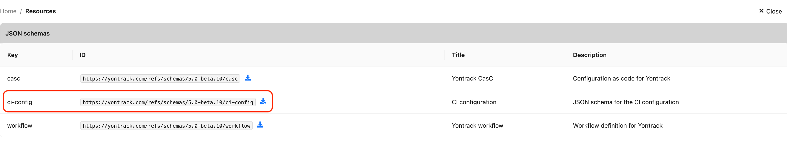

# CI configuration

Jenkins pipelines, GitHub workflows, direct integrations with the CLI can use a `.yontrack/ci.yaml` file for an easy setup of the Yontrack items based on the available information.

!!! note

    Prior to Yontrack V5, the usual way of feeding data into Yontrack was to use the GraphQL CLI, either directly or via integrations like Jenkins pipeline steps, GitHub actions, CLI, etc.

    This is still possible, but the new "CI configuration" is the recommended way to feed data into Yontrack.

This `.yontrack/ci.yaml` file acts a unique way to configure the elements of your pipeliens into Yontrack, and is compatible with all the support CI tools.

For example, you can just use one unique endpoint to send a configuration file to Yontrack:

```yaml
version: v1
configuration:
  defaults:
    branch:
      validations:
        BUILD:
          tests: {}
        UI_UNIT:
          tests: {}
        KDSL.ACCEPTANCE:
          tests: {}
        PLAYWRIGHT:
          tests: {}
      promotions:
        BRONZE:
          validations:
            - BUILD
            - UI_UNIT
            - KDSL.ACCEPTANCE
            - PLAYWRIGHT
        RELEASE:
          promotions:
            - BRONZE
          validations:
            - GITHUB.RELEASE
      notificationsConfig:
        notifications:
          - name: On validation error
            events:
              - new_validation_run
            keywords: failed
            channel: slack
            channelConfig:
              channel: '#notifications'
              type: 'ERROR'
            contentTemplate: |
              Build ${build} has failed on ${validationStamp}.
          - name: On BRONZE
            promotion: BRONZE
            events:
              - new_promotion_run
            channel: slack
            channelConfig:
              channel: '#notifications'
              type: 'SUCCESS'
            contentTemplate: |
              Build ${build} has been promoted to ${promotionLevel}.
          - name: On internal release
            promotion: RELEASE
            events:
              - new_promotion_run
            channel: slack
            channelConfig:
              channel: '#internal-releases'
              type: 'SUCCESS'
            contentTemplate: |
              Yontrack ${build} has been released.

              ${promotionRun.changelog?title=true&commitsOption=ALWAYS}
  custom:
    configs:
      - conditions:
          branch: '^release/\d+\.\d+$'
        branch:
          notificationsConfig:
            notifications:
              - name: On RELEASE
                promotion: RELEASE
                events:
                  - new_promotion_run
                channel: slack
                channelConfig:
                  channel: '#releases'
                  type: 'SUCCESS'
                contentTemplate: |
                  Yontrack ${build} has been released.

                  ${promotionRun.changelog?title=true&commitsOption=OPTIONAL}
```

## Integrations

There are several ways to integrate this Yontrack CI Configuration from your tools.

* [GitHub actions](#github-actions)
* [Jenkins pipeline](#jenkins-pipeline)
* [Yontrack CLI](#yontrack-cli)
* [Direct GraphQL call](#direct-graphql-call)

### GitHub actions

You can use the [`nemerosa/ontrack-github-actions-cli-config`](https://github.com/nemerosa/ontrack-github-actions-cli-config) GitHub action to configure Yontrack from your GitHub workflows:

```yaml
  - name: "Yontrack configuration"
    id: yontrack-config
    uses: nemerosa/ontrack-github-actions-cli-config@v{{ ontrack_github_actions_cli_config_version }}
    env:
      YONTRACK_URL: ${{ '{{' }} vars.YONTRACK_URL {{ '}}' }}
      YONTRACK_TOKEN: ${{ '{{' }} secrets.YONTRACK_TOKEN {{ '}}' }}
    with:
      github-token: ${{ '{{' }} secrets.GITHUB_TOKEN {{ '}}' }}
```

It expects the `.yontrack/ci.yaml` file to be present in the root of the repository.

### Jenkins pipeline

You can use the https://github.com/nemerosa/ontrack-jenkins-cli-pipeline Jenkins pipeline library to configure Yontrack from your Jenkins pipelines:

```groovy
ontrackCliCIConfig()
```

It expects the `.yontrack/ci.yaml` file to be present in the root of the repository.

### Yontrack CLI

You can use the [Yontrack CLI](https://github.com/nemerosa/ontrack-cli) to configure Yontrack from your CI pipelines:

```shell
ontrack-cli ci config \
  --file .yontrack/ci.yaml \
  --env ... \
  --env ...
```

!!! note

    See [environment variables](#environment-variables) for the list of inputs.

### Direct GraphQL call

Finally, you can always use the GraphQL API to configure Yontrack from your CI pipelines:

```graphql
mutation {
    configureBuild(input: {
        config: "...",
        ci: "",
        scm: "",
        env: [...]
    }) {
        build {
            id
        }
        errors {
            message
        }
    }
}
```

In this mutation's input:

* `config` is the YAML for the CI Configuration
* `ci` is the name of the [CI engine](#ci-engines) to use
* `scm` is the name of the [SCM engine](#scm-engines) to use
* `env` is the list of [environment variables](#environment-variables) to use

## Reference

The minimal CI Configuration file is:

```yaml
version: v1
configuration: {}
```

The following elements will be configured automatically in Yontrack:

* a [project](#project-configuration) will be created based on the detected SCM URL (for example, if the SCM URL is `https://github.com/nemerosa/ontrack`, a project named `ontrack` will be created and associated with the `https://github.com/nemerosa/ontrack` GitHub repository)
* a [branch](#branch-configuration) will be created based on the detected SCM branch (for example, if the SCM branch is `release/1.0`, a branch named `release-1.0` will be created and associated with the `release/1.0` SCM branch)
* a [build](#build-configuration) will be created and associated with  the detected SCM commit. The name of the build is generated using a timestamp. If a `VERSION` [environment variable](#environment-variables) is defined, its value will be used as the build release label.

The `configuration` section can have two sub-sections:

* `defaults` contains the [configurations](#configuration) which are used by default.
* `custom` contains a list of [configurations](#configuration), each of them associated with number of [conditions](#conditions). These configurations act as overrides to the `defaults` ones if the conditions are met.

### Configuration

Each configuration contains the following optional elements:

* [`project`](#project-configuration)
* [`branch`](#branch-configuration)
* [`build`](#build-configuration)

#### Project configuration

The `project` configuration is optional.

It may contain the following elements:

* `properties` - list of [properties](#properties) to set for the project
* `name` - if set, overrides the name of the project instead of computing it from the environment
* `scmConfig` - name of the SCM configuration to use for this project instead of computing it from the environment
* `issueServiceIdentifier` - issue service configuration for this project
* `scmIndexationInterval` - SCM indexation interval (in minutes)
* `extensions` - list of [extensions](#extensions) to apply to the project

#### Branch configuration

The `branch` configuration is optional.

It may contain the following elements:

* `properties` - list of [properties](#properties) to set for the branch
* `validations` - list of [validation stamps](#validations) to define for the branch
* `promotions` - list of [promotion levels](#promotions) to define for the branch
* `extensions` - list of [extensions](#extensions) to apply to the branch

##### Validations

The `validations` property is a map of all the [validation stamps](../concepts/model/index.md#validation-stamps) to define for the branch.

The simplest configuration is to define only a list of names for these validation stamps:

```yaml
branch:
  validations:
    - build: {}
    - ui-unit: {}
    - acceptance: {}
    - ui-acceptance: {}
```

This code would define four validation stamps named `build`, `ui-unit`, `acceptance` and `ui-acceptance`, not typed.

The validation stamps can be typed using their configurations. For example, to make the `build` validation stamp typed for a test summary:

```yaml
branch:
  validations:
    - build:
        tests:
          warningIfSkipped: true
```

!!! note

    Use the [JSON schema](#json-schema) to see which other types are available.

##### Promotions

The `promotions` property is a map of all the [promotion levels](../concepts/model/index.md#promotion-levels) to define for the branch.

The simplest configuration is to define only a list of names for these promotion levels:

```yaml
branch:
  promotions:
    - BRONZE: {}
    - SILVER: {}
```

Each promotion level can be associated with a list of validation stamps and/or other promotion levels:

```yaml
branch:
  promotions:
    - BRONZE:
        validations:
          - build
          - ui-unit
    - SILVER:
        validations:
          - acceptance
          - ui-acceptance
        promotions:
          - BRONZE
```

#### Build configuration

The `build` configuration is optional.

It may contain the following elements:

* `properties` - list of [properties](#properties) to set for the build
* `buildName` - overrides the computed build name using a [template](../appendix/templating.md) (see [below](#build-name))
* `extensions` - list of [extensions](#extensions) to apply to the build

When using the Bitbucket or GitHub [SCM](#scm-engines), the `GIT_COMMIT` [environment variable](#environment-variables) is used to set a [Git Commit property](../generated/properties/property-net.nemerosa.ontrack.extension.git.property.GitCommitPropertyType.md) on the build.

For the GitHub [CI engine](#ci-engines), the build is linked to the GitHub workflow run.

For the Jenkins [CI engine](#ci-engines), the build is linked to the Jenkins build.

If the `VERSION` [environment variable](#environment-variables) is defined, its value will be used as the build release label.

##### Build name

By default, the build name is computed using:

```text
{timestamp}-{suffix}
```

where:

* the timestamp is the current UTC timestamp using the `yyyyMMddHHmmss` format
* the suffix depends on the [CI engine](#ci-engines) being used, but is usually the value of the `BUILD_NUMBER` [environment variable](#environment-variables) or the `GITHUB_RUN_NUMBER` environment variable in a GitHub workflow.

This build name can be overridden using the `buildName` property, which is a [template](../appendix/templating.md) with only one context, `env`, allowing to access the [environment variables](#environment-variables) defined in the CI configuration.

For example, if you want to use your custom timestamp format and a build number, you can use:


```text
buildName: '${#.datetime?format=yyyy-MM-dd-HH-mm-ss}-${env.BUILD_NUMBER}'
```


### Conditions

Each custom configuration is associated with a list of conditions. For example:

```yaml
custom:
    configs:
      - conditions:
          branch: '^release/\d+\.\d+$'
        branch:
          # Branch configuration
```

In this case, the `branch` configuration will be used to patch the default configuration for any SCM branch matching the regular expression `^release/\d+\.\d+$`.

The custom configuration is applied only if **all the conditions**   in the list are met.

See the [conditions reference](../generated/ci-config/conditions/index.md) for the list of supported conditions and their parameters.

#### Merging the configurations

When a custom configuration conditions are met, it is merged with the default configuration.

The rules to merge a custom configuration into a default one are:

* properties, validations and promotions are merged at key level
* in lists:
  * custom elements not present in the default list are added
  * default elements not present in the custom list are left
  * elements present in both lists are merged. The rules depend on the type of [extension](#extensions)

### CI engines

In the context of the CI Configuration, a CI engine is the client which will call Yontrack to configure the elements like the project, branch and build.

It's responsible to collect some environment and allow Yontrack to perform its actions.

If a CI engine is not specified, Yontrack will do its best to guess it from the provided environment. Each CI engine has its own way of checking the environment to see if it matches.

See the [CI engines reference](../reference/ci-config/ci-engines/index.md) for the list of supported CI engines and the way they work.

!!! note

    If the way you [inject the CI Configuration](#integrations) does not support the detection of the CI engine, you can pass it explicitly using the `ci` parameter. For example with the Yontrack CLI:

    ```bash
    yontrack \
      ... \
      --ci github
    ```

### SCM engines

In the context of the CI Configuration, a SCM engine is responsible for linking the project, branch and build to a SCM repository.

If a SCM engine is not specified, Yontrack will do its best to guess it from the provided environment. Each SCM engine has its own way of checking the environment to see if it matches. It usually uses the SCM URL provided by the [CI engine](#ci-engines).

See the [SCM engines reference](../reference/ci-config/scm-engines/index.md) for the list of supported SCM engines and the way they work.

!!! note

    If the way you [inject the CI Configuration](#integrations) does not support the detection of the SCM engine, you can pass it explicitly using the `scm` parameter. For example with the Yontrack CLI:

    ```bash
    yontrack \
      ... \
      --scm bitbucket-server
    ```

### Including files

It can be very cumbersome to define the whole CI Configuration in a single file.

Most of the [integrations](#integrations) allow to include other files using the `@<file path>` syntax.

For example, given a `.yontrack/branch.yaml` file:

```yaml
validations:
  BUILD:
    tests: {}
  UI_UNIT:
    tests: {}
  KDSL.ACCEPTANCE:
    tests: {}
  PLAYWRIGHT:
    tests: {}
promotions:
  BRONZE:
    validations:
      - BUILD
      - UI_UNIT
      - KDSL.ACCEPTANCE
      - PLAYWRIGHT
  RELEASE:
    promotions:
      - BRONZE
    validations:
      - GITHUB.RELEASE
```

you can include it at the default `branch` configuration level:

```yaml
version: v1
configuration:
  defaults:
    branch: '@branch.yaml'
```

This inclusion trick can be used anywhere in the CI Configuration file.

### Environment variables

Each [CI engine](#ci-engines) is responsible for collecting the environment variables it needs to configure Yontrack.

See the list of [CI engines](../reference/ci-config/ci-engines/index.md) to check what environment variables they expect.

### Extensions

[//]: # (TODO)

### Properties

Arbitrary properties can be set on projects, branches and builds.

The general syntax is (for example for a build):

```yaml
build:
  properties:
    <fqcn>: <config>
```

where:

* `<fqcn>` is the fully qualified class name of the property type
* `<config>` is the configuration of the property

!!! note

    See the [properties reference](../generated/properties/index.md) for the list of available properties.

Some properties provide aliases to simplify the configuration.

For example:

* `release` for the [release property](../generated/properties/property-net.nemerosa.ontrack.extension.general.ReleasePropertyType.md) - note that most of the time, you won't need this since it is automatically set when the `VERSION` environment variable is defined.
* `useLabel` for the [use label property](../generated/properties/property-net.nemerosa.ontrack.extension.general.BuildLinkDisplayPropertyType.md)

For example, for a project:

```yaml
project:
  properties:
    useLabel: false
```

!!! note

    You can use the [JSON schema](#json-schema) to see which other properties are available and what is their configuration.

## JSON schema

The JSON Schema for the CI Configuration is available in the UI in the user menu, under _User information_ > _Resources_ in the _JSON schemas_ section:



Once downloaded, you can use it to validate your CI Configuration files. See the [appendixes](../appendix/json-schemas.md) to learn more about using JSON schemas for edition and validation.
