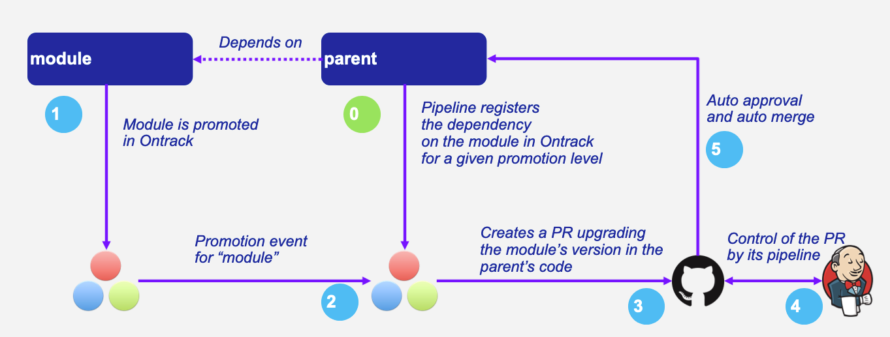

# Auto-versioning

Beside collecting data about the performance of your delivery, Yontrack can in turn use this information to drive other
automation processes.

One of these processes that Yontrack can drive is the "auto-versioning on promotion", which allows the propagation of
versions from one repository to others using quality gates based on
Yontrack [promotions](../../concepts/model/index.md#promotion-levels).

Let's imagine a project `parent` which has a dependency on a `module` expressed through a version property somewhere in
a file.

Ideally, whenever the `module` has a new version is a given range, we want this version to be used automatically by the
`parent`.

Manually, we can do this of course:

* We update the version in the `parent`
* We perform any needed post-processing like a resolution of locks
* We commit and push the change.
* Voilà.

If we put extra automation in the mix, you can define a perfectly valid auto-versioning process, and some external tools
can even be used to perform this process for you.

This becomes more complex whenever having a new version of the `module` is not enough of a criteria to have it used.
This may be a release which has not been qualified yet by extra quality processes (long running acceptance tests for
example, etc.).

That's where the concept of [promotion](../../concepts/model/index.md#promotion-levels) in Yontrack can play an
essential role:

* the `module` is promoted
* this starts the following process:
    * Yontrack creates a pull request for the `parent` where the version of the `module` has been changed to the one
      being
      promoted
    * any required post processing is performed on this PR
    * when the PR is ready to be merged (with all its controls), it's merged automatically

Result:

* versions are propagated automatically only when "promotion gates" are opened
    * one quality gate at the source, using promotions
    * one quality gate at the target, using automated checks

This is valid from one module to a project, and can be easily extended to a full tree of dependent modules.

The diagram below shows how this works:



!!! note "When not to use auto versioning"

    While auto-versioning is pretty easy to put in place, it should not be used where traditional dependency management
    based on locks can be used instead for simple code libraries.
    
    Auto-versioning on promotion is, however, particularly well suited to deal with situations like:
    
    * modular monoliths
    * GitOps repositories with fixed versions

## Configuration

The auto-versioning configurations are set at the level of the _target branches_. The exact way to send the
auto-versioning configuration depends on your type of [client](../../start/configuration.md), but we recommend
the [CI config injection](../../configuration/ci-config.md#auto-versioning).

See the [integrations](#integrations) after this section.

--8<-- "auto-versioning/config.md"

!!! note

    When an auto-versioning configuration is set, it can be checked in the branch page, in its properties.

### Targeting a series of branches

In this scenario, the parent wants to be notified of a promotion on a series of branches, and Yontrack triggers the
upgrade _only_ if the promotion has occurred on the _latest_ branch.

Setup:

* set the `sourceBranch` parameter to a regular expression on the Git branch, for example: `release\/.\..*`

How does it work?

* when a promotion occurs on the desired level:
    * Yontrack gets the list of branches for the dependency
    * orders them by descending version
    * filters them using the semantic versioning
    * triggers an upgrade only if the promoted branch is the first in this list (latest in terms of version)

Pro's:

* simple
* allows auto upgrades fairly easily

Con's:

* the dependency must really take care of a strong semantic versioning

### Branch expressions

The `sourceBranch` parameter can be set to `&<expression>` where `<expression>` is an expression used to detect the
source branch on the source project for a branch eligible for auto versioning.

Supported values are listed below.

#### `&regex`

By using:

```yaml
sourceBranch: "&regex:<regex>"
```

this is equivalent to the default behaviour:

```yaml
sourceBranch: "<regex>"
```

#### `&same`

The source branch must have the exact same name as the target branch.

Example: if you have a branch `release-1.24` on a parent project `P` and you want to get updates from a `dependency`
project only for the same branch, `release-1.24`, you can use:

```yaml
sourceBranch: "&same"
```

#### `&most-recent`

Two branches (`release/1.1` & `release/1.2`) are available for a project which is dependency of an auto-versioned parent
project with the following default branch source:

```yaml
branch: 'release\/1\..*'
```

In this scenario, no promotion has been granted yet in `release 1.2` of the dependency.

When 1.1 is promoted, Yontrack identifies a branch on the parent project to be a potential candidate for
auto-versioning.

This branch is configured to accept only the latest `release/1.*` branch, which is - now - the `release/1.2`.

Therefore, a 1.1 promotion is no longer eligible as soon as the 1.2 branch was created (and registered in Yontrack).

What exactly do we want to achieve? In this scenario, we always want the version promoted in 1.1 as long as there is
none in 1.2. Let's imagine we promote a 1.1 while 1.2 was already promoted, what then? How do we protect ourselves?

The idea is to accept a promotion as long as there is no such a promotion in later branches.

* a 1.1 is promoted, and there is no such promotion in more recent branches (1.2, etc.), we accept it
* a 1.1 is promoted, and there is already such a promotion in a more recent branch (1.2 for example), we reject it

To implement this strategy, we have to use:

```yaml
branch: '&most-recent:release\/1\..*'
```

#### `&same-release`

On the same model as the "&same" `sourceBranch` parameter, there is the possibility to get a "&same-release" branch
source.

This is to be used in cases where the dependency and its parent follow the same branch policy at `release/` branch
level, but only for a limited number of levels.

For example, a parent has release branches like release/1.24.10, with a dependency using on release/1.24.15. We want
release/1.x.y to always depend on the latest release/1.x.z branch (using 1. as a common prefix).

One way to do this is to use: `sourceBranch: "release/1.24.*"`  but this would force you to always update the source
branch parameter for every branch:

* release/1.24.* in release/1.24.x branch
* release/1.25.* in release/1.25.x branch
* etc.

A better way is to use, in this scenario:

```yaml
sourceBranch: "&same-release:2"
```

This means:

* if you're on a release/x.y.z branch, use release/x.y.* for the latest branch
* for any other branch (main) for example, we use the same branch

!!! note

    Note that `:2` means: take the first two numbers of the version of the release branch. By default, it'd be `:1` and can be omitted: `sourceBranch: "&same-release"`.

### Version source

By default, the version to use in the target project is computed directly from
the [build](../../concepts/model/index.md#builds) which has been promoted.

The default behavior is:

* if the source project is configured to use the labels for the
  builds (["Build name display"](../../generated/properties/property-net.nemerosa.ontrack.extension.general.BuildLinkDisplayPropertyType.md)
  property), the label (or release, or version) of the build is used. If this label is not present, the auto-versioning
  request will be rejected
* if the source project is not configured, the build name is taken as the version

This version computation can be adapted using the [`versionSource`](#configuration) configuration parameter.

The different options for this parameter are:

* `default` - uses the default behavior described above
* `name` - uses the name of the build, regardless of the source project configuration
* `labelOnly` - uses the label attached to the build, regardless of the source project configuration. If there is no
  label, the auto versioning request is rejected
* `metaInfo/<category>/<name>` or `metaInfo/<name>` - the version is the value of a meta-information item of the request
  category (optional) or name. If so such meta-information is found, the auto versioning request is rejected.

### Additional paths

The `additionalPaths` configuration property allows the specification of additional paths to update
instead of just the main one.

!!! note

    This can somehow be considered as a form of [post-processing](#post-processing) but
    without the need to call an external service.

Example:

```yaml
configurations:
  - # ...
    targetPath: "gradle.properties"
    targetProperty: "one-version"
    additionalPaths:
      - path: manifest.toml
        property: global.oneVersion
        propertyType: toml
        versionSource: metaInfo/rpmVersion
```

In this example, we want the auto-versioning to:

* update the `one-version` property of the `gradle.properties` file using the version of the build having been promoted
* update the `global.oneVersion` property of the `manifest.toml` file, but this time using the `rpmVersion`
  meta-information of the build having been promoted

Both changes will be part of the same PR.

[Post-processing](#post-processing) is still possible and would be run after all changes have been applied first (
default path & additional paths).

### Target files types

Auto)versioning, in the end, works by updating a _target file_, designed in the configuration by the `targetPath` or
`path` property.

A regular expression (`regex` parameter) can be used to identify the change.

This expression is used to 1) identify the current version 2) replace the current version by a new one.
In order for this to work, the regular expression must:

* match the whole target line in the target file
* have a capturing group in position 1 identifying the version to read or replace

It is also possible to use a higher level of file type, by specifying a _propertyName_ and optionally a _propertyType_.

The _propertyName_ designates a _property_ in the target file and the _propertyType_ designates the type of the file to
replace.

The following types are currently supported:

* `properties` (default) - Java properties file, typically used for a `gradle.properties` file
* `npm` - NPM package file, typically used for `package.json`
* [`maven`](#maven-pom-file) - Maven POM file
* [`yaml`](#yaml-files) - YAML file
* [`toml`](#toml-files) - TOML file

#### Maven POM file

For the `maven` type, the file to transform is a Maven `pom.xml` file. The `property` is _required_ to be one of the
`<properties>` elements of the file.

For example, given the following POM:

```xml

<project>
    <properties>
        <dep.version>1.10</dep.version>
        <yontrack.version>4.4.10</yontrack.version>
    </properties>
</project>
```

we can refer to the `yontrack.version` using the following auto versioning configuration:

```yaml
configurations:
  - # ...
    targetPath: pom.xml
    propertyType: maven
    property: yontrack.version
```

#### YAML files

When `propertyType` is set to `yaml`, `property` is expected to define a path inside the YAML file.

This path is expressed using
the https://docs.spring.io/spring/docs/4.3.25.RELEASE/spring-framework-reference/htmlsingle/#expressions[Spring
Expression Language].

For example, given the following YAML file (a deployment fragment in Kubernetes):

```yaml
---
apiVersion: apps/v1
kind: Deployment
metadata:
  name: my-app
spec:
  template:
    spec:
      containers:
        - name: component
          image: repo/component:0.1.1
```

To get to the `repo/component:0.1.1` value, the path to set will be:

```text
#root.^[kind == 'Deployment' and metadata.name == 'my-app'].spec.template.spec.containers.^[name == 'component'].image
```

See
the [Spring Expression Language](https://docs.spring.io/spring/docs/4.3.25.RELEASE/spring-framework-reference/htmlsingle/#expressions)
reference for a complete reference but this expression already illustrates some key points:

* `#root` refers to the "root object", used to evaluate the expression, in our case, the list of YAML "documents",
  separated by `---`
* `.^[<filter>]` is an operator for a list, evaluating the given filter for each element until one element is found.
  Only the found element is returned.
* `.name` returns the value of the `name` property on an object
* literal strings are using single quotes, for example: `'Deployment'`

If `property` is set to the expression mentioned above, the value being returned will be
`repo/component:0.1.1`.

However, we want to use `0.1.1`only.

For this purpose, you need to specify also the `propertyRegex` and set it, for this example to:

```yaml
propertyRegex: '^repo\/component:(.*)$'
```

!!! note

    Putting regular expressions in YAML files can be tricky. One safe way is to use single-quotes to surround them.

!!! warning

    The use of SpringEL can be difficult to understand for non-Spring developers. There is a task
    in Yontrack 5 to support JSON path expressions. Please contact your support if you're interested in this feature.

#### TOML files

When `propertyType` is set to `toml`, `property` is expected to define a path inside the TOML file.

For example, given the following TOML file:

```toml
[images]
myVersion = "2.0.0"
```

To update the `myVersion` property in the `images` table, one can set the auto versioning `property` to
`images.myVersion`.

!!! warning

    As of the time of writing, the TOML support is still experimental. See
    issue [#1156](https://github.com/nemerosa/ontrack/issues/1156).

## Post-processing

In some cases, it's not enough to have only a version being updated into one file.
Some additional post-processing may be needed.

For example, if using Gradle or NPM dependency locks, after the version is updated, you'd need to resolve and write the
new dependency locks.

The auto-versioning feature allows you to configure this post-processing.

In the [branch configuration](#configuration), you can set two properties for each source configuration:

* `postProcessing` - ID of the post-processing mechanism
* `postProcessingConfig` - configuration for the post-processing mechanism

As of now, only two post-processing mechanisms are supported:

* [Jenkins pipeline](jenkins.md)
* [GitHub Actions workflow](github.md)

## Pull requests

After a branch is created to hold the new version, after this branch has been optionally post-processed, Yontrack will
create a pull request from this branch to the initial target branch.

The `autoApproval` [branch configuration property](#configuration) (set to `true` by default) is used by Yontrack to
check how pull requests are to be handled.

If set to `false`, Yontrack will just create a pull request and stop here.

If set to `true`, the fate of the pull request depends on the `autoApprovalMode` which has been set in
the [branch configuration](#configuration):

`CLIENT`

:    This is the default behaviour. Ontrack takes the ownership of the pull request lifecycle:

:    * PR is approved automatically
:    * Yontrack waits for the PR to become mergeable
:    * Yontrack merges the PR
:    Pros: Full visibility on the PR lifecycle within Yontrack
:    Cons: This creates additional load on Yontrack

`SCM`

:    Ontrack relies on the SCM (GitHub for example) for the lifecycle of the pull request, in a "fire and forget" mode:

:    * PR is approved automatically
:    * PR is set for auto merge
:    * In the background, the PR will be merged automatically once all the conditions are met, but Ontrack does not
follow that up
:    Pros: Less load on Ontrack since the PR lifecycle is fully managed by the SCM
:    Cons: Less visibility on the PR lifecycle from Ontrack

### Configuration of approvals

Both modes, `CLIENT` and `SCM`, need the SCM configuration used by Yontrack to have additional attributes.

#### Configuration for GitHub

The GitHub configuration used by the Yontrack project must have its `autoMergeToken` attribute set to a GitHub Personal
Access Token with the following permissions:

* `repo`

and the corresponding user must have at least the `Triage` role on the target repositories.

!!! note

    This `autoMergeToken` must be linked to a user _which is not_ the user used by the GitHub configuration.
    It's because a user cannot approve their own pull requests.

### `CLIENT` mode

No specific configuration is needed for the `CLIENT` mode.

### `SCM` mode

There is some configuration to be done at SCM level.

#### `SCM` mode for GitHub

The target repository, the one defining the project being auto-versioned, must have the following settings:

* the `Allow auto-merge` feature must be enabled in the repository

## Audit logs

All auto-versioning processes and all their statuses are recorded in an audit log, which can be accessed using dedicated
pages.

The auto-versioning audit can be accessed:

* from the _Auto versioning audit_ user menu, for all projects and branches
* from the _Tools > Auto versioning audit (target)_ from a project page when the project is considered a _target_ of the
  auto versioning
* from the _Tools > Auto versioning audit (source)_ from a project page when the project is considered a _source_ of the
  auto versioning
* from the _Tools > Auto versioning audit_ from a branch page when the branch is targeted by the auto versioning

All these pages are similar and show:

* a form to filter the audit log entries
* a paginated list of audit log entries

Each log entry contains the following information:

* the unique ID of the auto-versioning process
* target project and branch (only available in global & project views)
* source project
* version being updated
* the [schedule](#scheduling) if set
* [post-processing](#post-processing) ID if any
* [auto approval mode](#pull-requests) if any
* running flag - is the auto-versioning process still running?
* current state of the auto-versioning process
* link to the PR if any
* timestamp of the latest state
* duration of the process until the latest state

You can click on the ID to get more details about the auto-versioning process. The following information is available:

* the history of the states of the process
* all details stored in the auto-versioning order

### Audit cleanup

To avoid accumulating audit log entries forever, a cleanup job is run every day to remove obsolete entries.
The behaviour of the cleanup is controlled through the [global settings](#general-configuration).

### Audit metrics

Yontrack exports some [operational metrics](../../operations/metrics.md) about the auto-versioning processes.

See the [reference](../../generated/metrics/net.nemerosa.ontrack.extension.av.metrics.AutoVersioningMetrics.md) for the
list of these metrics.

## Auto versioning checks

While auto)versioning is configured to automatically upgrade branches upon the promotion of some other projects, it's
also possible to use this very configuration to check if a given build is up-to-date or not with the latest
dependencies.

One can call the Yontrack API (or better, make use of the existing [integrations](#integrations)) to check if a build is
up-to-date or not. This creates a [validation run](../../concepts/model/index.md#validation-runs) on this build:

* it'll be `PASSED` if the dependency are up-to-date
* `FAILED` otherwise

The name of the validation stamp is defined by the `validationStamp` parameter in the [configuration](#configuration) of
the branch:

* if defined, will use this name
* if set to `auto`, the validation stamp name will be `auto-versioning-<project>`, with `<project>` being the name of
  the source project
* if not set, no validation is created

## Notifications

The auto)versioning feature integrates with the [notifications](../notifications/index.md) framework by emitting several
events you can subscribe to:

* `auto-versioning-success` - whenever an auto versioning process completes
* `auto-versioning-error` - whenever an auto versioning process finishes with an error
* `auto-versioning-pr-merge-timeout-error` - whenever an auto versioning process cannot merge a pull request because of
  a timeout on its merge condition (only when `autoApprovalMode` is set to `CLIENT` - see <<auto-versioning-pr>>)

## Throttling

By default, when auto-versioning requests pile up for a given source and target, all the intermediary processing
requests are canceled.

For example, given the following scenario, for a given source project and a given target branch:

* (1) auto versioning to version 1.0.1
* auto versioning to version 1.0.2 while (1) is still processed
* auto versioning to version 1.0.3 while (1) is still processed
* auto versioning to version 1.0.4 while (1) is finished

In this scenario, the processing of 1.0.1 and 1.0.4 will have been processed and completed while 1.0.2 and 1.0.3 would
have been canceled.

!!! note

    The auto cancellation can be disabled by setting the `ontrack.extension.auto-versioning.queue.cancelling` [configuration property](../../generated/configurations/net.nemerosa.ontrack.extension.av.AutoVersioningConfigProperties.md) to `false`.

## Scheduling

The auto-versioning [configuration](#configuration) can use the `cronSchedule` parameter to schedule the auto-versioning
process at a given time.

As long as the schedule is not reached, all the auto-versioning requests will be [throttled](#throttling) and the last
one active will be kept until it becomes time to process it.

For example, given the following configuration:

```yaml
cronSchedule: '0 0 23 * * *'
```

All the auto-versioning requests but the last one will be canceled during the day. At 23:00 UTC every day, if there is
one auto-versioning request still active, it will be processed.

## Rescheduling

Any existing auto-versioning request can be rescheduled from its detail page accessible from
the [audit log](#audit-logs).

Navigate to the detail page of the auto-versioning details page and click on the _Reschedule_ button.

This creates a _new request_ and schedule it for immediate processing.

## Integrations

While using the [CI config injection](../../configuration/ci-config.md#auto-versioning) for the configuration of the
auto-versioning, there are several other ways to setup it.

### Jenkins pipeline

By using the [Jenkins Yontrack pipeline library](https://github.com/nemerosa/ontrack-jenkins-cli-pipeline), you can
setup the auto versioning configuration for a branch.

For example:

```groovy
ontrackCliAutoVersioning {
    branch "main"
    yaml "auto-versioning.yaml"
}
```

where `auto-versioning.yaml` is a file in the repository containing for example:

```yaml
dependencies:
  - project: my-library
    branch: release-1.3"
    promotion: IRON
    path: gradle.properties
    property: my-version
    postProcessing: jenkins
    postProcessingConfig:
    dockerImage: openjdk:8
    dockerCommand: ./gradlew clean
```

!!! warning

    For historical reasons, this YAML file uses `dependencies` as a root instead of `configurations`.

The [auto-versioning check](#auto-versioning-checks) is called using:

```groovy
ontrackCliAutoVersioningCheck()
```

## Examples

### Gradle update for last release

To automatically update the `dependencyVersion` in `gradle.properties` to the latest version
`1.*` of the project `dependency` when it is promoted to `GOLD`:

* sourceProject: `dependency`
* sourceBranch: `release/1\..*`
* sourcePromotion: `GOLD`
* targetPath: `gradle.properties`
* targetPropertyName: `dependencyVersion`
* targetPropertyType: `properties` (or nothing, it's a default)
* postProcessing: `...`
* postProcessingConfig:
    * `dockerImage`: `openjdk/8`
    * `dockerCommand`: `./gradlew resolveAndLockAll --write-locks`

### NPM update for last release

To automatically update the `@test/module` in `package.json` to the latest version
`1.*` of the project `dependency` when it is promoted to `GOLD`:

* sourceProject: `dependency`
* sourceBranch: `release/1\..*`
* sourcePromotion: `GOLD`
* targetPath: `package.json`
* targetPropertyName: `@test/module`
* targetPropertyType: `npm`
* postProcessing: `...`
* postProcessingConfig:
    * `dockerImage`: `node:jessie`
    * `dockerCommand`: `npm -i`

## Settings

### General configuration

Auto-versioning is enabled by default.

This can be disabled in the settings. Go to your user menu, in _System_ > _Settings_, then select _Auto-versioning_.

The following settings are available:

* _Enabled_ - enables or disables the auto-versioning in Yontrack
* _Audit retention duration_ - maximum duration to keep audit entries for active auto-versioning requests ()
* _Audit cleanup duration_ - maximum duration to keep audit entries for all kinds of auto-versioning requests (counted
  after the audit retention)
* _Build links_ - check to enable the creation of build links on auto-versioning (checked by default)

!!! note

    You can configure the settings as [code](../../configuration/casc.md):
    
    ```yaml
    ontrack:
      config:
        settings:
          auto-versioning:
            enabled: true
            auditRetentionDuration: 14d
            auditCleanupDuration: 90d
            buildLinks: true
    ```

### Queues

Yontrack uses queues in RabbitMQ to schedule and process auto-versioning events.

By default, `10` queues are allocated to process all auto-versioning events. You can
[monitor the queues in RabbitMQ](../../operations/rabbitmq.md) directly or use the
[auto-versioning metrics](../../operations/metrics.md) to know the load on the queues.

To change the number of queues, you can use
the [auto-versioning configuration properties](../../generated/configurations/net.nemerosa.ontrack.extension.av.AutoVersioningConfigProperties.md).
