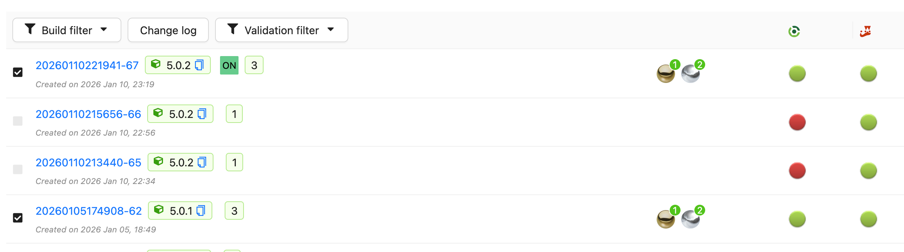
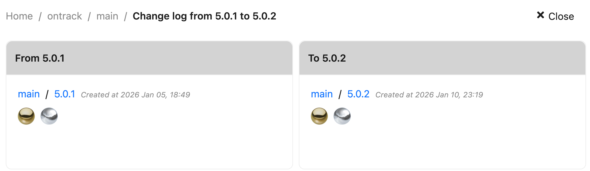
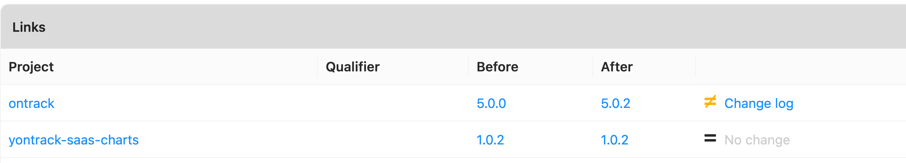
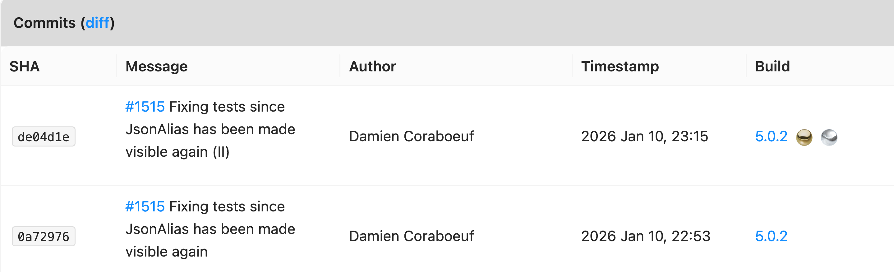
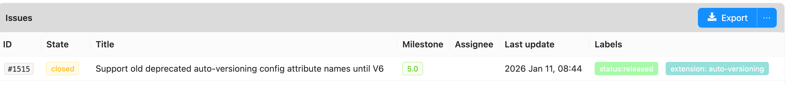
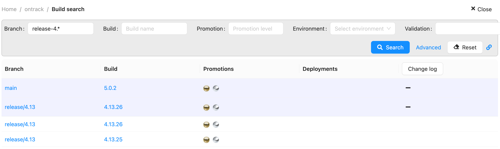

# Changelogs

Yontrack helps you generate changelogs for many situations:

* from build to build
* across branches
* from a last promotion etc.

These changes logs can be simple, done at branch level level only between two builds,
or [recursive](#recursive-changelogs) down the dependencies of a given project.

Changelogs contain a list of issues and/or commits, they can also be based
on [conventional commits](https://www.conventionalcommits.org/en/v1.0.0/).

Changelogs can be rendered as plain text, Markdown, HTML and other [formats](../notifications/index.md) are available.

## How to generate a changelog

### Using the UI

In the UI, a changelog can be generated from the branch page:

* select the boundaries of the changelog
* click on _Change log_



The changelog page displays several sections.

* details about the changelog boundaries:



* list of changes in known dependencies:



If a dependency has changes, you can drilldown into its own changelog.

* a list of commits for this changelog:



The _diff_ links allows to drilldown into the actual diff of the commits using the associated SCM.

* a list of issues for this changelog:



The _Export_ button allows exporting the changelog in different formats:

* HTML
* Jira
* Markdown
* Slack
* Text

Other options are also available to group the issues together.

When you finally click _Export_, the changelog is shown in a modal box and can be copied.

!!! note

    See also the [templating](#using-templating) for more advanced usages

### Using the UI across branches

You can generate a changelog between two builds on different branches.

Navigate to the project and select _Search builds_.

Using the filter options, select the builds you want to compare, click on the :material-plus: icon to select the
boundaries:



Once you have selected two boundaries, you can click on the _Change log_ button. You'll get the same changelog page as
for the [branch changelog](#using-the-ui).

!!! note

    You cannot generate changelogs between different projects.

### Using templating

The most powerful way to generate changelogs is to use [templating](../../appendix/templating.md).

Several template sources are available:

* [`Build.changelog`](../../generated/templating/sources/templating-source-build-changelog.md) - changelog between this
  build and another
* [`PromotionRun.changelog`](../../generated/templating/sources/templating-source-promotion-run-changelog.md) -
  changelog between a promoted build and the previous promotion
* [
  `PromotionRun.semanticChangelog`](../../generated/templating/sources/templating-source-promotion-run-semanticChangelog.md) -
  semantic changelog between a promoted build and the previous promotion

For example, to generate a mail on a promotion containing a semantic changelog, you could use the following template:

```
${promotionRun.semanticChangelog?issues=true&emojis=true}
```

In this example, the changelog not only contains the semantic changelog, but also the list of issues if there are any.
Each section (features, fixes, etc.) is also decorated with the corresponding emoji.

### Using the API

The classic and semantic changelogs can also be generated using the API:

```graphql
query {
    scmChangeLog(from: 1146, to: 1149) {
        # Classic changelog
        render(config: {commitsOption: ALWAYS}, renderer: "html")
        # Semantic changelog
        semantic(config: {emojis: true}, renderer: "markdown")
    }
}
```

!!! note

    Using the API directly may be a way to render more complex changelogs on your side.

### Using the clients

Using the [Yontrack CLI](https://github.com/nemerosa/ontrack-cli) or
the [Jenkins pipeline library](https://github.com/nemerosa/ontrack-jenkins-cli-pipeline), you can generate changelogs.

## Recursive changelogs

Both [classic](#classic-changelogs) and [semantic](#semantic-changelogs) changelogs can be recursive.

The following [options](#configuration-of-changelogs) are available:

* `dependencies`: comma-separated list of project links to follow one by one for a get deep change log. Each item in the
  list is either a project name, or a project name and qualifier separated by a colon (:)
* `allQualifiers`: loop over all qualifiers for the last level of `dependencies`, including the default one. Qualifiers
  at `dependencies` take precedence
* `defaultQualifierFallback`: if a qualifier has no previous link, uses the default qualifier (empty) qualifier

For example, using [templating](#using-templating), you could generate the main changelog between two builds, and then
the corresponding changelog for the `library` dependency:

```
${promotionRun.semanticChangelog?issues=true&emojis=true}

${promotionRun.semanticChangelog?issues=true&emojis=true&dependencies=library}
```

If the `library` project has a dependency on `core`, you can even generate a deeper changelog:

```
${promotionRun.semanticChangelog?issues=true&emojis=true}

${promotionRun.semanticChangelog?issues=true&emojis=true&dependencies=library}

${promotionRun.semanticChangelog?issues=true&emojis=true&dependencies=library,core}
```

## Configuration of changelogs

Besides the [recursivity options](#recursive-changelogs), the two types of changelogs have their own configuration.

### Classic changelogs

These changelogs display the list of issues between two builds. Optionally, the commits can be displayed as well using
the `commitsOption` parameter.

| Option        | Type    | Default value | Description                                                 |
|---------------|---------|---------------|-------------------------------------------------------------|
| empty         | String  | _Empty_       | String to use to render an empty or non existent change log |
| title         | Boolean | _false_       | Include a title for the changelog                           |
| commitsOption | (1)     | NONE          | Option to display commits                                   |

(1) the possible values for `commitsOption` are:

* NONE - Never rendering the commits (the default)
* OPTIONAL - Only rendering the commits if no issue is present
* ALWAYS - Always rendering the commits (additionally to the issues)

### Semantic changelogs

The semantic changelog is based on the [conventional Commits](https://www.conventionalcommits.org/en/v1.0.0/)
specification.

| Option   | Type     | Default value | Description                                            |
|----------|----------|---------------|--------------------------------------------------------|
| issues   | Boolean  | _false_       | Must a section for changelog actual issues be present? |
| sections | List (1) | _Empty_       | Mapping types to section titles                        |
| exclude  | List (2) | _Empty_       | Types to exclude from the changelog                    |
| emojis   | Boolean  | _false_       | Use emojis in the section titles                       |

(1) use the `sections` option to redefine the title of a given semantic type. For example, if you want to use `Other`
for `chore` and `Bugs` for `fix`, you can use the following configuration:

```
${promotionRun.semanticChangelog?sections=chore=Other&sections=fix:Bugs}
```

(2) use the `exclude` option to exclude some semantic types from the changelog. For example, to skip the generation for
the CI & Build types:

```
${promotionRun.semanticChangelog?exclude=ci&exclude=build}
```
