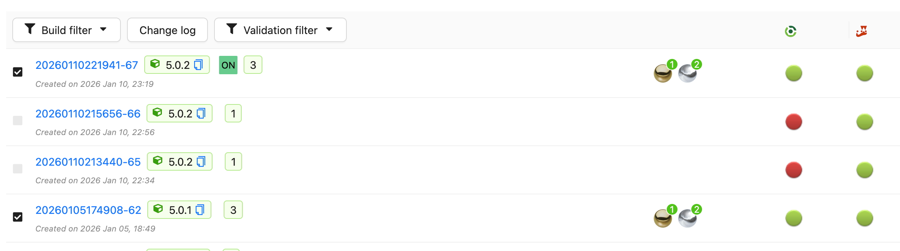
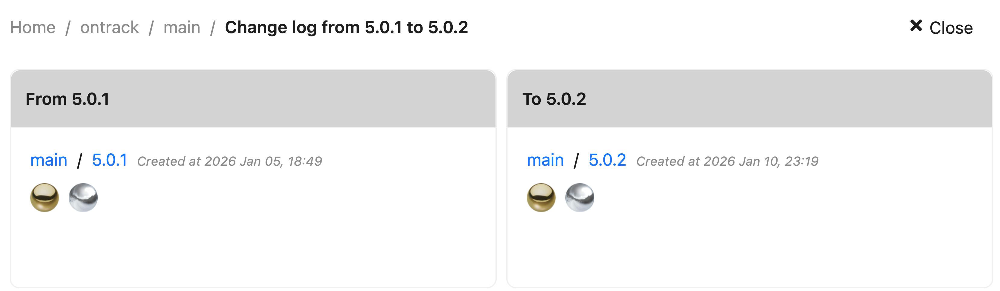
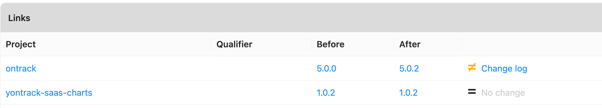
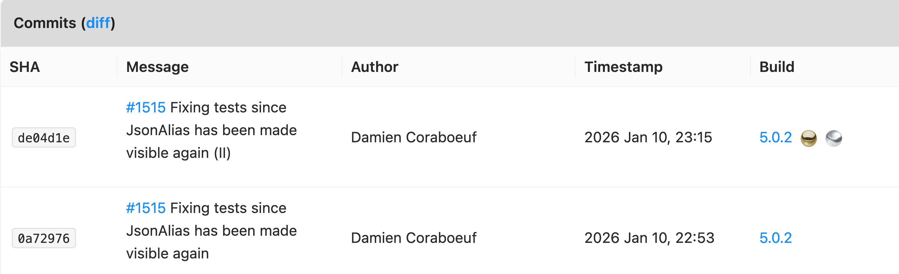
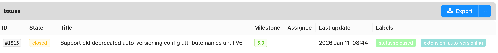
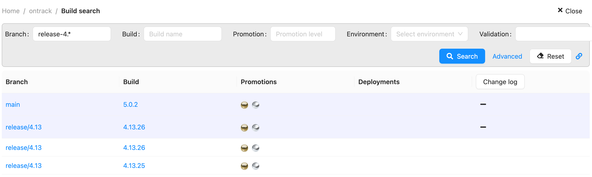

# Changelogs

Yontrack helps you generate changelogs for many situations:

* from build to build
* across branches
* from a last promotion etc.

These changes logs can be simple, done at branch level level only between two builds,
or [recursive](#recursive-changelogs) down the dependencies of a given project.

Changelogs contain a list of issues and/or commits, they can also be based
on [conventional commits](https://www.conventionalcommits.org/en/v1.0.0/).

Changelogs can be rendered as plain text, Markdown, HTML and other [formats](../notifications/index.md) are available.

## How to generate a changelog

### Using the UI

In the UI, a changelog can be generated from the branch page:

* select the boundaries of the changelog
* click on _Change log_



The changelog page displays several sections.

* details about the changelog boundaries:



* list of changes in known dependencies:



If a dependency has changes, you can drilldown into its own changelog.

* a list of commits for this changelog:



The _diff_ links allows to drilldown into the actual diff of the commits using the associated SCM.

* a list of issues for this changelog:



The _Export_ button allows exporting the changelog in different formats:

* HTML
* Jira
* Markdown
* Slack
* Text

Other options are also available to group the issues together.

When you finally click _Export_, the changelog is shown in a modal box and can be copied.

!!! note

    See also the [templating](#using-templating) for more advanced usages

#### Reading the changelog as a semantic changelog

The same changelog can be read in two ways, chosen from the _View_ menu in the page's command
bar:

* _Classic_ — the sections described above: boundaries, dependencies, commits and issues. This
  is what the page shows unless you ask for something else.
* _Semantic_ — the commits grouped into sections by their
  [conventional-commit](#semantic-changelogs) type, exactly as the templating renderer produces
  them for a notification. This is the form you paste into release notes, a pull request
  description or Jira.

The semantic view replaces the _issues_ section with the rendered changelog, shown as raw text
with a _Copy_ button — including for HTML, where the source is what you get, because the point
of choosing a format is to paste the result somewhere else. The boundaries and the dependency
changes stay: they answer which two builds this is about, whatever way you read it.

Four options sit in the panel's own header:

| Option    | Default    | Meaning                                                                          |
|-----------|------------|----------------------------------------------------------------------------------|
| _Format_  | `markdown` | The renderer: `text`, `markdown`, `html`, `jira` or `slack`                       |
| _Emojis_  | on         | Emojis in the section titles                                                      |
| _Issues_  | on         | An issues section **inside** the rendered text — the semantic view has no issues panel |
| _Commits_ | off        | Shows the classic commits section beside the rendered text                         |

The view and its options are remembered in your user preferences, so the changelog page opens
the way you last read it, on any machine.

They are also carried in the URL, so a link you share reproduces exactly what you were reading:

```
/extension/scm/changelog?from=1146&to=1149&view=semantic&format=jira&emojis=true&issues=true&commits=false
```

The parameters are written only when you change something. A changelog link with no `view=`
parameter keeps meaning "however *you* like to read it" for whoever opens it.

!!! note

    The semantic changelog only shows commits whose subject carries a conventional-commit type,
    such as `feat(api): search owners by phone number`. On a project whose commit messages do
    not follow that convention, the view says so instead of showing an empty panel — turn
    _Commits_ on to read the commits as they are. See [Semantic changelogs](#semantic-changelogs)
    for the same rendering used from a template.

### Using the UI across branches

You can generate a changelog between two builds on different branches.

Navigate to the project and select _Search builds_.

Using the filter options, select the builds you want to compare, click on the :material-plus: icon to select the
boundaries:



Once you have selected two boundaries, you can click on the _Change log_ button. You'll get the same changelog page as
for the [branch changelog](#using-the-ui).

!!! note

    You cannot generate changelogs between different projects.

### Using a permalink

The changelog page can be linked to directly, which is useful for release notes, chat messages or CI jobs.

Using the IDs of the two builds:

```
/extension/scm/changelog?from=1146&to=1149
```

Using the name of the project and the names of the two builds, which can be written without knowing any ID:

```
/extension/scm/my-project/changelog?from=1.2.0&to=1.3.0
```

In this second form, each boundary is looked for using
the [display name](../../generated/properties/property-net.nemerosa.ontrack.extension.general.ReleasePropertyType.md)
of the builds first, and then using their name.

The boundaries can be given in any order: the changelog is always computed from the oldest build to the most recent one.

If the project, one of the branches or one of the builds cannot be found, the reason is displayed on the page.

#### Selecting the branch of a boundary

Build names are unique inside a branch, not inside a project. When several builds of the project match a boundary, the
most recent one is used.

The branch of each boundary can be given to remove this ambiguity:

```
/extension/scm/my-project/changelog?from=1.2.0&fromBranch=release-1.2&to=1.3.0&toBranch=release-1.3
```

!!! warning

    When a branch is given, the _name_ of the build is looked for in this branch only, but its _display name_ is still
    looked for in the whole project. A boundary given as a display name can therefore be resolved into a build which is
    not on the branch which has been given.

    Giving a branch also changes the order of the matching: without a branch, the display name is matched first, and
    then the build name. With a branch, the build name is matched first, and then the display name.

### Using templating

The most powerful way to generate changelogs is to use [templating](../../appendix/templating.md).

Several template sources are available:

* [`Build.changelog`](../../generated/templating/sources/templating-source-build-changelog.md) - changelog between this
  build and another
* [`PromotionRun.changelog`](../../generated/templating/sources/templating-source-promotion-run-changelog.md) -
  changelog between a promoted build and the previous promotion
* [
  `PromotionRun.semanticChangelog`](../../generated/templating/sources/templating-source-promotion-run-semanticChangelog.md) -
  semantic changelog between a promoted build and the previous promotion

For example, to generate a mail on a promotion containing a semantic changelog, you could use the following template:

```
${promotionRun.semanticChangelog?issues=true&emojis=true}
```

In this example, the changelog not only contains the semantic changelog, but also the list of issues if there are any.
Each section (features, fixes, etc.) is also decorated with the corresponding emoji.

### Using the API

The classic and semantic changelogs can also be generated using the API:

```graphql
query {
    scmChangeLog(from: 1146, to: 1149) {
        # Classic changelog
        render(config: {commitsOption: ALWAYS}, renderer: "html")
        # Semantic changelog
        semantic(config: {emojis: true}, renderer: "markdown")
    }
}
```

!!! note

    Using the API directly may be a way to render more complex changelogs on your side.

### Using the clients

Using the [Yontrack CLI](https://github.com/nemerosa/ontrack-cli) or
the [Jenkins pipeline library](https://github.com/nemerosa/ontrack-jenkins-cli-pipeline), you can generate changelogs.

## Recursive changelogs

Both [classic](#classic-changelogs) and [semantic](#semantic-changelogs) changelogs can be recursive.

The following [options](#configuration-of-changelogs) are available:

* `dependencies`: comma-separated list of project links to follow one by one for a get deep change log. Each item in the
  list is either a project name, or a project name and qualifier separated by a colon (:)
* `allQualifiers`: loop over all qualifiers for the last level of `dependencies`, including the default one. Qualifiers
  at `dependencies` take precedence
* `defaultQualifierFallback`: if a qualifier has no previous link, uses the default qualifier (empty) qualifier

For example, using [templating](#using-templating), you could generate the main changelog between two builds, and then
the corresponding changelog for the `library` dependency:

```
${promotionRun.semanticChangelog?issues=true&emojis=true}

${promotionRun.semanticChangelog?issues=true&emojis=true&dependencies=library}
```

If the `library` project has a dependency on `core`, you can even generate a deeper changelog:

```
${promotionRun.semanticChangelog?issues=true&emojis=true}

${promotionRun.semanticChangelog?issues=true&emojis=true&dependencies=library}

${promotionRun.semanticChangelog?issues=true&emojis=true&dependencies=library,core}
```

## Commit messages

Wherever a changelog renders a commit, it renders only the **first line** of its message - the
subject - and truncates it at 100 characters, ellipsis included. Commit messages, in particular the
ones written by coding agents, routinely run to dozens of lines, and a changelog is a list of
subjects.

This applies to the changelog page, to the changelogs rendered through
[templating](#using-templating) and the [API](#using-the-api), and to the description of a commit in
the search results.

The full message is never lost: it is stored as-is, indexed in full by the search - so that looking
for a phrase in the body of a commit still finds it - and displayed in full on the commit page, one
click away from the changelog.

The maximum length can be changed for the changelogs rendered through templating or the API, using
the `commitsMaxLength` option, common to classic and semantic changelogs:

```
${promotionRun.changelog?commitsOption=ALWAYS&commitsMaxLength=250}
```

Setting `commitsMaxLength` to `0` disables the truncation - the subject is then rendered in full,
however long it is. It does *not* bring the body of the message back: only the first line is ever
rendered in a changelog.

The length used on the changelog page and in the search results is not configurable.

## Configuration of changelogs

Besides the [recursivity options](#recursive-changelogs), the two types of changelogs have their own configuration.

### Classic changelogs

These changelogs display the list of issues between two builds. Optionally, the commits can be displayed as well using
the `commitsOption` parameter.

| Option        | Type    | Default value | Description                                                 |
|---------------|---------|---------------|-------------------------------------------------------------|
| empty            | String  | _Empty_       | String to use to render an empty or non existent change log                       |
| title            | Boolean | _false_       | Include a title for the changelog                                                 |
| commitsOption    | (1)     | NONE          | Option to display commits                                                         |
| commitsMaxLength | Int     | 100           | Maximum length of a [commit message](#commit-messages), 0 to disable the truncation |

(1) the possible values for `commitsOption` are:

* NONE - Never rendering the commits (the default)
* OPTIONAL - Only rendering the commits if no issue is present
* ALWAYS - Always rendering the commits (additionally to the issues)

### Semantic changelogs

The semantic changelog is based on the [conventional Commits](https://www.conventionalcommits.org/en/v1.0.0/)
specification. The changelog page can be read this way too — see
[Reading the changelog as a semantic changelog](#reading-the-changelog-as-a-semantic-changelog);
the options below are the ones available from a template, of which the page exposes `issues` and
`emojis`.

| Option   | Type     | Default value | Description                                            |
|----------|----------|---------------|--------------------------------------------------------|
| issues           | Boolean  | _false_       | Must a section for changelog actual issues be present?                              |
| sections         | List (1) | _Empty_       | Mapping types to section titles                                                     |
| exclude          | List (2) | _Empty_       | Types to exclude from the changelog                                                 |
| emojis           | Boolean  | _false_       | Use emojis in the section titles                                                    |
| commitsMaxLength | Int      | 100           | Maximum length of a [commit message](#commit-messages), 0 to disable the truncation |

(1) use the `sections` option to redefine the title of a given semantic type. For example, if you want to use `Other`
for `chore` and `Bugs` for `fix`, you can use the following configuration:

```
${promotionRun.semanticChangelog?sections=chore=Other&sections=fix:Bugs}
```

(2) use the `exclude` option to exclude some semantic types from the changelog. For example, to skip the generation for
the CI & Build types:

```
${promotionRun.semanticChangelog?exclude=ci&exclude=build}
```
