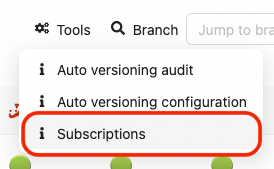
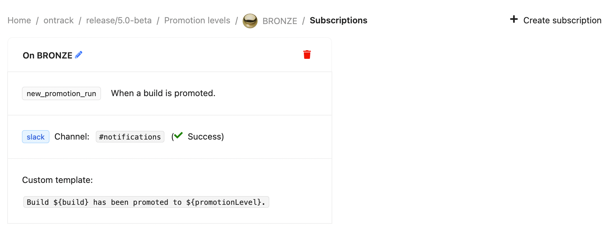
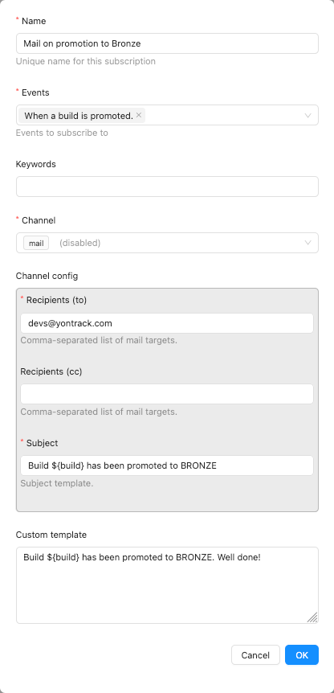
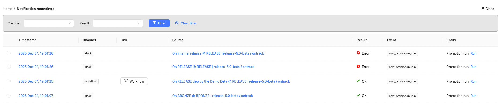
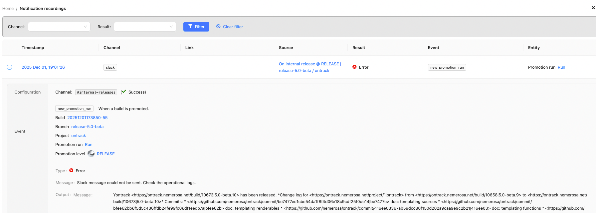

# Notifications

Yontrack has the possibility to send notifications to different [backends](../../generated/notifications/index.md) like webhooks, email, Slack messages, etc.

A notification is the association between an _event_ occurring on an _entity_ and sent to a given _channel_ using some _configuration_.

For example, a notification can be:

* event: a build has been promoted
* entity: the build, the promotion level
* channel: email
* channel configuration: the subject & the email addresses
* an optional custom template

In this example, the body of the email would be a text like "Build B of branch R in project P has been promoted to BRONZE", which various links to Yontrack.

!!! note
    
    By default, the notifications use the [default templates](../../generated/events/index.md) of the events but a [custom template](../../appendix/templating.md) can be provided.

Administrators of Yontrack can create and configure the different [backends](../../generated/notifications/index.md).

Subscriptions can be either [local](#local-subscriptions) (subscribing to the events on a given branch) or [global](#global-subscriptions) (subscribing to the events in all Yontrack, regardless of the entity).

## Notification backends

See the [appendixes](../../generated/notifications/index.md) for a complete list of the existing notification backends and their configurations.

## Subscriptions

Subscriptions can be done at entity level (project, branch, promotion, etc.) or globally.

### Local subscriptions

On an entity page (like the page for a project, a branch, etc.), go to the _Tools_ menu and select _Subscriptions_:



On the following screen, you can manage the list of subscriptions at this entity level.



To create a subscription, select the _New subscription_ command and enter the fields for the subscription:



* events - list of [events](../../generated/events/index.md) to listen to
* keywords - space-separated list of words which will be used to restrict the events being listened to
* channel - destination for the notification.
  Depending on the channel being selected, additional fields are needed (for example, for a Slack notification, the Slack channel is required)
* custom template - if provided, it'll override the default template associated with the event. See the [templating](../../appendix/templating.md) section for its syntax.

In the subscription list, you can delete existing subscriptions.

## Global subscriptions

The management of the global subscriptions is exactly the same as for the [local ones](#local-subscriptions), but for the fact that the global subscriptions are accessible through the _Global subscriptions_ menu.

!!! note

    Global subscriptions can be configured using [CasC](../../configuration/casc.md). For example:
    
    ```yaml
    ontrack:
      extensions:
        notifications:
            global-subscriptions:
              - name: On Gold
                events:
                  - new_promotion_run
                keywords: "GOLD main"
                channel: slack
                channel-config:
                  channel: "#my-channel"
                contentTemplate: |
                  Promoted to ${promotionLevel}.
    ```

## Recordings

For audit and troubleshooting purposes, all notifications are recorded and administrators can have access to them using the _Notification records_ user menu:



Each recording has the following columns:

* timestamp (UTC) - when was the notification actually sent
* channel - which channel was used by the notification
* link - link or button to access more information about the notification outcome
* source - source of the notification (like a subscription)
* result - outcome of the notification
* event - event that triggered the notification
* entity - entity linked to the notification

By clicking on the :material-plus: icon on the left, you can see more details about the notification:



Finally, the administrator can filter recordings on their results or channels.

## Examples

This section shows a number of custom templates for some events

### Changelog on promotion

To send a changelog on a promotion, subscribe to the [`new_promotion_run`](../../generated/events/event-new_promotion_run.md) event:

```text
Change log:

${promotionRun.changelog}
```

If the project builds have linked to a `dependency` project's builds, it may be interesting to follow the links recursively:

```text
Change log for ${build.release}:

${promotionRun.changelog}

Change log for the dependency:

${promotionRun.changelog?project=dependency}
```

## Notification backends

!!! note

    The whole list of notification backends is available in the [references](../../generated/notifications/index.md). You'll find below some detail about the most common ones.

* [Jenkins](jenkins.md) - triggering a Jenkins job
