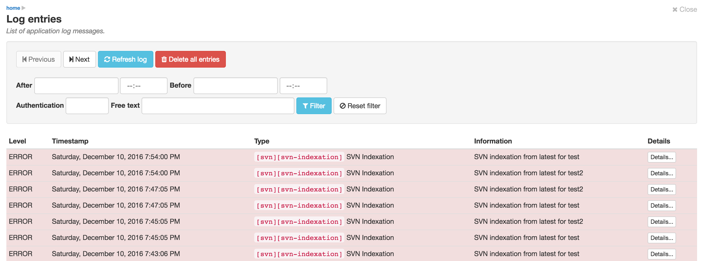
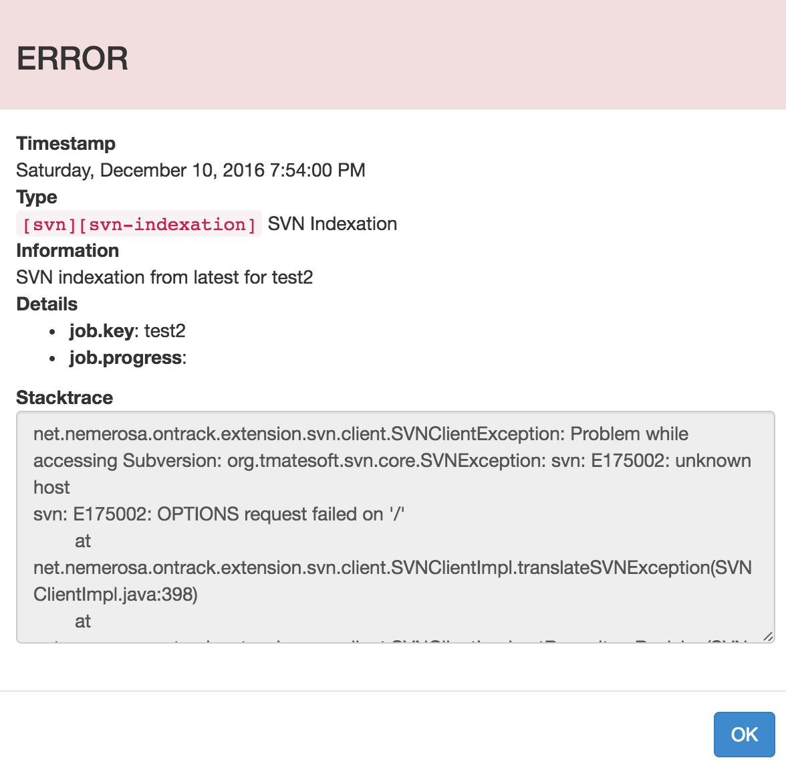

[[admin-log-entries]]
=== Application log messages

The list of application log messages is available to the _Administrators_ only
and is accessed through the user menu.

It allows an administrator to manage the error messages.

The log items are displayed from the most recent to the oldest. By default,
only 20 items are displayed on a page. You can navigate from page to page by
using the _Previous_ and _Next_ buttons.

You can filter the log entries you want to see by using the filter fields:

* after - only log entries created _after_ this time will be displayed
* before - only log entries created _before_ this time will be displayed
* authentication - you can enter the name of a user, and only errors having
  occurred to this user will be displayed.
* free text - this text will be searched in all other fields of the log message:
  details, information, type.

Click on the _Filter_ button to activate the filter and on _Reset filter_ to
delete all fields.

You can refresh the log entries by clicking the _Refresh log_ button.

Finally, you can remove _all_ log entries (all of them, independently from
the current filter) by clicking on the _Delete all entries_ button. A
confirmation will be asked.

NOTE: Log entries are kept only for 7 days. This delay can be configured. See
      the <<configuration-properties,documentation>> for more information.

You can click on the _Details..._ button of a log entry to get more details
about the error:

If available, the stack trace can be selected and copied (actually, like any
other element of this dialog). Dismiss the dialog by clicking on the _OK_
button.
