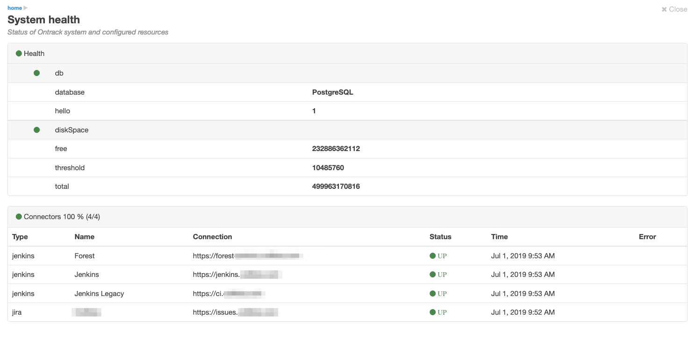

[[admin-status]]
=== Status page

The stage page is available to the <<security,_Administrators_>> only
and is accessed through the user menu.

It displays two sections:

* the health of Ontrack itself, based on https://docs.spring.io/spring-boot/docs/{spring-boot-version}/reference/htmlsingle/#production-ready-health[Spring Boot health information]
* the statuses of all the <<integration-management,connectors>>

For example:

[NOTE]
====
This information is also available through several end points:

* `/admin/status` - health + connectors
* `/manage/health` - health only (regular Spring Boot health end point)
* `/manage/connectors` - connectors only - <<integration-management,extra management end point>> provided by Ontrack
====
