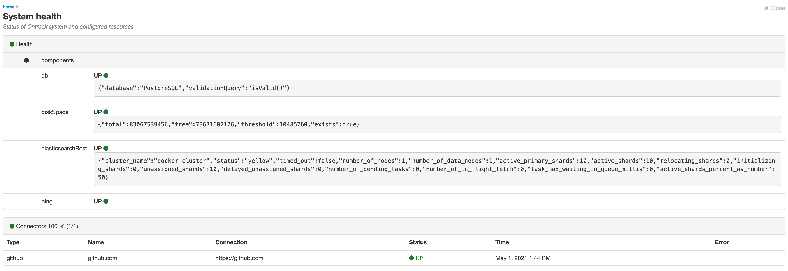

[[administration-management]]
=== Management end points

The overall health of the Ontrack system can be accessed in the user menu under _System health_:

* it displays the status of the components Ontrack needs to work properly
* and all the connections that Ontrack holds for projects

[[administration-management-rest]]
==== REST info

The `/rest/info` REST end point returns basic information:

[source,json]
----
{
  "_self": "/rest/info/",
  "version": {
    "date": "2021-04-29T11:15:20.271757Z",
    "display": "4.0-beta.28",
    "full": "release-4.0-beta-0062120",
    "branch": "release-4.0-beta",
    "build": "0062120",
    "commit": "006212063f9ad62bb52cb24f675f2fafeb83d12b",
    "source": "release/4.0-beta",
    "sourceType": "release"
  },
  "extensionList": {
    "extensions": [
      {
        "id": "oidc",
        "name": "OIDC",
        "description": "Support for OIDC authentication",
        "version": "4.0-beta.28",
        "options": {
          "gui": true,
          "dependencies": [
            "casc"
          ]
        }
      }
    ]
  }
}
----

[[administration-management-actuator]]
==== Actuator end points

Ontrack exposes Spring Boot actuator end points:

* over HTTP (JMX is disabled)
* port `8800`
* on `/manage` context path

[NOTE]
====
The management port can be configured using the default `management.server.port` system property or `MANAGEMENT_SERVER_PORT` environment variable.
====

[CAUTION]
====
The management end points authentication is disabled by default in Ontrack, so make sure the chosen port (`8800` by default) is not exposed unnecessarily or enable authentication.

Check the Spring Boot documentation for more information.
====

The following end points are exposed by default:

* `/manage/health` - health of Ontrack and its components
* `/manage/info` - basic information about the Ontrack instance
* `/manage/prometheus` - exposes environment metrics for being consumed by Prometheus

Additionally, custom management end points are available:

* `/manage/influxdb` - if <<integration-influxdb,InfluxDB integration>> is enabled. The `GET` method returns the status of the connection between Ontrack and InfluxDB, and the `POST` method forces a reconnection. See <<monitoring-metrics-influxdb-management>> for more information.
* `/manage/connectors` - the connectors are used to connect to external systems like Jenkins, JIRA, Git repositories, etc. The `manage/connectors` end point allows an <<security,administrator>> to get information about the state of those connectors.
