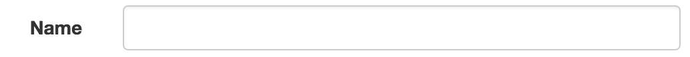
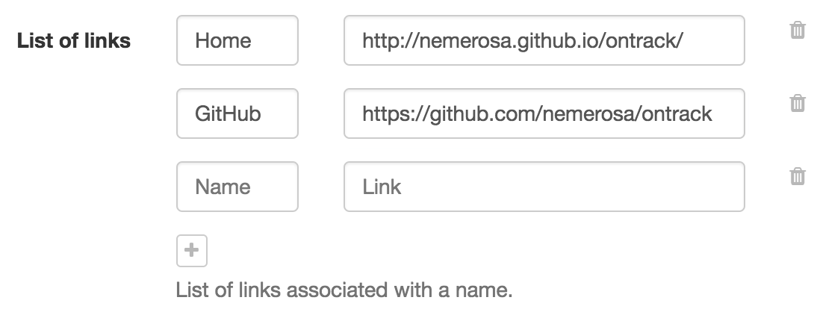

[[architecture-ui-forms-fields-common]]
====== Common field properties

|===
| Property | Method | Default value | Description
| `name` | `of(...)` | _required_ | Mapping
| `label` | `label(...)` |  _none_ | Display name
| `required` | `optional()` | `true` | Is the input required?
| `readOnly` | `readOnly()` | `false` | Is the input read-only?
| `validation` | `validation(...)`| _none_ | Message to display is the field content is deemed invalid
| `help` | `help(...)` | _none_ | Help message to display for the field (see below for
  special syntax)
| `visibleIf` | `visibleIf(...)` |  _none_ | Expression which defines if the field is displayed or
  not - see below for a detailed explanation
| `value` | `value(...)` | _none_ | Value to associated with the field
|===

[[architecture-ui-forms-fields-help]]
====== `help` property

TODO

[[architecture-ui-forms-fields-visibleIf]]
====== `visibleIf` property

TODO

[[architecture-ui-forms-fields-text]]
====== `text` field

The `text` field is a single line text entry field, mapped to the HTML
`<input type="test"/>` form field.

|===
| Property | Method | Default value | Description

| `length` | `length(...)` | `300` | Maximum length for the text
| `regex` | `regex(...)` | `.*` | The text must comply with this regex in order to be valid
|===

Example:

[source,java]
----
Form.create()
   .with(
      Text.of("name")
         .label("Name")
         .length(40)
         .regex("[A-Za-z0-9_\\.\\-]+")
         .validation("Name is required and must contain only alpha-numeric characters, underscores, points or dashes.")
   )
----

[[architecture-ui-forms-fields-password]]
====== `password` field

TODO

[[architecture-ui-forms-fields-memo]]
====== `memo` field

TODO

[[architecture-ui-forms-fields-email]]
====== `email` field

TODO

[[architecture-ui-forms-fields-url]]
====== `url` field

TODO

[[architecture-ui-forms-fields-named-entries]]
====== `namedEntries` field

Multiple list of name/value fields:

The user can:

* add / remove entries in the list
* set a name and a value for each item
* the name might be optional - the value is not

|===
| Property | Method | Default value | Description

| `nameLabel` | `nameLabel(...)` | "Name" | Label for the "name" input part of an entry.
| `valueLabel` | `valueLabel(...)` | "Value" | Label for the "value" input part of an entry.
| `nameRequired` | `nameOptional()` | `true` | If the name part is required.
| `addText` | `addText(...)` | "Add an entry" | Label for the "add" button.
|===

Example:

[source,java]
----
Form.create()
   .with(
      NamedEntries.of("links")
         .label("List of links")
         .nameLabel("Name")
         .valueLabel("Link")
         .nameOptional()
         .addText("Add a link")
         .help("List of links associated with a name.")
         .value(value != null ? value.getLinks() : Collections.emptyList())
   )
----

[[architecture-ui-forms-fields-date]]
====== `date` field

TODO

[[architecture-ui-forms-fields-yes-no]]
====== `yesno` field

TODO

[[architecture-ui-forms-fields-date-time]]
====== `dateTime` field

TODO

[[architecture-ui-forms-fields-int]]
====== `int` field

TODO

[[architecture-ui-forms-fields-selection]]
====== `selection` field

TODO

[[architecture-ui-forms-fields-multi-strings]]
====== `multi-strings` field

TODO

[[architecture-ui-forms-fields-multi-selection]]
====== `multi-selection` field

TODO

[[architecture-ui-forms-fields-multi-form]]
====== `multi-form` field

TODO

[[architecture-ui-forms-fields-custom]]
====== Creating your custom fields

TODO
