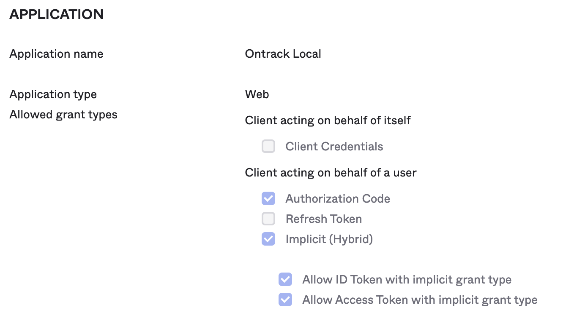
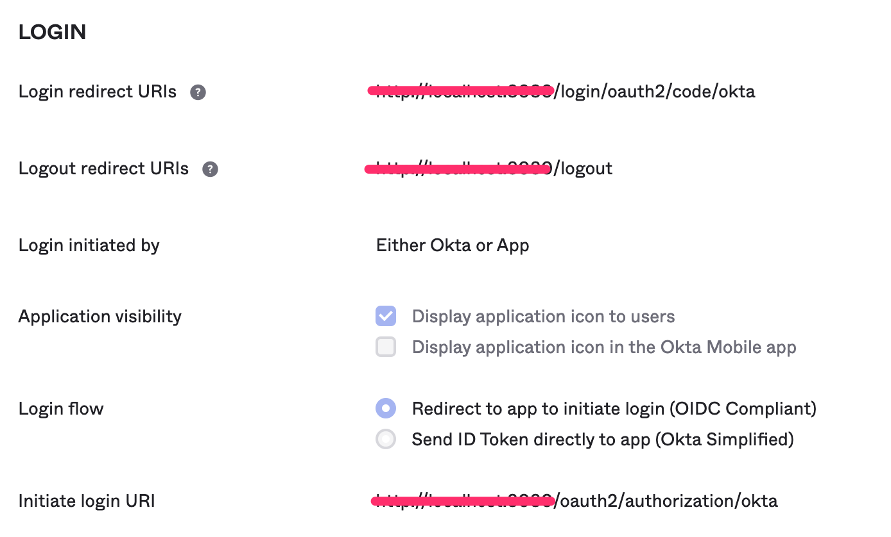
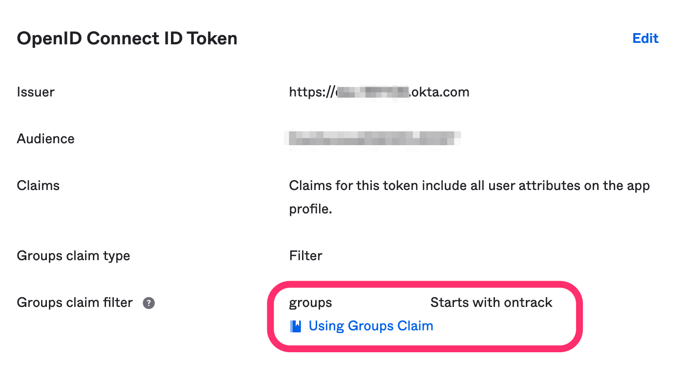
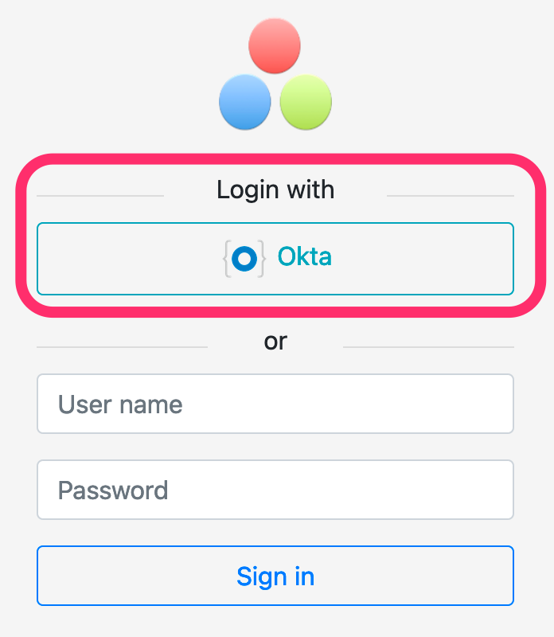

[[authentication-okta]]
==== Okta setup

In Okta, an Ontrack application must be configured with the following parameters:

* application type: `Web`
* Allowed grant types:
** Client acting on behalf of a user:
*** Authorization code `ON`
*** Implicit (hyprid)
**** Allow ID Token with implicit grant type `ON`
**** Allow Access Token with implicit grant type `ON`

* Login redirect URIs: `<ontrack url>/login/oauth2/code/okta`
* Logout redirect URIs: `<ontrack url>/logout`
* Login initiated by: `Either Okta or App`
* Application visibility:
** Display application icon to users `ON`
* Login flow:
** Redirect to app to initiate login (OIDC Compliant) `ON`
* Initiate login URI: `<ontrack url>/oauth2/authorization/okta`

If you want to use Okta groups in the group mappings in Ontrack, go to _Sign On_ section of the application and make sure to select a list of groups (using a filter):

In this example, we select all groups whose name starts with `ontrack`.

On the Ontrack side, as an administrator:

* navigate to the _OIDC providers_ menu
* click on "Create provider"
* add the following information:
** ID: unique ID for your provider, typically `okta`
** Name: a display name, which will be used on the login page
** Description: used as a tooltip on the login page
** Issuer ID: `https://<okta domain>.okta.com/oauth2/default`
** Client ID of the application in Ontrack
** Client secret of the application in Ontrack
** Group filter: regular expression to filter the group list sent by Okta in the `groups` claim

In the OIDC provider list, you can optionally set a picture for this configuration. This picture will be used on the login page. For example:

When the users click on the button, they will be redirected to Okta for authentication.

Upon a first connection, an account will be created automatically on Ontrack, based on the information returned by Okta.
