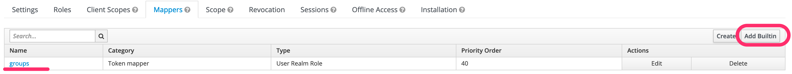
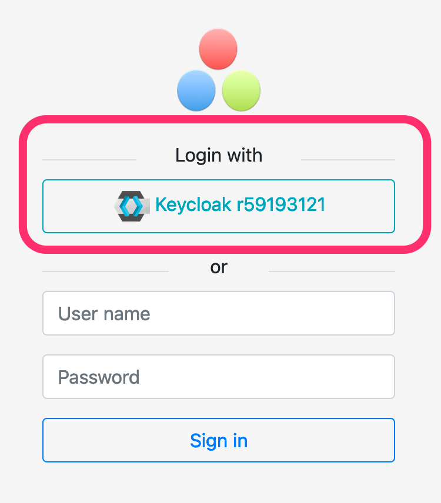

[[authentication-openid]]
=== OpenID authentication

Ontrack supports https://openid.net[OpenId] identify providers for authentication and group permissions.

Ontrack has been tested with <<authentication-keycloak,Keycloak>> and <<authentication-okta,Okta>>.

[[authentication-keycloak]]
==== Keycloak setup

NOTE: Ontrack has been tested with https://www.keycloak.org/[Keycloak] 12.0.4.

Given a Keycloak realm, the Ontrack client can be configured this way:

* client protocol: `openid-connect`
* valid redirect URLs: `<ontrack url>/*`
* base URL: `<ontrack url>/login/oauth2/code/<keycloak realm>`
* web origins: `<ontrack url>`

If you want to use Keycloak for group mappings in Ontrack, go to _Mappers_ and add the built-in "groups" mapper:

On the Ontrack side, as an administrator:

* navigate to the _OIDC providers_ menu
* click on "Create provider"
* add the following information:
** ID: unique ID for your provider. It must be aligned with the name of the Keycloak realm (see Keycloak configuration above)
** Name: a display name, which will be used on the login page
** Description: used as a tooltip on the login page
** Issuer ID: `<keycloak url>/auth/realms/<keycloak realm>`
** Client ID: ID of the client in Keycloak
** Client secret: can be left blank for Keycloak
** Group filter: regular expression to filter the group list sent by Keycloak in the `groups` claim

In the OIDC provider list, you can optionally set a picture for this configuration. This picture will be used on the login page. For example:

When the users click on the button, they will be redirected to Keycloak for authentication.

Upon a first connection, an account will be created automatically on Ontrack, based on the information returned by Keycloak.

[[authentication-okta]]
==== Okta setup
