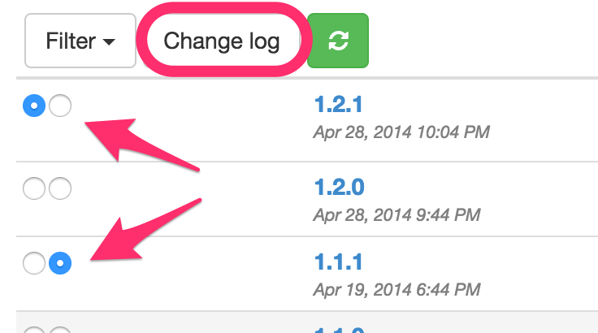
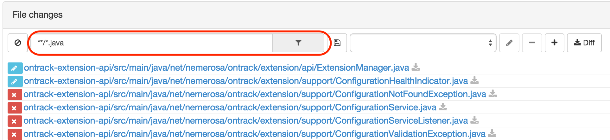
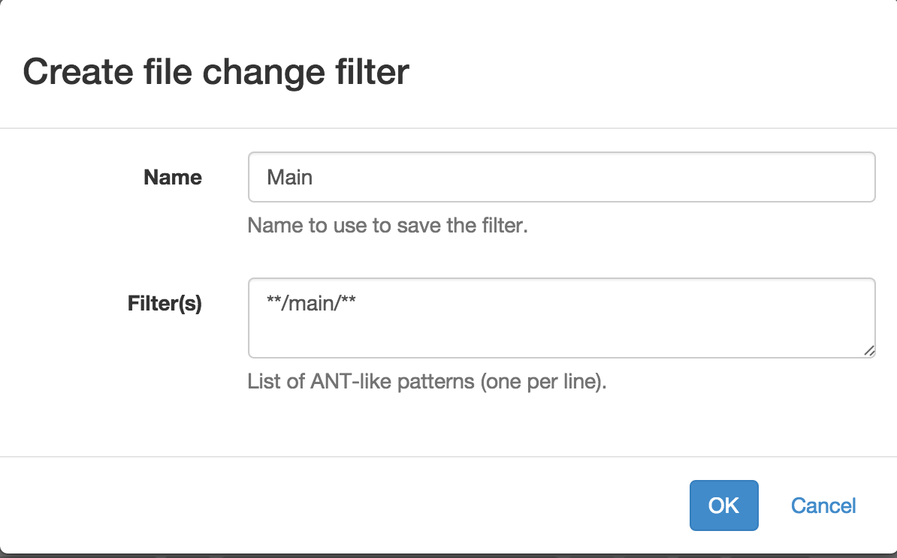
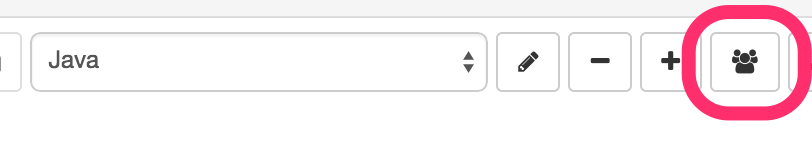
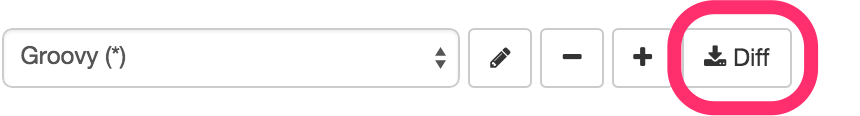

[[changelogs]]
=== Change logs

When working with <<usage-git,Git>> or <<usage-subversion,Subversion>>, you
have the opportunity to get a change log between two <<usage-builds,builds>> of
the same project.

[[changelogs-selection]]
==== Selection

In the <<usage-branches,branch view>>, you can select the two boundaries
of the change log by:

* clicking on a build row
* clicking while holding the `shift` key on another build row

Two arrows indicate the current selection:

TIP: Note that by default the first and the last build of the current view
are selected as boundaries.

The _Change log_ button displays the change log page, which contains four
sections:

* general information about the two build boundaries
* the commits (for Git) or revision (for Subversion) section
* the issues section
* the file changes selection

Only the first section (build information) is always displayed - the three
other ones are displayed only when you request them by clicking on one of the
corresponding buttons or links.

Note that the issue section is available only if the corresponding SCM
configuration (Git or Subversion) is associated with an issue server (like
<<usage-jira,JIRA>> or <<usage-github,GitHub>>).

[[changelogs-commits]]
==== Commits/revisions

This section displays the changes between the two build boundaries. For Git,
the associated commit graph is also displayed:

image::images/changelog.commits.png[Git commits,600]

[[changelogs-issues]]
==== Issues

The list of issues associated with the commits between the two build boundaries
is displayed here:

image::images/changelog.issues.png[Issues]

[[changelogs-files]]
## File changes

The list of file changes between the two build boundaries is displayed here:

image::images/changelog.files.png[Change log files,600]

Each file change is associated with the corresponding changes. This includes
the list of revisions for Subversion.

Additionally, you can define filters on the file changes, in order to have
access to a list of files impacted by the change log.

By entering a ANT-like pattern, you can display the file paths which match:

For more complex selections, you can clock on the _Edit_ button and you'll
have a dialog box which allows you to define:

* a name for your filter
* a list of ANT-like patterns to match

If you are authorized, you can also save this filter for the project, allowing
its selection by all users.

In the list of filters, you find the filters you have defined and the ones
which have been shared for the whole project. The latter ones are marked with
an asterisk (*):

image::images/changelog.files.filtershared.png[Change log files filter shared,400]

You can update and delete filters. Note that the shared filters won't be
actually updated or deleted, unless you are authorized.

Finally, you can get the unified diff for the selected filter by clicking on
the _Diff_ button:

This will display a dialog with:

* the unified diff you can copy
* a permalink which allows you download the diff from another source

You can obtain a quick diff on one file by clicking on the icon at the right
of a file in the change log:

image::images/changelog.files.quickdiff.png[Quick diff on file,600]
