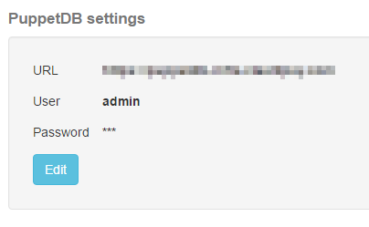
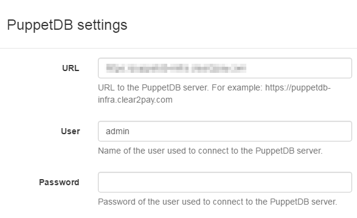

[[extending-settings]]
==== Extending the settings

An <<extending, extension>> can add a entry in the list of global settings.

Start by creating an invariant class which contains the data to manage in
the new settings.

TIP: in the sample below, we use some PuppetDB connection settings, which
     need a URL, a user name and a password.

[source,java]
----
@Data
public class PuppetDBSettings {
    private final String url;
    private final String username;
    private final String password;
}
----

The settings are managed in Ontrack by two distinct services:

* a manager - responsible for the edition of the settings
* a provider - responsible for retrieving the settings

NOTE: as-of today, the service cannot be the same class.

To define the manager, extend the `AbstractSettingsManager` class and use your settings class as a parameter:

[source,java]
----
@Component
public class PuppetDBSettingsManager extends AbstractSettingsManager<PuppetDBSettings> {

    private final SettingsRepository settingsRepository;
    private final EncryptionService encryptionService;

    @Autowired
    public PuppetDBSettingsManager(CachedSettingsService cachedSettingsService, SecurityService securityService, SettingsRepository settingsRepository, EncryptionService encryptionService) {
        super(PuppetDBSettings.class, cachedSettingsService, securityService);
        this.settingsRepository = settingsRepository;
        this.encryptionService = encryptionService;
    }

    @Override
    protected void doSaveSettings(PuppetDBSettings settings) {
        settingsRepository.setString(PuppetDBSettings.class, "url", settings.getUrl());
        settingsRepository.setString(PuppetDBSettings.class, "username", settings.getUsername());
        settingsRepository.setPassword(PuppetDBSettings.class, "password", settings.getPassword(), false, encryptionService::encrypt);
    }

    @Override
    protected Form getSettingsForm(PuppetDBSettings settings) {
        return Form.create()
                .with(
                        Text.of("url")
                                .label("URL")
                                .help("URL to the PuppetDB server. For example: http://puppetdb")
                                .value(settings.getUrl())
                )
                .with(
                        Text.of("username")
                                .label("User")
                                .help("Name of the user used to connect to the PuppetDB server.")
                                .optional()
                                .value(settings.getUsername())
                )
                .with(
                        Password.of("password")
                                .label("Password")
                                .help("Password of the user used to connect to the PuppetDB server.")
                                .optional()
                                .value("") // Password never sent to the client
                );
    }

    @Override
    public String getId() {
        return "puppetdb";
    }

    @Override
    public String getTitle() {
        return "PuppetDB settings";
    }
}
----

To define the provided, implement the `AbstractSettingsManager` and use your settings class as a parameter:

[source,java]
----
@Component
public class PuppetDBSettingsProvider implements SettingsProvider<PuppetDBSettings> {

    private final SettingsRepository settingsRepository;
    private final EncryptionService encryptionService;

    @Autowired
    public PuppetDBSettingsProvider(SettingsRepository settingsRepository, EncryptionService encryptionService) {
        this.settingsRepository = settingsRepository;
        this.encryptionService = encryptionService;
    }

    @Override
    public PuppetDBSettings getSettings() {
        return new PuppetDBSettings(
                settingsRepository.getString(PuppetDBSettings.class, "url", ""),
                settingsRepository.getString(PuppetDBSettings.class, "username", ""),
                settingsRepository.getPassword(PuppetDBSettings.class, "password", "", encryptionService::decrypt)
        );
    }

    @Override
    public Class<PuppetDBSettings> getSettingsClass() {
        return PuppetDBSettings.class;
    }
}
----

That's all there is to do. Now, the new settings will automatically appear in the _Settings_ page:

and can be edited using the form defined above:

