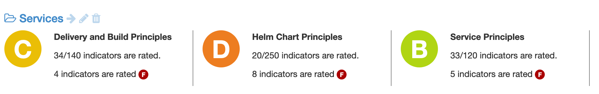

[[extension-indicators]]
=== Project indicators

Project indicators are set at <<model,project>> level to hold values about different
_types_ of information.

Those types of information are grouped into _categories_ and can have a specific _value
type_, like a boolean (yes/no), a percentage, a numeric value, etc. Types can be entered
manually, imported or computed.

Every of those indicator values have a level of _compliance_ which computed as a
percentage (from 0% - very bad - to 100% - very good) according to the configuration
of the type. The compliance is also associated with a rating, from `F` (very bad) to
`A` (very good).

The indicator values can be entered manually at project level or be computed.

Projects can be grouped together in _portfolios_ which are also associated with
a subset of categories. And a global view of all portfolios is associated with a
specific subset of categories.

Finally, the history of indicators is retained by Ontrack and can be used to compute
trends at the different levels (at project level, at portfolio level or globally).

[[extension-indicators-acl]]
==== Indicators authorization model

Having access to a project grants automatically access to viewing the associated indicators.

However, managing indicators, types & portfolios is granted according to the following matrix:

|===
| Function | Administrator | Global indicator manager | Global indicator portfolio manager | Project manager/owner | Project indicator manager |

| Global indicators | Yes | Yes | No | No | No |

| Type and category management (1) | Yes | Yes | No | No | No |

| Portfolio management | Yes | Yes | Yes | No | No |

| Indicator edition (2) | Yes | Yes | No | Yes | Yes |
|===

(1) Imported types & categories are not open to edition.
(2) Computed indicators are not open to manual edition.

[[extension-indicators-types]]
==== Indicator types management

Categories & types can be managed manually by an authorized used using the following user menus:

* _Indicator categories_
* _Indicator types_

A _category_ must have the following attributes:

* _id_ - unique ID for this category among all the categories
* _name_ - display name for this category

A _type_ must have the following attributes:

* _id_ - unique ID for this type among all the type
* _name_ - display name for this type
* _link_ - optional URL for more information about this type
* _value type_ - type of indicator value this type. For example, a percentage or a boolean
* _value config_ - configuration for the _value type_, used to compute the indicator compliance and rating

Categories and types can also be <<extension-indicators-import,imported>> or
<<extension-indicators-computing,computed>>. In such a case, both the category and the type
are associated with a _source_ and they cannot be edited.

[[extension-indicators-value-types]]
===== Value types

The following value types are available in Ontrack:

|===
| Type | Description | Configuration | Example

| Yes/No
| Value which can be either _Yes_ (`true`) or _No_ (`false`)
| `required` - flag to indicate if the indicator _must_ be _Yes_ in order
  for the project to be fully compliant. If `required` is `false`, the rating will
  be `A` is the value is set to _Yes_  and `D` if the value is _No_. For a
  _No_ value on a _required_ indicator, the rating would be `F`.
| "Project should be build with Gradle" - because of the "should", the indicator
  _required_ value is set to `false`.

| Percentage
| Integer value between `0` and `100` inclusive
| `threshold` - pivot value (see example)

  `higherIsBetter` - a higher percentage in the value of the indicator indicates
  a better quality (see example)
| "Test coverage" is expressed as a percentage and `higherIsBetter` will be
  set to `true`. If `threshold` is set to 80:

  * any value >= 80% has a rating of `A`
  * for values below 80%, the rating is computed proportionally, with 0% having
    a rating of `F`

  "Duplicated code" can also be expressed as a percentage, but this time
  with `higherIsBetter` being set to `false`. If `threshold` is set to 10:

  * any value <= 10% has a rating of `A`
  * for values above 10%, the rating is computed proportionally, with 100% having
    a rating of `F`

| Number
| Integer value >= 0
| `min` - pivot value (see example)

  `max` - secondary pivot value (see example)

  `higherIsBetter` - a higher value of the indicator indicates
  a better quality (see example)
| "Number of blocking issues" is expressed as a number with `higherIsBetter`
  being set to `false`. If `min` is 0 and `max` is 10:

* any value set to 0 has a rating of `A`
* any value >= 10 has a rating of `F`
* for any value in between, the rating is computed proportionally

A "Number of tests" could be expressed as a number with `higherIsBetter`
being set to `true`. If `min` is 100 and `max` is 1000:

* any value <= 100 has a rating of `F`
* any value >= 1000 has a rating of `A`
* for any value in between, the rating is computed proportionally
|===

[NOTE]
====
Additional value types can be created by registering an <<extending,extension>>
implementing the `IndicatorValueType` interface. See existing value types
for examples.
====

[[extension-indicators-projects]]
==== Indicator edition

An authorized user can edit the indicator for a project by going to the _Tools_ menu
and select _Project indicators_.

All available types are displayed, grouped by categories, and each indicator value is shown
together with its value, its rating. Note that selecting a time range allows to compute
and display the trend for each indicator.

If the indicator is open to edition, the user can click on the pencil icon to edit the
value according to the value type. Upon validation, a _new_ indicator value is stored ; the
old value is kept for history and trend computation.

An authorized user can also _delete_ the indicator ; this actually register a new _null_
value for the indicator. The historical values are kept.

[[extension-indicators-portfolios]]
==== Indicator portfolios

Portfolios are available in the _Indicator portfolios_ user menu and the
associated page displays the list of already created portfolios.

[[extension-indicators-import]]
==== Importing categories and types

TODO

[[extension-indicators-computing]]
==== Computing indicators

TODO

