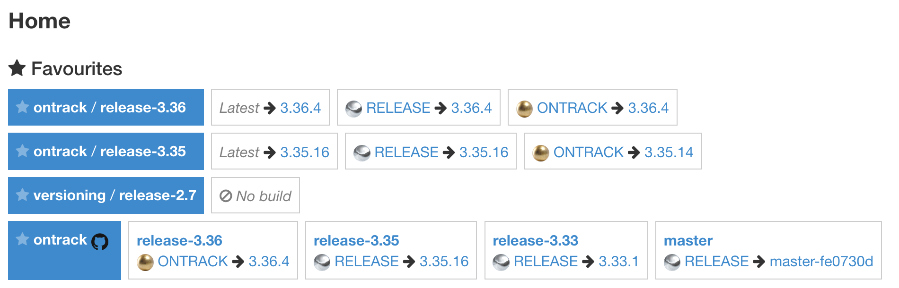
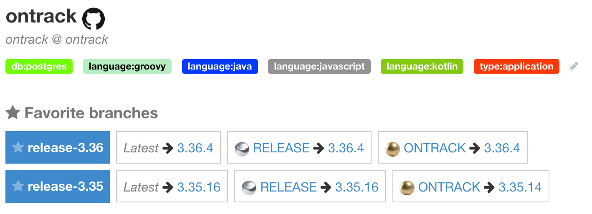
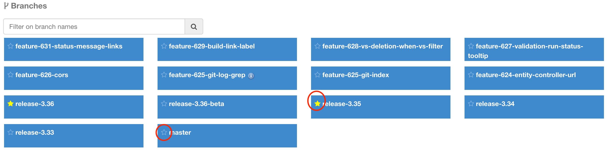

[[branches-favorites]]
==== Branch favorites

Instead of selectioning a <<projects-favorites,project as a favorite>>,
one might find more convenient to select branches only.

This reduces the clutter on the home page when projects tend
to have a lot of branches.

All favorite branches do appear on the home page, together with any
<<projects-favorites,favorite project>>:

The favorite branches of a given project do also appear on the project page:

In both cases, following information is displayed:

* latest build
* latest build per promotion

[NOTE]
====
Branches can be unselected as favorite using the star left of their name.
====

In order to select a branch as favorite, use the little star left of
its name in the branch list in the project page:

[NOTE]
====
You can use this star to unselect it as well. When selected, the star
is marked as yellow.
====
