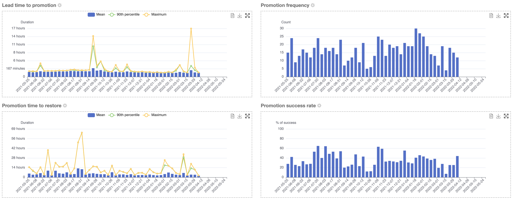
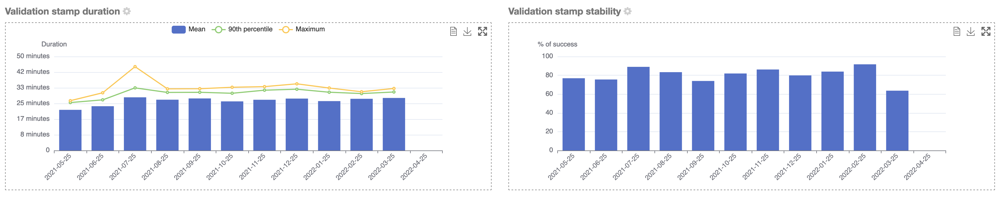

[[delivery-metrics]]
=== Delivery metrics

One of the core features of Ontrack is the assignment of <<model,promotion levels>> to some builds, either explicitly from the CI or through <<promotion-levels-auto-promotion,auto promotion>>.

_Delivery metrics_ are about measuring the performance and stability of these promotions on four different axes:

* _lead time to promotion_ - how long does it take from the moment a <<model,build>> is created to the moment it is promoted to a given level? This gives an indication on the performance of your delivery.

* _frequency_ - how many promotions do you get over a given period of time? This gives an absolute indicator about how often your delivery process performs.

* _success rate_ - what is the percentage of builds reaching a given promotion level? While 100% is not a goal (because of the very nature of a delivery pipeline, where failure is expected when finding actual issues), high values indicate a high stability of your delivery process.

* _time to restore_ - given a build which is _not_ promoted, how long does it take to restore this promotion? The time it takes to _fix_ an issue is a strong indicator of the resilience of your delivery process.

These metrics are valid for:

* one project
* one branch
* one promotion level

Additionally, Ontrack distinguishes between:

* single project metrics - where we measure the performance of a promotion level within the same project
* end-to-end project metrics - where we measure the performance of a promotion level _across_ several projects, by following the <<builds-links,build links>>. Single project metrics are a special case of end-to-end project metrics.

[[delivery-metrics-single-project]]
==== Single project delivery metrics

Navigate to any promotion level. Four charts are displayed, one for each of the axes:

* lead time, with mean, 90th percentile & maximum
* frequency, count of promotions over the selected period
* success rate
* time to restore, with mean, 90th percentile & maximum

For each chart, you can:

* visualize the data
* export the chart as an image
* put the chart fullscreen

You can select the interval and the period (cog icon next to the chart title). These settings are valid for all the charts for all the promotions.

Additionally, you also have two charts a validation stamp level:

* how long lasts the validation?
* how stable it is?

[NOTE]
====
For API access to the single project delivery metrics, consider using the exported <<delivery-metrics-e2e>>.
====

[[delivery-metrics-e2e]]
==== End-to-end project delivery metrics