[[feature-indicators]]
=== Project indicators

Project indicators are set at <<model,project>> level to hold values about different _types_ of information.

image::images/extension-indicators-portfolio-overview.png[Portfolio overview]

Those types of information are grouped into _categories_ and can have a specific _value type_, like a boolean (yes/no), a percentage, a numeric value, etc. Types can be entered manually, imported or computed.

Every of those indicator values have a level of _compliance_ which computed as a percentage (from 0% - very bad - to 100% - very good) according to the configuration of the type. The compliance is also associated with a rating, from `F` (very bad) to `A` (very good).

The indicator values can be entered manually at project level or be computed.

Projects can be grouped together in _portfolios_ which are also associated with a subset of categories. And a global view of all portfolios is associated with a specific subset of categories.

Finally, the history of indicators is retained by Ontrack and can be used to compute trends at the different levels (at project level, at portfolio level or globally).

Indicators functions can be accessed either by:

* the _Indicators_ menu for the <<feature-indicators-acl,managers>>, leading to a page listing all the different options
* the _Indicator portfolios_ menu for the non managers, leading the list of existing <<feature-indicators-portfolios,portfolios>>

[[feature-indicators-acl]]
==== Indicators authorization model

Having access to a project grants automatically access to viewing the associated indicators.

However, managing indicators, types & portfolios is granted according to the following matrix:

|===
| Function | Administrator | Global indicator manager | Global indicator portfolio manager | Project manager/owner | Project indicator manager |

| Global indicators | Yes | Yes | No | No | No |

| Type and category management (1) | Yes | Yes | No | No | No |

| <<feature-indicators-view,View management>> | Yes | Yes | No | No | No |

| Portfolio management | Yes | Yes | Yes | No | No |

| Indicator edition (2) | Yes | Yes | No | Yes | Yes |
|===

(1) Imported types & categories are not open to edition.
(2) Computed indicators are not open to manual edition.

[[feature-indicators-types]]
==== Indicator types management

Categories & types can be managed manually by an authorized using the following user menus:

* _Indicators > Categories_
* _Indicators > Types_

A _category_ must have the following attributes:

* _id_ - unique ID for this category among all the categories
* _name_ - display name for this category

A _type_ must have the following attributes:

* _id_ - unique ID for this type among all the type
* _name_ - display name for this type
* _link_ - optional URL for more information about this type
* _value type_ - type of indicator value this type. For example, a percentage or a boolean
* _value config_ - configuration for the _value type_, used to compute the indicator compliance and rating

Categories and types can also be <<feature-indicators-import,imported>> or<<feature-indicators-computing,computed>>. In such a case, both the category and the type are associated with a _source_ and they cannot be edited.

[[feature-indicators-value-types]]
===== Value types

The following value types are available in Ontrack:

|===
| Type | Description | Configuration | Example

| Yes/No
| Value which can be either _Yes_ (`true`) or _No_ (`false`)
| `required` - flag to indicate if the indicator _must_ be _Yes_ in order
  for the project to be fully compliant. If `required` is `false`, the rating willbe `A` is the value is set to _Yes_  and `D` if the value is _No_. For a_No_ value on a _required_ indicator, the rating would be `F`.
| "Project should be build with Gradle" - because of the "should", the indicator_required_ value is set to `false`.

| Percentage
| Integer value between `0` and `100` inclusive
| `threshold` - pivot value (see example)

  `higherIsBetter` - a higher percentage in the value of the indicator indicates
  a better quality (see example)
| "Test coverage" is expressed as a percentage and `higherIsBetter` will be
  set to `true`. If `threshold` is set to 80:

  * any value >= 80% has a rating of `A`
  * for values below 80%, the rating is computed proportionally, with 0% having
    a rating of `F`

  "Duplicated code" can also be expressed as a percentage, but this time
  with `higherIsBetter` being set to `false`. If `threshold` is set to 10:

  * any value <= 10% has a rating of `A`
  * for values above 10%, the rating is computed proportionally, with 100% having
    a rating of `F`

| Number
| Integer value >= 0
| `min` - pivot value (see example)

  `max` - secondary pivot value (see example)

  `higherIsBetter` - a higher value of the indicator indicates
  a better quality (see example)
| "Number of blocking issues" is expressed as a number with `higherIsBetter`
  being set to `false`. If `min` is 0 and `max` is 10:

* any value set to 0 has a rating of `A`
* any value >= 10 has a rating of `F`
* for any value in between, the rating is computed proportionally

A "Number of tests" could be expressed as a number with `higherIsBetter`
being set to `true`. If `min` is 100 and `max` is 1000:

* any value <= 100 has a rating of `F`
* any value >= 1000 has a rating of `A`
* for any value in between, the rating is computed proportionally
|===

[NOTE]
====
Additional value types can be created by registering an <<extending,extension>>implementing the `IndicatorValueType` interface. See existing value types for examples.
====

[[feature-indicators-projects]]
==== Indicator edition

An authorized user can edit the indicator for a project by going to the _Tools_ menu and select _Project indicators_:

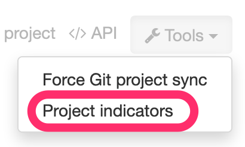

All available types are displayed, grouped by categories, and each indicator value is shown together with its value, its rating:

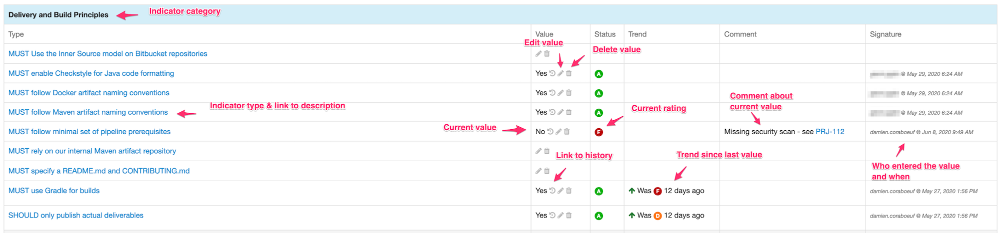

If the indicator has a previous value, its previous rating is displayed.

If the indicator is open to edition, the user can click on the pencil icon to edit the value according to the value type. Upon validation, a _new_ indicator value is stored ; the old value is kept for history and trend computation.

Comments can be associated with an indicator values. Links & issue references will be rendered as links.

An authorized user can also _delete_ the indicator ; this actually register a new _null_ value for the indicator. The historical values are kept.

The history of an indicator can be accessed by clicking on the _History_ icon:

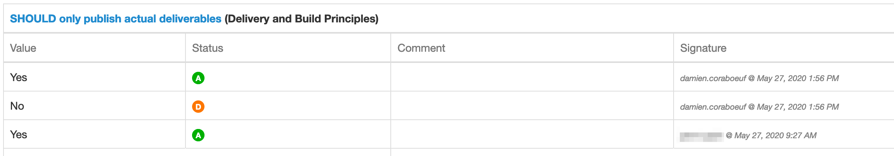

The list of <<feature-indicators-portfolios,portfolios>> the project belongs to is displayed at the top of the indicator list:

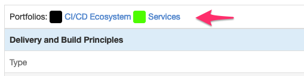

[[feature-indicators-portfolios]]
==== Indicator portfolios

Portfolios are available in the _Indicator portfolios_ user menu (or _Indicators > Portfolios_ for the managers) and the associated page displays the list of already created portfolios.

In this list, each portfolio is associated with the list of categories for the current <<feature-indicators-view,view>> and each of these categories is associated with the average rating for all the projects and all the types of this category.

image::images/extension-indicators-portfolio-overview.png[Portfolio overview]

NOTE: Only indicators having an actual value are used to compute the average rating. The indicators which are not set are not used for the computation and the ratio "number of indicators being set" to the"number of total indicators" is also displayed. This gives an idea about the trust we can have in this average rating.

NOTE: The minimum ratings are also mentioned if they diverge from the average.

The trend period allows to display the average value from the past, and to compare it with the current value.

[[feature-indicators-portfolios-management]]
===== Management of portfolios

<<feature-indicators-acl,Authorized users>> can create, edit and delete portfolios.

Creating a portfolio is done using the _Create portfolio_ command:

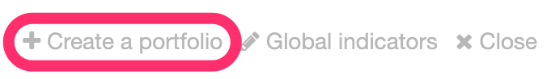

The portfolio creation dialog requires:

* an ID - must be unique amont all the portfolios and will be used as an
  identifier. It must therefore comply with the following regular expression:
  `[a-z0-9:-]+` (lowercase letters, digits, `:` colon or `-` dashes). The ID
  cannot be modified later on.
* a display name

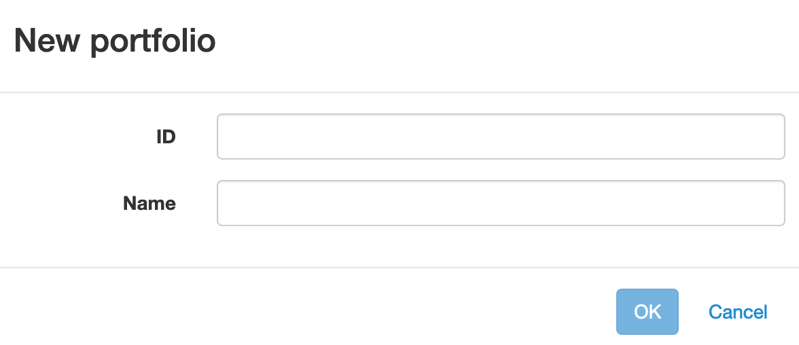

Once created, the portfolio appears on the portfolio overview and can be edited or deleted using the appropriate icons:

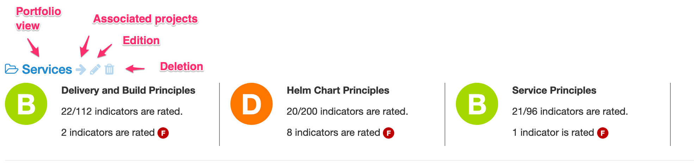

* the portfolio name is actually a link going to the detailed <<feature-indicators-portfolios-view,portfolio view>>
* the arrow icon goes to the home page and displays only the projects associated to this portfolio
* the edition icon goes to the <<feature-indicators-portfolios-edition,portfolio edition page>>
* the deletion icon displays a warning and allows the user to delete the portfolio.

NOTE: The deletion of a portfolio _does not_ delete any indicator in any project.

[[feature-indicators-portfolios-view]]
===== Portfolio page

By clicking on the portfolio name in the portfolio overview, you get to a page displaying:

* the list of projects associated with this portfolio
* the list of categories associated with this portfolio
* the average indicator rating for project and for each category

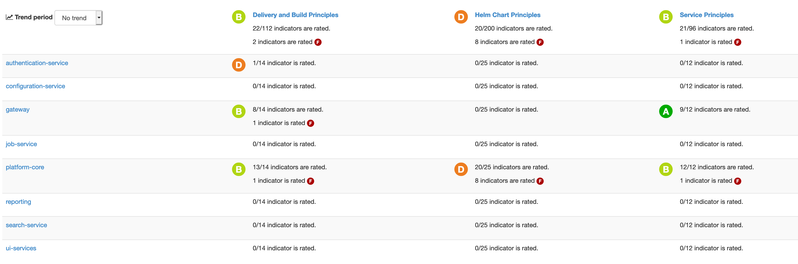

NOTE: As for the portfolio overview, the average rating is computed only using the indicators which are actually set, and the ratio filled vs. total is displayed.

NOTE: You can also select a <<feature-indicators-view,view>> to change the selected categories.

The trend period selector allows you to check the past average values and the associated trends.

Clicking on a project name goes to the <<feature-indicators-projects,project indicators page>>.

Clicking on a category name goes to a page displaying a detailed view of indicators for all the types in this category and for all the projects of this portfolio:

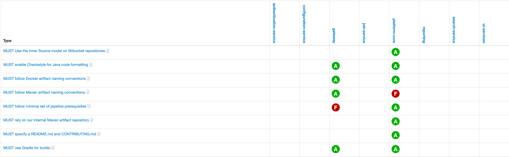

In this view, clicking on the icon right to the type name will bring up a page displaying the indicator values for this type for all the projects of this portfolio:

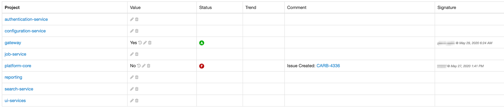

According to your rights, you can edit and delete indicator values from this page.

[[feature-indicators-portfolios-edition]]
===== Portfolio edition

The portfolio edition page allows you to:

* edit the portfolio display name (not the ID)
* set a label to select the associated projects
* select the categories associated with this portfolio

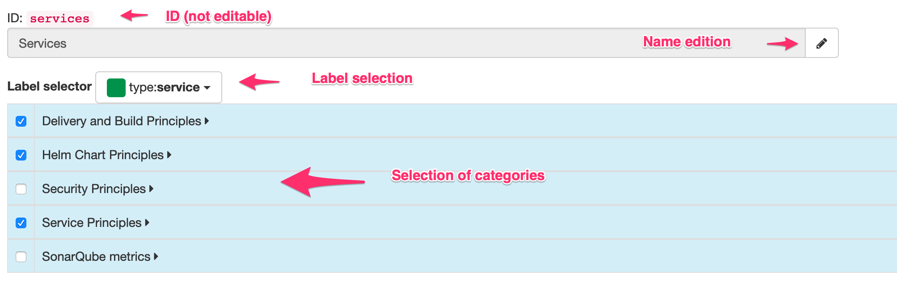

The label allows a portfolio to be associated to all projects which have this label. See <<projects-labels>> for more information on how to manage labels.

[NOTE]
====
<<feature-indicators-acl,"Global indicator portfolio managers">> and<<feature-indicators-acl,"Global indicator managers">> can associate existing labels to projects but cannot create new labels.
====

[[feature-indicators-view]]
==== Indicator views

Indicator views group categories together under a common name. These views can be used in the following pages to restrict the categories which are shown:

* overview of all portfolios
* portfolio page
* project indicators

The list of views can be <<feature-indicators-acl,edited>> by administrators and global indicator managers, using the _Indicators > Views_ menu.

In the view management page, the user can:

* create new views
* edit the list of categories for an existing view
* delete existing views

[[feature-indicators-import]]
==== Importing categories and types

While indicator categories and types can be <<feature-indicators-types,entered manually>>, it is also possible to import lists of categories and their associated types.

****
In a company, a number of "principles" have been created for projects to comply with. They have been written as Asciidoc and are published as a browsable web site. The associated principles, grouped in pages, have been imported as types (and categories) in Ontrack, by parsing the Asciidoc.
****

To import categories & types in Ontrack, you need a user allowed to <<feature-indicators-acl,manage types>> and you can use the `POST /extension/indicators/imports` end point, passing a JSON as payload.

For example, with Curl:

[source,bash]
----
curl --user <user> \
  -H "Content-Type: application/json" \
  -X POST \
  http://ontrack/extension/indicators/imports \
  --data @payload.json
----

where:

[source,json]
.payload.json
----
{
  "source": "principles",
  "categories": [
    {
      "id": "service-principles",
      "name": "Service Principles",
      "types": [
        {
          "id": "java-spring-boot",
          "name": "SHOULD Use Java & spring boot stack",
          "required": false,
          "link": "https://example.com/architecture-principles/latest/service_principles.html#java-spring-boot"
        }
      ]
    }
  ]
}
----

The `source` is an ID identifying the nature of this list.

Each category must have an `id` (unique in Ontrack) and a display `name`.

Each type must have:

* an `id` (unique in Ontrack)
* a display `name`
* a `required` flag - as of now, only "Yes/No" <<feature-indicators-value-types,value types>>
  are supported
* an optional `link` to some external documentation

Upon import:

* new existing & types are created
* existing categories & types are updated and associated indicators are left untouched
* removed categories & types are marked as deprecated, and associated indicators are kept

[NOTE]
====
Instead of marking obsolete categories & types as deprecated, those can be deleted using the `ontrack.config.extension.indicators.importing.deleting = true`<<configuration-properties,configuration property>> but this is not recommended.
====

NOTE: Imported categories & types cannot be edited.

[[feature-indicators-export]]
==== Exporting categories and types

The list of indicators for a category or a type can be visualized and exported as CSV for all projects or for a selection of projects.

In the list of categories or types, click on the eye icon to access a report about the indicators for this category or type:

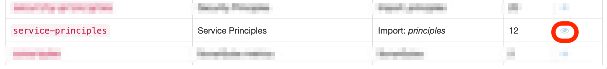

The indicator category report page displays a matrix of all indicator values for the selected projects and the types which are in this category. For the indicator type page, it's the same layout, but only one column for the selected type.

By default, only projects having at least one indicator filled in for the selected types are displayed. You can unselect the _Only projects with values_ to display all projects.

In both the category and type report page, you can select the _CSV Export_ link to download this list as a CSV file.

[[feature-indicators-computing]]
==== Computing indicators

It is possible to define some types whose value is not entered manually but is computed by Ontrack itself.

You do so by registering an <<extending,extension>> which implements the `IndicatorComputer` interface, or the `AbstractBranchIndicatorComputer` class when the value must be computed from the "main branch" of a project.

See the documentation of those two types for more information.

The `SonarQubeIndicatorComputer` extension is an example of such an implementation.

NOTE: Computed categories & types cannot be edited, and their values cannot be edited manually.

[[feature-indicators-configurable]]
==== Configurable indicators

Some indicators, provided by Ontrack, are configurable:

* they are disabled by default, and an <<feature-indicators-acl,administrator>> must enable them
* optionally, these indicators take some parameters

Once enabled, these configurable behave like any other computed indicator:

* they are computed in the background
* they cannot be edited

As an administrator, you can access the list of configurable indicators through _Indicators > Configuration_:

image::images/feature-indicators-configurable-menu.png[Configuration of the indicators]

In the following page, the list of configurable indicators is shown, with their current status (enabled / disabled), their parameters, etc.

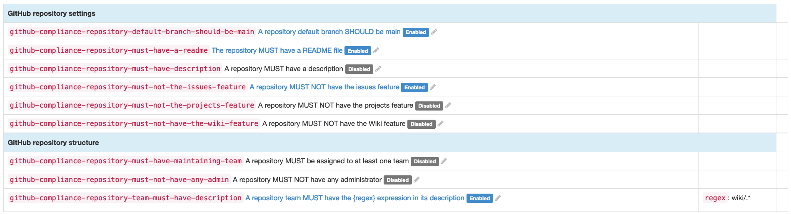

The administrator can use the edit button (pencil icon) to edit a given indicator and fill:

* its status: enabled or disabled
* an optional link (to some additional and specific documentation for example)
* some parameters specific to this indicator

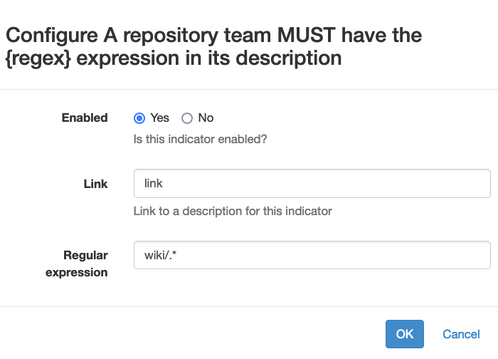
