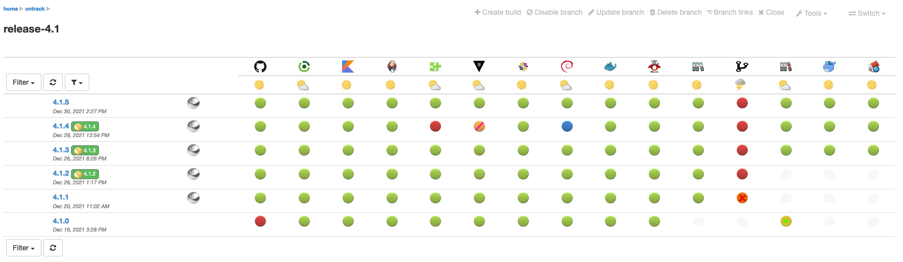
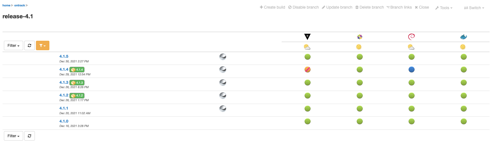
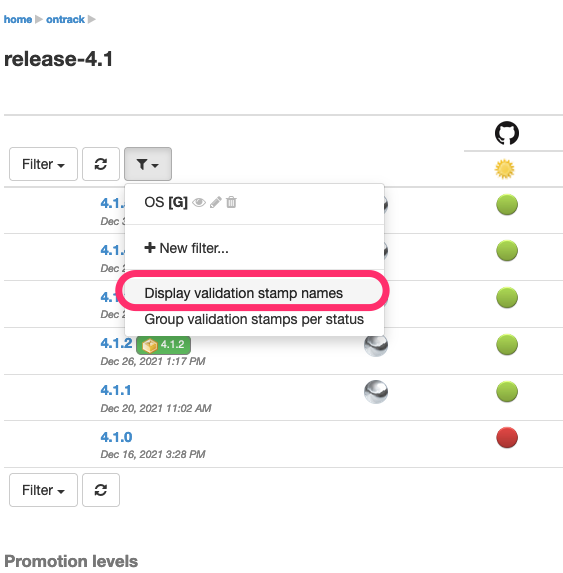
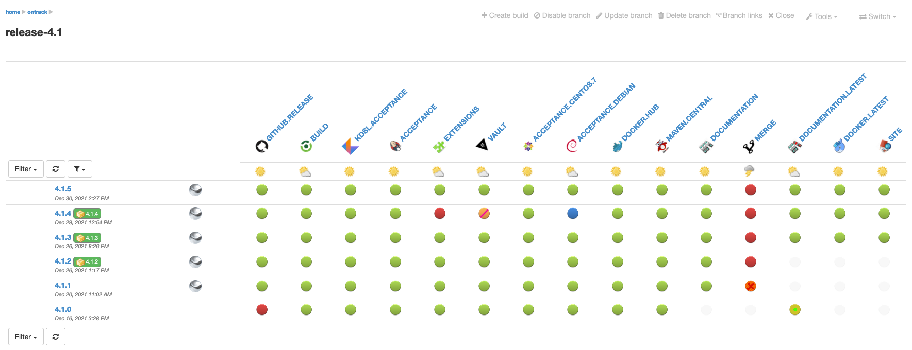
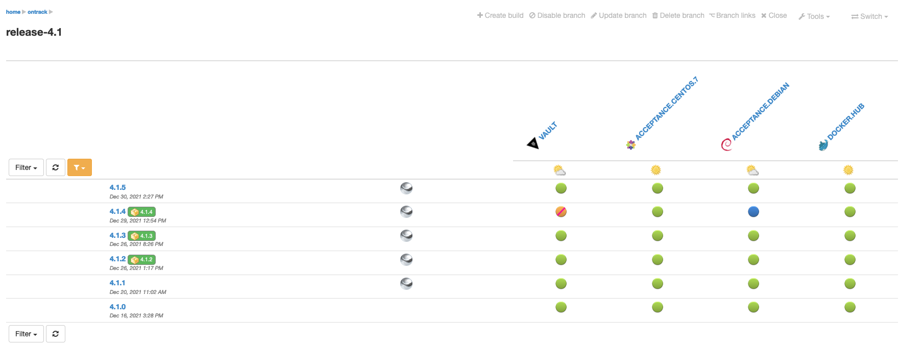
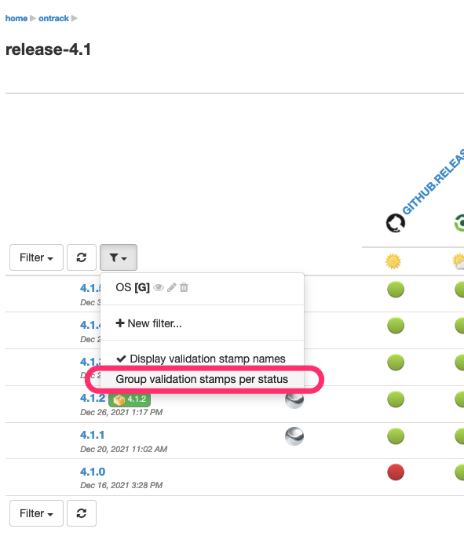
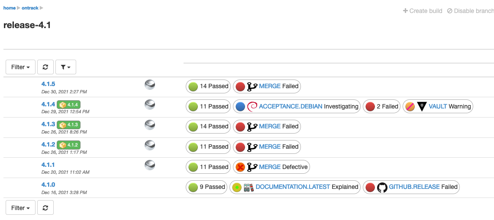
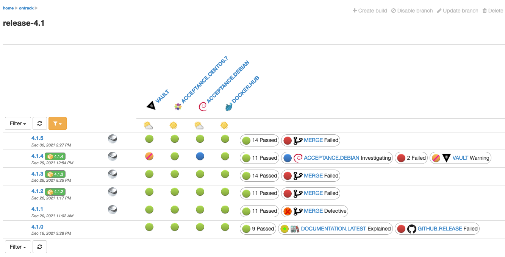
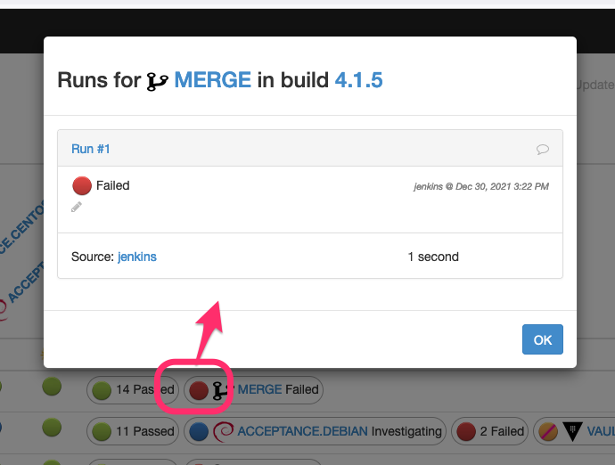
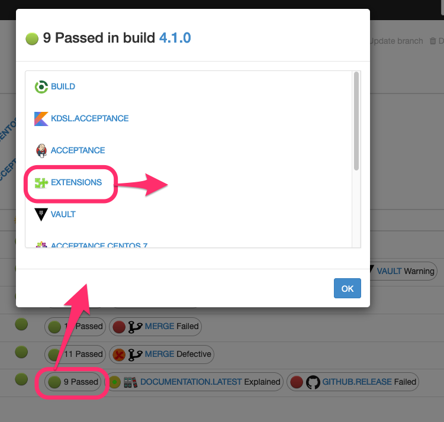

[[feature-validation-stamp-display-options]]
==== Validation stamp display options

In the branch view, you can tune the display of the validations using different options.

By default, you get all the validation stamps of the branch:

You can restrict the number of validation stamps being displayed by using a <<branches-validation-stamp-filters,validation stamp filter>>:

Additionally, you can display the names of the validation stamps by selecting the _Display validation stamp names_ option in the validation stamp filter menu:

This displays:

or with a filter:

Finally, when dealing with too many validation stamps for the display to be OK, you can choose to group validations per status:

And this displays:

When using a <<branches-validation-stamp-filters,validation stamp filter>>, the validation stamps matched by the selected filter are always displayed, on the left of the groups:

If one validation has a particular status, clicking on the validation displays the latest validation run, and from there, you can progress its status and/or enter comments:

When several validations have the same status, the dialog will display the list of validations having this status. Clicking on a validation will then display the latest validation run for this validation:

