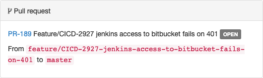

[[git-pull-requests]]
==== Git pull requests

When Git is enabled for a project, branches in Ontrack can point to Git branches
or to pull requests when this feature is enabled.

When an Ontrack branch points to a pull request, its behavior and its features remain the same:

* change logs
* builds
* validations
* promotions
* etc (see <<branches>>)

[[git-pull-requests-enabling]]
==== Enabling Git pull requests

Support for pull requests is enabled by default in Ontrack.

The `ontrack.config.extension.git.pullrequests.enabled` <<configuration-properties,configuration property>>
can be set to `false` to disable the support for pull requests.

Other <<configuration-properties,configuration properties>> can be set to control the maintenance and performances for pull requests.

[[git-pull-requests-branch]]
==== Enabling a branch as a pull request

In order to set an Ontrack branch as a pull request, it is enough that:

* the <<git-pull-requests-enabling,support for pull requests>> is enabled
* the Ontrack project is linked to a Git repository
* the associated Git branch is the name of a pull request

The name of a pull request is typically something like `PR-123` but this may vary from one Git provider
to another.

[NOTE]
====
Pull requests are not supported for bare Git repositories. Only repositories linked to providers
like GitHub, Bitbucket or GitLab are supported.
====

Once a branch points to a pull request through its associated Git branch, the following information
is available on the branch page:

This gives:

* the name of the PR as a link to the Git provider
* the title of the PR
* the status of the PR
* the source and target Git branch of the PR

If either the source or target branch exists in Ontrack, the name of the Git branch
is a link to the associated Ontrack branch.

If a branch points to a PR, the branch is also associated with a decoration:

image::images/git-pull-requests-branch-decoration.png[200,Git PR decoration]

The icon has a tooltip showing the same information than above and is a link to the Git provider.

[[git-pull-requests-search]]
==== PR search

PR information is available for the search, like any other branch.

[[git-pull-requests-lifecycle]]
==== PR lifecycle

Whenever a PR is deleted, the branch remains considered as a PR - but the link will not be rendered
and the PR will be marked as not valid.

[NOTE]
====
Information about a PR is cached and will not be refreshed in real-time.

See <<configuration-properties>> for the way it's configured.
====

An Ontrack branch identified as a PR which is not valid any longer (deleted, closed) will be disabled
after 1 day and deleted after further 7 days.

This behavior (enablement and durations) is configurable through
<<configuration-properties,configuration properties>>.

[[git-pull-requests-metrics]]
==== PR cache metrics

A cache is used internally to avoid calling the remote SCM each time Ontrack needs some information about a PR.

[NOTE]
====
For the parameters of this cache, check <<configuration-properties-git>>.
====

In order to tune this cache, the following metrics are exposed:

* `ontrack_extension_git_pr_cache_count` - total number of PR entries being cached
* `ontrack_extension_git_pr_cache_hits` - number of calls to the cache where the PR entry is actually cached and valid
* `ontrack_extension_git_pr_cache_miss` - number of calls to the cache where the PR must be refreshed from the SCM
* `ontrack_extension_git_pr_cache_time_scm` - time it takes to refresh a PR from the SCM
* `ontrack_extension_git_pr_cache_time_all` - total time it takes to get and/or refresh a PR using the cache
