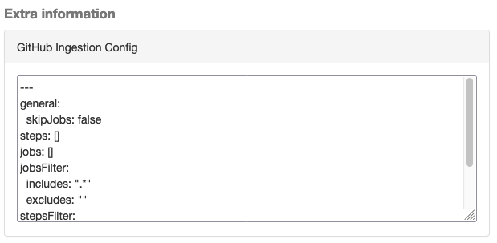
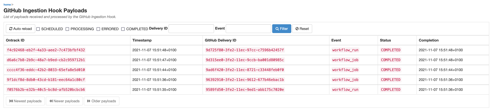
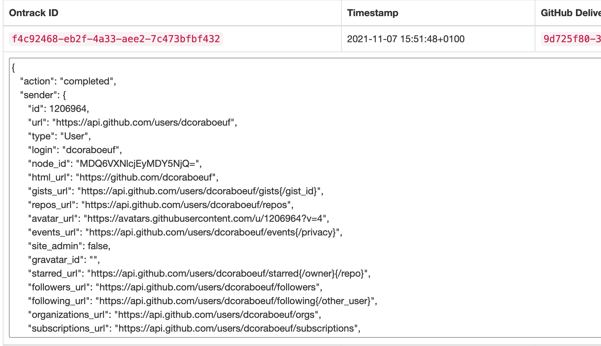

[[integration-github-ingestion]]
=== GitHub Ingestion

In addition to Ontrack being able to <<integration-github,interact with GitHub>>, it is also possible to set up a https://docs.github.com/en/developers/webhooks-and-events/webhooks/about-webhooks[webhook] in GitHub so that data from GitHub Actions workflows is automatically ingested by Ontrack, without having the workflows being adapted in any way. This allows for a seamless integration between GitHub Actions workflows and Ontrack.

[[integration-github-ingestion-features]]
==== GitHub ingestion features

When a workflow runs, the following items are created or updates in Ontrack.

The project in Ontrack will be called like the _repository_, adjusted for Ontrack naming conventions for entities. It'll be associated with the first matching GitHub configuration. Optionally, the organization name can be set as a prefix to the project names using the <<integration-github-ingestion-settings,global settings>>.

The branch is Ontrack will be called according the head branch (or the PR name) and its Git branch will also be set.

The build is created by aggregating the workflow name and the run number. Additionally, the following properties are set:

* the Git commit property
* the run info

Validation stamps are created using `<job>-<step>`, adjusted for the Ontrack naming convventions.

Builds and validation runs are associated with properties & decorations linking to the source workflow run in GitHub.

The creation of the validation runs occurs as the workflow run is in progress, allowing Ontrack to collect information as it goes.

[[integration-github-ingestion-setup-ontrack]]
==== Ontrack setup

At least one <<integration-github,GitHub configuration>> must be created.

The communication between GitHub and Ontrack is secured through a specific token, outside the Ontrack normal authentication mechanisms.

This secret can be generated by using:

[source,bash]
----
ruby -rsecurerandom -e 'puts SecureRandom.hex(20)'
----

but other ways are also acceptable.

In the _Settings_, go to the _GitHub workflow ingestion_ section and set the token as previously generated.

[[integration-github-ingestion-setup-github]]
==== GitHub setup

In GitHub, the Ontrack ingestion hook can be setup at repository or at organization level.

Go to the _Settings > Webhooks_ section and add a new webhook:

* URL - `<ontrack>/hook/secured/github/ingestion`
* Content type - `application/json`
* Secret - the secret you generated in the <<integration-github-ingestion-setup-ontrack>>
* Permissions:
** Workflow jobs
** Workflow runs
** Pushes (for autoconfiguration, see later)

[[integration-github-ingestion-customization]]
==== Customization

The default behaviour of the ingestion can be customized by putting a `.github/ontrack/ingestion.yml` file in the repository.

All fields are optional and when omitted, default values are used.

This file is taken into account automatically, on push or when the ingestion configuration has not been loaded yet.

[source,yaml]
----
# General settings
general:
  #  Must jobs be considered as validations?
  skipJobs: true
# List of specific step configurations
steps:
  # Exact name of the step in the workflow (required)
  - name: The step name
    # Name of the validation stamp to use (instead of a generated one)
    # Default value: the name of the step,
    # adjusted for the Ontrack naming constraints & conventions
    validation: the-step-name
    # Must we use the job name as a prefix to the validation stamp?
    # Default value: the job name is added as a prefix
    validationJobPrefix: true
    # Description for the validation stamp
    # Default value: the name of the step
    description: The step name
# List of specific job configurations
jobs:
  # Exact name of the job in the workflow (required)
  - name: Job name
    # Name of the validation stamp to use (instead of a generated one)
    # Default value: the name of the job,
    # adjusted for Ontrack naming constraints & conventions
    validation: job-name
    # Description for the validation stamp
    # Default value: the name of the job
    description: Job name
# Filter for the jobs
jobsFilter:
  # Inclusion rule (by default, all jobs are included)
  includes: ".*"
  # Exclusion rule (by default, no job is excluded)
  excluded: ""
# Filter for the steps
stepsFilter:
  # Inclusion rule (by default, all steps are included)
  includes: ".*"
  # Exclusion rule (by default, no step is excluded)
  excluded: ""
----

For example, if we want to associate the vaidation stamp `unit-tests` to the step `Runs unit tests` in the `build` job, we can use:

[source,yaml]
----
steps:
  - name: Runs unit tests
    validation: unit-tests
    validationJobPrefix: false
----

The ingestion configuration is saved together with the branch and is visible in the UI as an extra information:

This information is also available programmatically using a GraphQL query:

[source,graphql]
----
{
  branches(id: 589) {
    gitHubIngestionConfig {
      general {
        skipJobs
      }
      steps {
        name
        validation
        validationJobPrefix
        description
      }
      jobs {
        name
        validation
        description
      }
      jobsFilter {
        includes
        excludes
      }
      stepsFilter {
        includes
        excludes
      }
    }
  }
}
----

[[integration-github-ingestion-settings]]
==== General settings

In the _Settings > GitHub workflow ingestion_ section, you can configure the following features:

* the secret token used by the GitHub hook
* the number of days GitHub hook payloads are kept by Ontrack
* if the organization name must be used as a prefix for the generated project names
* the default Git indexation interval to use for the projects
* inclusion/exclusion rules for the repositories to be ingested
* inclusion/exclusion rules for the jobs to be ingested
* inclusion/exclusion rules for the steps to be ingested
* the identifier of the issue service to use by default. For example `self` for GitHub issues or `jira//config`.

[[integration-github-ingestion-management]]
==== Management

The Ontrack hook receives all registered GitHub event payloads. The latter are processed in a queue and then kept for investigation and inspection.

[NOTE]
====
The payloads whose signature cannot be be checked or is not OK are not stored.
====

The number of days these payloads are kept is configured in the <<integration-github-ingestion-settings,global settings>>.

An Ontrack administrator can access the list of payloads using the _GitHub Ingestion Hook Payloads_ user menu:

The _Auto refresh_ button allows the content of the payload list to be automatically refreshed every 10 seconds. The settings are saved in the browser local storage.

The list can be filtered using the following arguments:

* the processing statuses:
** `SCHEDULED` - the payload has been received and queued for later processing.
** `PROCESSING` - the payload is currently being processed. Some Ontrack elements may have already been created.
** `ERRORED` - the processing failed. The payload entry in the list will have an explanation.
** `COMPLETED` - the processing of the payload completed successfully.
* the GitHub Delivery ID - each event payload sent by GitHub is associated with a unique delivery ID.
* the GitHub event - the event which sent the payload

By clicking on the internal Ontrack ID (leftmost column), you can display for information about the payload, including its complete JSON content:

[[integration-github-ingestion-metrics]]
==== Metrics

The metrics are grouped in the following categories:

* hook reception level
* ingestion queing
* ingestion processing

[[integration-github-ingestion-metrics-hook]]
===== Hook metrics

|===
|Metric |Type |Tags |Description

|ontrack_extension_github_ingestion_hook_signature_error_count
|Counter
|event
|Number of rejections because of signature mismatch

| ontrack_extension_github_ingestion_hook_repository_rejected_count
|Counter
|event,owner,repository
|Number of repository-based events rejected because the repository was rejected

|ontrack_extension_github_ingestion_hook_repository_accepted_count
|Counter
|event,owner,repository
|Number of accepted repository-based events

|ontrack_extension_github_ingestion_hook_accepted_count
|Counter
|event,owner?,repository?
|Number of events which are scheduled for processing

|ontrack_extension_github_ingestion_hook_ignored_count
|Counter
|event,owner?,repository?
|Number of events which were accepted but won't be processed
|===

[[integration-github-ingestion-metrics-queue]]
===== Queue metrics

|===
|Metric |Type |Tags |Description

|ontrack_extension_github_ingestion_queue_produced_count
|Counter
|event,owner?,repository?,routing
|Number of payloads sent to the queues

|ontrack_extension_github_ingestion_queue_consumed_count
|Counter
|event,owner?,repository?,queue
|Number of payloads received by the queues

|===

[[integration-github-ingestion-metrics-process]]
===== Processing metrics

|===
|Metric |Type |Tags |Description

|ontrack_extension_github_ingestion_process_started_count
|Counter
|event,owner?,repository?
|Number of payloads whose processing has started

|ontrack_extension_github_ingestion_process_success_count
|Counter
|event,owner?,repository?
|Number of payloads whose processing has succeeded

|ontrack_extension_github_ingestion_process_ignored_count
|Counter
|event,owner?,repository?
|Number of payloads whose processing has been ignored

|ontrack_extension_github_ingestion_process_error_count
|Counter
|event,owner?,repository?
|Number of payloads whose processing has finished with an error

|ontrack_extension_github_ingestion_process_finished_count
|Counter
|event,owner?,repository?
|Number of payloads whose processing has finished

|ontrack_extension_github_ingestion_process_time
|Timer
|event,owner?,repository?
|Time it took to process this payload

|===

[[integration-github-ingestion-configuration]]
==== Configuration

See <<configuration-properties>> for the list of all available properties.

[[integration-github-ingestion-configuration-routing]]
===== Routing

By default, Ontrack uses one unique RabbitMQ queue to process all incoming payloads, with a maximum concurrency of 10.

In some cases, when some repositories are more active than others, it may be useful to create other queues in order to prioritize the work.

You can define routing configurations based on regular expressions matching the repository owner & names. For example:

[source,yaml]
----
ontrack:
  extension:
    github:
      ingestion:
        processing:
          repositories:
            very-active:
              repository: my-very-active-repository
----

This will create an additional queue, called `github.ingestion.very-active` where all the processing for the `my-very-active-repository` repository will be sent to.
