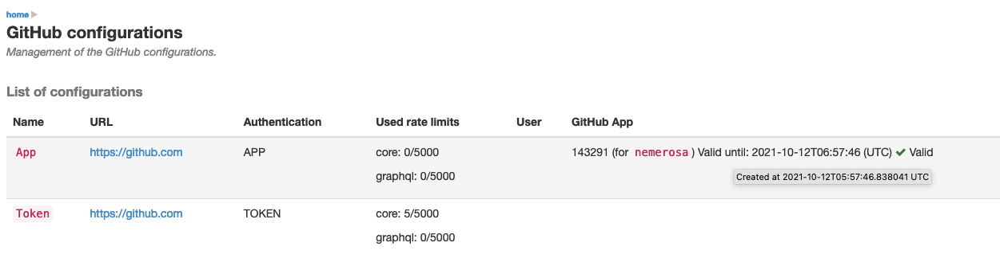

[[integration-github]]
=== Working with GitHub

https://github.com[GitHub] is an enterprise Git repository manager on the cloud
or hosted in the premises.

When <<usage-git,working with Git>> in Ontrack, one can configure a project to
connect to a GitHub repository.

[[integration-github-config]]
==== General configuration

The access to a GitHub instance must be configured.

1. as <<security,administrator>>, go to the _GitHub configurations_ menu
2. click on _Create a configuration_
3. in the configuration dialog, enter the following parameters:
** **Name**  - unique name for the configuration
** URL - URL to the GitHub instance. If left blank, it defaults to the https://github.com location

Several authentication modes are supported:

* User & Password - credentials used to access GitHub
* OAuth2 token - authentication can also be performed using a https://docs.github.com/en/authentication/keeping-your-account-and-data-secure/creating-a-personal-access-token[Personal Access Token] instead of using a user/password pair
* GitHub App - see <<integration-github-app,below>> for more information

The existing configurations can be updated and deleted.

TIP: Although it is possible to work with an anonymous user when accessing
     GitHub, this is not recommended. The rate of the API call will be limited
     and can lead to some errors.

[[integration-github-app]]
==== GitHub App authentication

In large Ontrack setup, with hundreds of GitHub repositories, using a GitHub Personal Access Token might not be enough any longer since we can very fast hit the 5000 API rate limit of GitHub.

Using a GitHub App extends this limit a bit more.

[[integration-github-app-creation]]
===== Creating a GitHub app

In your _personal_ settings, go to _Developer settings > GitHub Apps_ and click _New GitHub App_:

* _GitHub App name_ - any name
* _Homepage URL_ - your Ontrack URL (for example, not used, but required)
* Uncheck _Webhook > Active_
* _Repository permissions_:
** Actions / Read-only (optional)
** Contents / Read-only
** Issues / Read-only
** Pull requests / Read-only
** Organization permissions
** Members / Read-only
* Select the _Any account_ option
* Select _Create GitHub App_

Then _Generate a private key_ and save the generated PEM file.

This PEM file _must_ be converted in order to be used in Ontrack. Given the `app.pem` file downloaded from GitHub in the previous step, generate a new PEM file (`ontrack.pem` for example, it does not matter):

[source,bash]
----
openssl pkcs8 -topk8 -inform PEM -outform PEM \
  -nocrypt \
  -in app.pem \
  -out ontrack.pem
----

The content of the generated PEM file will be used for the GitHub configuration in Ontrack.

[[integration-github-app-installation]]
===== Installing the GitHub app

Still on the GitHub app page:

* Note down the ID of the app
* Select the _Install App_ menu
* Select the organization/user you want to use this app into
* Select its scope
* Select _Install_

[[integration-github-app-configuration]]
===== Configuring authentication

When creating a <<integration-github-config,GitHub configuration>>, the following parameters must be set to use a GitHub App for the connection from Ontrack:

* App ID - the ID that you noted in the previous step
* App Private Key - the content of the PEM that you generated previously. It must start with `----- BEGIN PRIVATE KEY -----`

The _App Installation Account Name_ is needed whenever you have installed this app in more than one organization. In this case, specify the organization name in this field.

[[integration-github-app-list]]
===== GitHub app tokens

Authentication tokens based on GitHub Apps are valid for one hour. They are renewed automatically by Ontrack.

The list of GitHub configurations lets you see the validity of the tokens for the configurations based on GitHub Apps:

[[integration-github-project]]
==== Project configuration

The link between a project and a GitHub repository is defined by the _GitHub
configuration_ property:

* **Configuration** - selection of the GitHub configuration created before -
  this is used for the accesses
* **Repository** - GitHub repository, like `nemerosa/ontrack`
* Indexation interval - interval (in minutes) between each synchronisation
  (Ontrack maintains internally a clone of the GitHub repositories)
* Issue configuration - issue service. If not set or set to "GitHub issues",
  the issues of the repository will be used

Branches can be <<usage-git,configured for Git>> independently.

[[integration-github-scm-catalog]]
===== SCM Catalog configuration

The <<scm-catalog,SCM Catalog>> feature requires some additional
configuration for GitHub. See the specific <<scm-catalog-github,section>>
for more information.

[[integration-github-metrics]]
==== GitHub metrics

When Ontrack contains at least one GitHub configuration, the following metrics are exposed to signal how the rate limit currently is:

* `ontrack_extension_github_ratelimit_core_limit`
* `ontrack_extension_github_ratelimit_core_remaining`
* `ontrack_extension_github_ratelimit_core_used`
* `ontrack_extension_github_ratelimit_graphql_limit`
* `ontrack_extension_github_ratelimit_graphql_remaining`
* `ontrack_extension_github_ratelimit_graphql_used`

All these metrics are tagged with `configuration`. The value of the tag is the name of the configuration in Ontrack.

These metrics are enabled by default but can be disabled by setting the `ontrack.extension.github.metrics.enabled` <<configuration-properties,configuration property>> to `false`.
