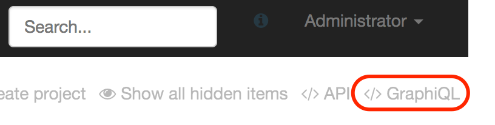
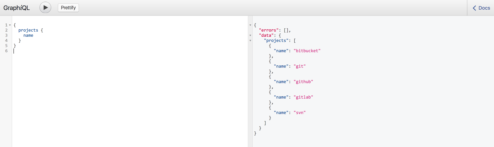

[[integration-graphql]]
=== GraphQL support

Since version 2.29, Ontrack provides some support for
http://graphql.org/[GraphQL].

NOTE: While most of the Ontrack model is covered, only the query mode
is supported right now. Support for mutations might be integrated in
later releases.

The GraphQL end point is available at the `/graphql` context path. For example,
if Ontrack is available at http://localhost:8080, then the GraphQL end point
is available at http://localhost:8080/graphql.

Ontrack supports all capabilities of GraphQL schema introspection.

Example of a GraphQL query, to get the list of branches for a project:

[source]
----
{
   projects (id: 10) {
      branches {
         id
         name
      }
   }
}
----

[[integration-graphql-curl]]
=== Calling with Curl

One basic way to integration with the GraphQL interface of Ontrack is to use
https://curl.haxx.se/[Curl].

Given the following file:

[source]
.query.json
----
{
   query: "{ projects (id: $projectId) { branches { id name }}}",
   variables: {
      projectId: 10
   }
}
----

You can `POST` this file to the Ontrack GraphQL end point, for example:

[source,bash]
----
curl -X POST --user user http://localhost:8080/graphql --data @query.json
----

[[integration-graphql-dsl]]
=== Using the DSL

The simplest way is to use the <<dsl,Ontrack DSL>> to run a query:

[source,groovy]
----
def result = ontrack.graphQLQuery(
   '''{
      projects (id: $projectId) {
         id
         branches {
            id
            name
         }
      }
   }''',
   [
      projectId: 10,
   ]
)

assert result.errors != null && result.errors.empty
assert result.data.projects.size() == 1
assert result.data.projects.get(0).id == 10
----

See the <<dsl-ontrack-graphQLQuery,`graphQLQuery`>> documentation for more details.

[[integration-graphql-graphiql]]
=== GraphiQL support

Ontrack supports https://github.com/graphql/graphiql[GraphiQL] and allows
to experiment with Ontrack GraphQL queries directly in your browser.

You can access the GraphiQL IDE page by clicking on the _GraphiQL_ command
in the top right corner of the home page of Ontrack:

You can then type and experiment with your GraphQL queries:

IMPORTANT: The access rights used for your GraphQL queries are inherited
from your Ontrack connection. Connect with your user in Ontrack before
switching to the GraphiQL IDE. Login in from within GraphiQL is not
supported yet.
