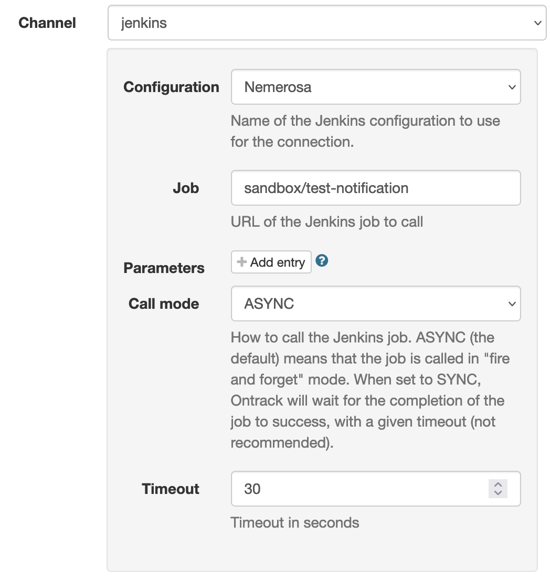

[[integration-jenkins]]
=== Integration with Jenkins

Jenkins can inject data into Ontrack - see <<feeding-jenkins>> for this purpose. But Ontrack can also link builds to Jenkins by:

* defining a Jenkins configuration
* setting a link to a Jenkins folder at project or branch level
* setting a link to a Jenkins build at build level
* triggering Jenkins builds on <<notifications>>

[[integration-jenkins-notifications]]
==== Triggering Jenkins builds on notifications

Upon a <<notifications,notification>>, one may want to trigger a Jenkins build. For example, given a <<model,build>> being promoted to a certain level ("BRONZE" for example), one may want to trigger a Jenkins build to complete additional validations. This is a pretty good way to perform long-running deployment pipelines (security scans, performance tests, etc.) while avoiding coupling pipelines together.

To do this, a <<notifications,subscription>> can be created at the promotion level, to listen to "new promotion runs" events and to trigger a Jenkins pipeline.

Using the UI, the subscription looks like:

* _Configuration_ - the Jenkins configuration to use (it defines the URL to connect to, the credentials to use)
* _Job_ - the relative path to the job to launch.
* _Parameters_ - a list of name/value pairs to pass to the Jenkins job as parameters
* _Call mode_ - defines if the job must be called asynchronously (the default) or synchronously. In the former case, Ontrack fires the job and then returns immediately. In the later case, Ontrack will wait for the job to complete and check its result before considering the notification successful. Note that this can have impacts on performances.
* _Timeout_ - in case the synchronous call mode is used, defines the amount of seconds to wait for the completion of the Jenkins build

Several remarks:

* for the job, a reduced path, without the `/job/` separator can be used. Keeping the `/job/` separator is fine as well. So the `job/sandbox/job/test-notification` and `sandbox/test-notification` are in this regard equivalent.
* the _job_ and _parameters_ values can contain expansion placeholders

For example, a parameter value may contain `{Project}`  as a value, indicating that the project name linked to the event the notification is about will be used as a value.

Other placeholders, like `Branch`, `Promotion`, etc., are available, depending on the type of event. Their values can also be updated and encoded. See <<appendix-event-variables>> for a list of options.

[[integration-jenkins-notifications-api]]
===== Using the API

The GraphQL API can be used to setup the promotion:

[source,graphql]
----
mutation {
    subscribePromotionLevelToEvents(input: {
        project: "my-project",
        branch: "my-branch",
        promotion: "BRONZE",
        channel: "jenkins",
        channelConfig: {
            config: "my-jenkins-config-name",
            job: "my-folder/my-pipeline/{scmBranch|urlencode}",
            parameters: [
                {
                    name: "PROMOTION",
                    value: "{Promotion}"
                }
            ],
            callMode: "ASYNC"
        },
        events: [
            "new_promotion_run"
        ]
    }) {
        errors {
            message
        }
        subscription {
            id
        }
    }
}
----

[[integration-jenkins-notifications-casc]]
===== Definition as code

Like all other subscriptions, the Jenkins notifications can be defined <<casc,as code>>. For example, to define a trigger for a promotion level:

[source,yaml]
----
ontrack:
  extensions:
    notifications:
      entity-subscriptions:
        - entity:
            project: my-project
            branch: my-branch
            promotion: GOLD
          subscriptions:
            - channel: jenkins
              channel-config:
                config: my-jenkins-config-name
                job: "my-folder/my-pipeline/{scmBranch|urlencode}",
                parameters:
                  - name: PROMOTION
                    value: "{Promotion}"
                callMode: ASYNC
              events:
                - new_promotion_run
----

