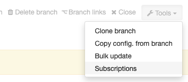
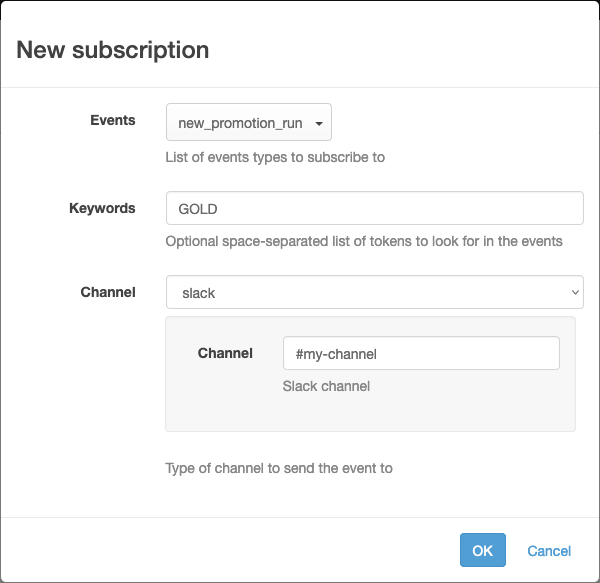
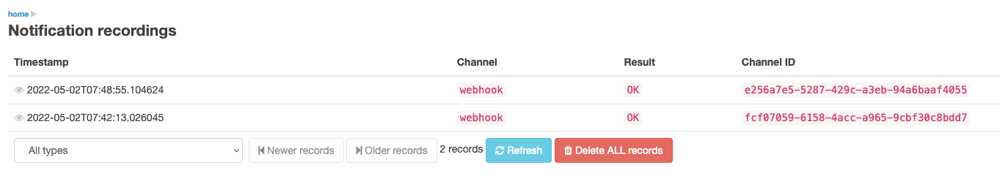
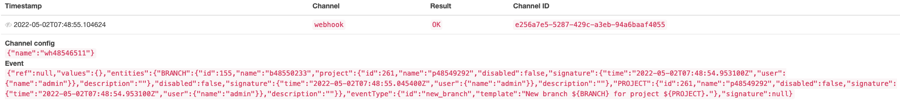

[[notifications]]
=== Notifications

Ontrack has the possibility to send notifications to different <<notifications-backends,backends>> like some webhooks, email, Slack messages, etc.

[WARNING]
====
By default, notifications are _not_ enabled. You need to activate them by setting the <<configuration-properties-notifications,`ontrack.config.extension.notifications.enabled`>> configuration property to `true`.
====

A notification is the association between an _event_ occurring on an _entity_ and sent to a given _channel_ using some _configuration_.

For example, a notification can be:

* event: a build has been <<model,promoted>>
* entity: the branch the build <<model,belongs to>>
* channel: email
* channel configuration: the subject & the email addresses
* an optional custom template

In this example, the body of the email would be a text like "Build B of branch R in project P has been promoted to P", which various links to Ontrack.

[NOTE]
====
By default, the notifications use the <<appendix-events,default templates>> of the events but a
<<appendix-templating,custom template>> can be provided.
====

Administrators of Ontrack can create and configure the different <<notifications-backends,backends>>.

They can also configure the notifications at entity level to respond to some events using notification configurations (<<notifications-subscriptions,_subscriptions_>>).

Subscriptions can be either <<notifications-subscriptions-local,local>> (subscribing to the events on a given branch) or <<notifications-subscriptions-global,global>> (subscribing to the events in all Ontrack, regardless of the entity).

[[notifications-backends]]
==== Notification backends

See <<appendix-notifications>> for a complete list of the existing notification backends and their configurations.

[[notifications-subscriptions]]
==== Subscriptions

Subscriptions can be done at <<model,entity level>> (project, branch, promotion, etc.) or globally.

[[notifications-subscriptions-local]]
===== Local subscriptions

On an entity page (like the page for a project, a branch, etc.), go to the _Tools_ menu and select _ Subscriptions_:

On the subsequent, you can manage the list of subscriptions at this entity level.

To create a subscription, select the _New subscription_ command and enter the fields for the subscription:

* events - list of events to listen to
* keywords - space-separated list of words which will be used to restrict the events being listened to
* channel - destination for the notification.
Depending on the channel being selected, additional fields are needed (for example, for a Slack notification, the Slack channel is required)
* custom template - if provided, it'll override the default template associated with the event. See <<appendix-templating>> for its syntax.

On the subscription list, you can:

* enable/disable each subscription
* delete a subscription

[[notifications-subscriptions-global]]
===== Global subscriptions

The management of the global subscriptions is exactly the same as for the <<notifications-subscriptions-local,local>> ones, but for the fact that the global subscriptions are accessible through the _Global subscriptions_ menu.

[NOTE]
====
Global subscriptions can be configured using <<casc,CasC>>. For example:

[source,yaml]
----
ontrack:
    extensions:
        notifications:
            global-subscriptions:
                - events:
                    - new_promotion_run
                  keywords: "GOLD main"
                  channel: slack
                  channel-config:
                    channel: "#my-channel"
                  contentTemplate: |
                    Promoted to ${promotionLevel}.
----
====

[[notifications-recordings]]
==== Recordings

For audit and troubleshooting purposes, all notifications are recorded and administrators can have access to them using the _Notification recordings_ user menu:

Each recording has the following columns:

* timestamp (UTC) - when was the notification actually sent
* channel - which channel was used by the notification
* result - outcome of the notification
** OK - notification was sent successfully
** NOT_CONFIGURED - the notification channel not configured
** INVALID_CONFIGURATION - the notification channel is wrongly configured
** DISABLED - the notification channel has been disabled
** ERROR - there was an error

By clicking on the eye icon left of the timestamp, you can see more details about the notification:

* Channel config - the JSON representation of the configuration of the notification channel
* Event - the JSON representation of the event being sent

Finally, the administrator can filter recordings on their results and the _Delete ALL records_ can be used to clear out all recordings.

[[notifications-examples]]
==== Examples

This section shows a number of custom templates for some events.

To send a change log on a promotion, subscribe to the <<event-new_promotion_run,`new_promotion_run`>> event and use for example:

[source,text]
----
Change log:

${promotionRun.changelog}
----

If the project builds have linked to a `dependency` project's builds, it may be interesting to follow the links recursively:

[source,text]
----
Change log for ${build.release}:

${promotionRun.changelog}

Change log for the dependency:

${promotionRun.changelog?project=dependency}
----

[[notifications-metrics]]
==== Metrics

Following metrics are sent by Ontrack about the notifications:

|===
| Metric | Tags | Description

| `ontrack_extension_notifications_event_listening_received`
| `event`
| Count of events being received

| `ontrack_extension_notifications_event_listening_queued`
| `event`
| Count of events being actually queued

| `ontrack_extension_notifications_event_listening_dequeued`
| `event`
| Count of events being removed from the queue for dispatching

| `ontrack_extension_notifications_event_listening_dequeued_error`
| None
| Count of uncaught errors when listening to events

| `ontrack_extension_notifications_event_listening`
| `event`
| Count of events whose dispatching starts

| `ontrack_extension_notifications_event_dispatching_queued`
| `event`, `channel`, `routing`
| Count of events whose dispatching starts (pushed into the dispatching queue)

| `ontrack_extension_notifications_event_dispatching_dequeued`
| `event`, `channel`, `routing`
| Count of events whose dispatching starts (pulled from the dispatching queue)

| `ontrack_extension_notifications_event_dispatching_result`
| `event`, `channel`, `result`
| Count of events whose dispatching is finished

| `ontrack_extension_notifications_event_processing_started`
| `event`, `channel`
| Count of events whose processing is started

| `ontrack_extension_notifications_event_processing_channel_started`
| `event`, `channel`
| Count of events whose processing is started on an actual channel

| `ontrack_extension_notifications_event_processing_channel_unknown`
| `event`, `channel`
| Count of events whose processing is stopped because the channel is unknown

| `ontrack_extension_notifications_event_processing_channel_invalid`
| `event`, `channel`
| Count of events whose processing is stopped because the channel or its configuration is invalid

| `ontrack_extension_notifications_event_processing_channel_publishing`
| `event`, `channel`
| Count of events whose publication into a channel has started

| `ontrack_extension_notifications_event_processing_channel_result`
| `event`, `channel`, `result`
| Count of events whose publication into a channel has finished

| `ontrack_extension_notifications_event_processing_channel_error`
| `event`, `channel`
| Count of events whose publication into a channel has failed

|===

The overall processing of events looks like this:

[plantuml,"integration-notifications-cycle",png]
----
include::integration-notifications-cycle.puml[]
----
