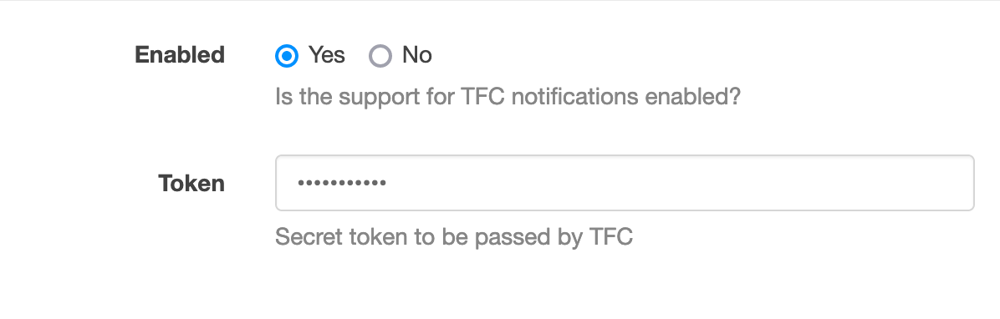

[[integration-tfc]]
=== Terraform Cloud integration

In Terraform Cloud, upon the completion of a run (success or failure) you can notify Ontrack of the result by adding a hook into the Notifications settings of a TFC workspace.

The result of this notification will be the creation of a <<model,validation>> in a build, with a status Passed or Failed, depending on the result of the run execution.

[NOTE]
====
In turn, you can use this validation to trigger other events, typically a promotion.
====

This feature is not enabled by default: in Ontrack, you need to go to the _Settings > TFC_ section:

* enabled - set this to _Yes_ to enable the webhook at Ontrack level
* token - set a secret value which will then be set in Terraform Cloud (see later)

[TIP]
====
You can define these settings as <<casc,code>>:

[source,yaml]
----
ontrack:
    config:
        settings:
            tfc:
                enabled: true
                token: xxxxx
----
====

In Terraform Cloud, you can register the Ontrack webhook by going to a workspace settings and then select _Notifications_.

There, create a _Webhook_ notification and enter the following values:

* Name - not used by Ontrack, set whichever name suits you the best
* URL - http://<ontrack-url>/hook/secured/tfc?project=&branch=&build=&validation= - see next section for the parameters
* Token - the token you've set in Ontrack TFC settings before
* Triggers - Ontrack only listens to "Completed" and "Errored" events but will just ignore any other trigger

For the parameters of the Webhook URL, there are 4 possible parameters:

|===
|Parameter |Description

|`project` (required)
|Name of the project in Ontrack. It must exist.

|`branch` (optional)
|Name of the branch in Ontrack. If set, it must exist. If this parameter is not set, the build will be search among all the branches of the project.

|`build` (required)
|Name of the build in Ontrack. It must exist. If the project is configured to use labels for the builds, then this parameter is considered a label.

|`validation` (required)
|Name of the validation in Ontrack. If it does not exist, it'll be created.
|===

Each of these parameters can be hardcoded:

[source]
----
project=my-project
----

or set by reference:

[source]
----
project=@variable
----

In this case, the value following `@` represents a variable of the Terraform Cloud workspace.

[CAUTION]
====
This variable must exist and must not be sensitive.
====
