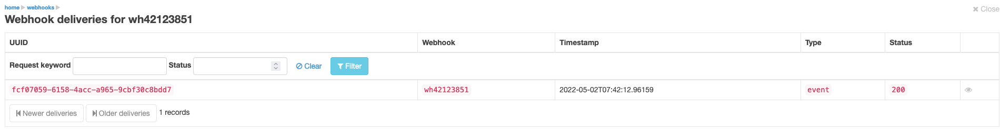
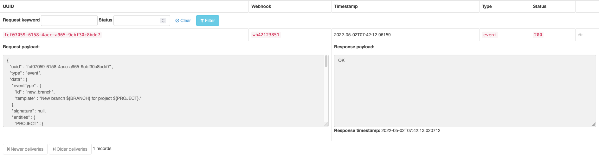

[[webhooks]]
=== Webhooks

Ontrack can be configured to send <<notifications,notifications>> to some webhooks using HTTP.

[WARNING]
====
Webhooks are disabled by default and must be enabled explicitly. See <<webhooks-settings,global settings>>.
====

[[webhooks-definitions]]
==== Definitions

Ontrack administrators can create webhooks using the _Webhooks_ entry in their user menu.

Webhooks can be created and deleted.

A webhook is defined by the following fields:

* name - a unique name for the webhook, which will be referred to when used in a subscription
* enabled - a flag to disable or enable the webhook
* url - a HTTP URL for the webhook. HTTPS is recommended but not required.
* timeout - number of seconds to wait before the connection to the webhook _url_ is abandoned (see also <<webhooks-timeouts,timeouts>> below)
* _authentication_ - the way to authenticate to the webhook (see <<webhooks-authentication,below>>)

[[webhooks-authentication]]
==== Authentication

Three types of authentication are supported:

* basic authentication - a username and a password must be provided
* bearer authentication - a token must be provided and will be sent in the `Authorization` header with its value set to `Bearer <provided token>`
* header authentication - a header name and value must be provided

[NOTE]
====
Authentication of webhooks is required.
====

[[webhooks-timeouts]]
==== Timeouts

Timeouts for the execution of the webhooks are defined at two levels:

* <<webhooks-settings,global settings>>
* <<webhooks-definitions,webhook definition>>

The actual timeout is the _maximum_ value between these two values.

[[webhooks-settings]]
==== Global settings

The _Webhooks_ section in the global settings allows the configuration of the following:

* enabled - global flag used for _all_ webhooks - set to _No_ by default
* timeout - number of minutes for the <<webhooks-timeouts,global timeout>> - set to 5 minutes by default
* retention days for the deliveries - number of days to keep the <<webhooks-deliveries,webhooks deliveries records>> - set to 30 days by default

[WARNING]
====
Webhooks are disabled by default and must be enabled explicitly.
====

[[webhooks-deliveries]]
==== Webhooks deliveries

Additionally to the <<notifications-recordings,notification recordings>>, deliveries to the webhooks are also registered by Ontrack and accessible by an administrator.

The deliveries for a given webhook are accessible through the _Deliveries_ button on the list of webhooks.

The following columns are displayed:

* unique ID for the delivery
* name of the webhook
* timestamp of the _request_
* type of payload
* HTTP status sent by the remote webhook

You can get more details by clicking on the UUID or the eye icon:

* request payload - the JSON actually sent to the webhook
* response payload - the payload returned by the webhook (interpreted as text)
* response timestamp - when the response was received
* stack - the error stacktrace in case of error
