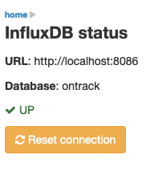

[[operations-metrics-influxdb]]
=== InfluxDB metrics

The InfluxDB <<extending,extension>> is shipped by default with Ontrack but is activated only if some properties are correctly set:

|===
| Property | Environment variable | Default | Description

| `ontrack.influxdb.enabled`
| `ONTRACK_INFLUXDB_ENABLED`
| `false`
| Enables the export of run info to InfluxDB

| `ontrack.influxdb.uri`
| `ONTRACK_INFLUXDB_URI`
| "http://localhost:8086"
| URI of the InfluxDB database
|===

Optionally, the following properties can also be set:

|===
| Property | Environment variable | Default | Description

| `ontrack.influxdb.username`
| `ONTRACK_INFLUXDB_USERNAME`
| "root"
| User name to connect to the InfluxDB database

| `ontrack.influxdb.password`
| `ONTRACK_INFLUXDB_PASSWORD`
| "root"
| Password to connect to the InfluxDB database

| `ontrack.influxdb.db`
| `ONTRACK_INFLUXDB_DB`
| "ontrack"
| Name of the InfluxDB database

| `ontrack.influxdb.create`
| `ONTRACK_INFLUXDB_CREATE`
| `true`
| If `true`, the database is created at startup

| `ontrack.influxdb.ssl.host-check`
| `ONTRACK_INFLUXDB_SSL_HOST_CHECK`
| `true`
| If `false`, disables host checking for certificates. *This should not be
used for a production system!*

| `ontrack.influxdb.log`
| `ONTRACK_INFLUXDB_LOG`
| `NONE`
| Level of log when communicating with InfluxDB. Possible values are: `NONE`, `BASIC`, `HEADERS` and `FULL`
|===

When an InfluxDB connector is correctly set, some Ontrack information is automatically sent to create timed values:

* <<run-info-export-influxdb,run info>>
* <<validation-runs-data-metrics,validation run data>>

[[monitoring-metrics-influxdb-management]]
==== InfluxDB management

In case the connection to InfluxDB drops, Ontrack will re-attempt to reconnect after 15 minutes by default.

[NOTE]
====
The retry period can be configured using the `ontrack.influxdb.validity` <<configuration-properties,configuration property>>. For example, to set to one hour:

[source,properties]
----
ontrack.influxdb.validity = 1h
----
====

You can force Ontrack to reconnect using several ways:

* through the `POST /manage/influxdb` management end point if you have access to it (depending on your installation)
* through the `POST /extension/influxdb` HTTP end point if you're an administrator
* through the UI under the _InfluxDB status" user menu:

