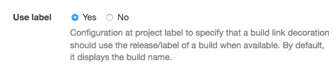

[[property-build-link-display-options]]
==== Build link display options property

By default, when a <<builds-links,build link>> is displayed as a
<<builds-links-decorations,decoration>> in the source build, the
target build name is used.

The target project can be configured to display any
<<property-release,label>> associated with the build instead
of using the build name.

In the target project page, select the "Build link display options"
property and configure it to use the label as display option
for the build link decoration:

