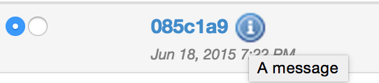

[[property-message]]
==== Message property

The _Message_ property can be associated with any <<model,entity>> in Ontrack.

A message is the association of some _text_ with a _type_: information, warning
or error:

image::property-message-dialog.png[Message input,400]

The message is of course displayed in the list of properties:

image::property-message-display.png[Message displayed,400]

... and as a decoration:

