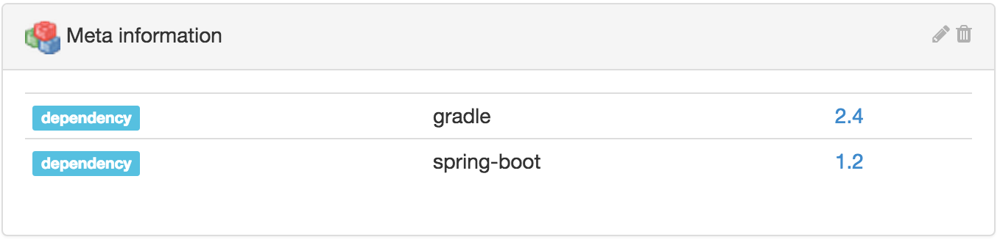

[[property-meta]]
==== Meta information property

Some arbitrary meta information properties can be associated with any
<<model,entity>> in Ontrack, using a set of values for some names, and
optionally some links and categories.

[[property-meta-input]]
===== Input

image::images/property-meta-information-dialog.png[Meta information input,400]

[[property-meta-display]]
===== Representation

The list of meta information properties is displayed in the list of properties:

[[property-meta-query]]
===== Querying

The meta information properties can be used for queries:

* in <<builds-filtering,build filters>>
* in build searches
* in global searches

In all those cases, the syntax to find a match is:

* `name:` or `name:*` - all entities which contain a `name` meta information
  property
* `name:value` - all entities which contain a `name` meta information property
  with the exact `value`
* `name:val*` - all entities which contain a `name` meta information property
  whose value starts with `val`
* the `*` wildcard can be used in any place

NOTE: Neither the link nor the category can be used for the search, only the
      name and the value.
