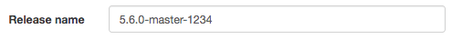
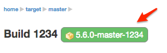
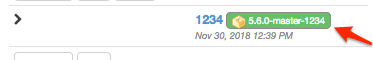

[[property-release]]
==== Release property

NOTE: Also known as label property.

A release label can be associated to any <<model,build>>.

Select the "Release" property and define its label:

The release label is then displayed as a decoration:

* in the build page

* in the build list

