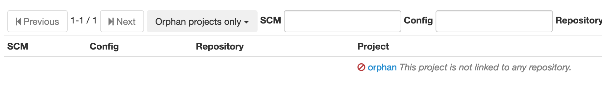
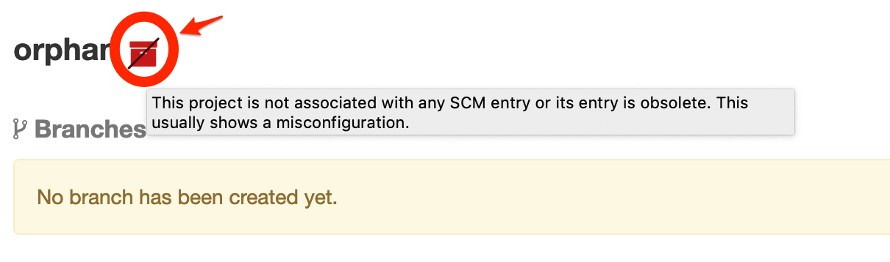
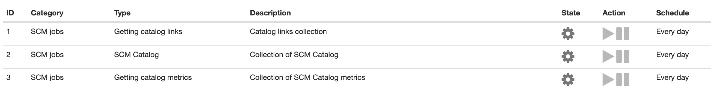
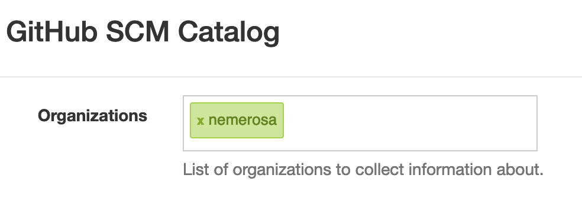

[[scm-catalog]]
==== SCM Catalog

Ontrack allows to collect information about all registered SCMs
and to correlate this information with the Ontrack <<model,projects>>.

[[scm-catalog-model]]
===== Model

A _SCM Catalog entry_ represents a physical SCM reposotory which
is accessible by Ontrack. An entry contains the following information:

* _SCM_ - type of SCM, like `github` or `bitbucket`.
* _Configuration_ - associated configuration in Ontrack to access
  this repository (URL, credentials, etc.).
* _Repository_ - identifier for this repository. It depends on the
  type of SCM. For example, for GitHub, it can be name of the repository,
  like `nemerosa/ontrack`.

A SCM catalog entry can be:

* _linked_ if an Ontrack project exists which is associated to this repository
* _unlinked_ otherwise

Some Ontrack projects are _orphan_ if they are not associated
with any repository accessible by Ontrack or if their associated
repository is not accessible.

[[scm-catalog-list]]
===== SCM Catalog list

To access the SCM catalog, you must be logged in. You must
select the _SCM Catalog_ item in your user menu.

The list looks like:

image::images/scm-catalog-list-entries.png[800,SCM Catalog]

The _Project_ column indicates if the entry is _linked_ or _unlinked_.
In case it is linked, a link to the Ontrack project page is available.

Filtering is possible using text boxes at the top. You can also
navigate back and forth in the list using the _Previous_ and
_Next_ buttons.

The main filter, labelled _Only SCM entries_, allows to select
the type of entry:

* _Only SCM entries_ - selected by default, shows all repositories
   accessible by Ontrack
* _All entries and orphan projects_ - additionally, shows the _orphan_ projects
* _Linked entries only_ - shows only the entries which are _linked_ to projects
* _Unlinked entries only_ - shows only the _unlinked_ entries
* _Orphan projects only_ - shows only the _orphan_ projects, as shown below:

In this case, only the link to the project is available since
no repository information is accessible.

[[scm-catalog-orphan-decoration]]
===== Orphan project decoration

Since _orphan_ projects are an anomaly (because every Ontrack
project should be associated with some kind of SCM), they
get a special decoration, so that they can easily be identified
(and fixed):

[[scm-catalog-labels]]
===== Project labels

If the <<projects-labels-auto,collection of project labels>>
is enabled, the following labels will be set for projects:

* `scm-catalog:entry` when the project is associated with a SCM Catalog entry
* `scm-catalog:no-entry` when the project is NOT associated with a SCM Catalog entry

Those labels can

[[scm-catalog-graphql]]
===== GraphQL schema

The SCM Catalog is accessible through the Ontrack GraphQL schema.

At root level, the `scmCatalog` query allows to query the SCM
Catalog itself and to filter the catalog.

For example, to get the list of _orphan_ projects:

[source]
----
{
  scmCatalog(link: "ORPHAN") {
    pageItems {
      project {
        name
      }
    }
  }
}
----

or to get the entries which are unlinked:

[source]
----
{
  scmCatalog(link: "UNLINKED") {
    pageItems {
      entry {
        scm
        config
        repository
        repositoryPage
      }
    }
  }
}
----

NOTE: See the GraphQL schema documentation for more fields and filters.

Additionally, the `scmCatalogEntry` field is available on the `Project` tpe
to provide information about any associated SCM Catalog entry:

[source]
----
{
  projects(name: "ontrack") {
    scmCatalogEntry {
      scm
      config
      repository
      repositoryPage
    }
  }
}
----

[[scm-catalog-metrics]]
===== Metrics

The following <<monitoring-metrics,metrics>> are available:

* `ontrack_extension_scm_catalog_total` (gauge) - count of SCM catalog entries + orphan projects
* `ontrack_extension_scm_catalog_entries` (gauge) - count of SCM catalog entries
* `ontrack_extension_scm_catalog_linked` (gauge) - count of _linked_ SCM catalog entries
* `ontrack_extension_scm_catalog_unlinked` (gauge) - count of _unlinked_ SCM catalog entries
* `ontrack_extension_scm_catalog_orphan` (gauge) - count of orphan projects

[[scm-catalog-jobs]]
===== Administration

This feature is enabled by default but can be controlled using
some administrative <<admin-console-job,jobs>>:

* _Collection of SCM Catalog_ - gets the list of repositories
  accessible from Ontrack. Runs once a day.
* _Catalog links collection_ - gets the links between the
  projects and associated SCM repositories. Runs once a day.
* _Collection of SCM Catalog metrics_ - computes some metrics
  about the SCM catalog

[[scm-catalog-github]]
====== Specific configuration for GitHub

The GitHub repositories are _not_ collected unless their
organization is specifically allowed. By default, none are.

In order to enable the scanning of a GitHub organization,
log as administrator, go to the _Settings_, scroll to the
_GitHub SCM Catalog_ section and enter the names of the
organizations to authorise for collection. For example, below,
only the `nemerosa` organization is allowed:

