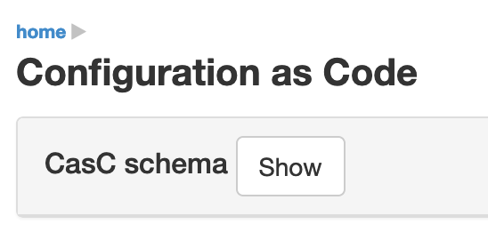
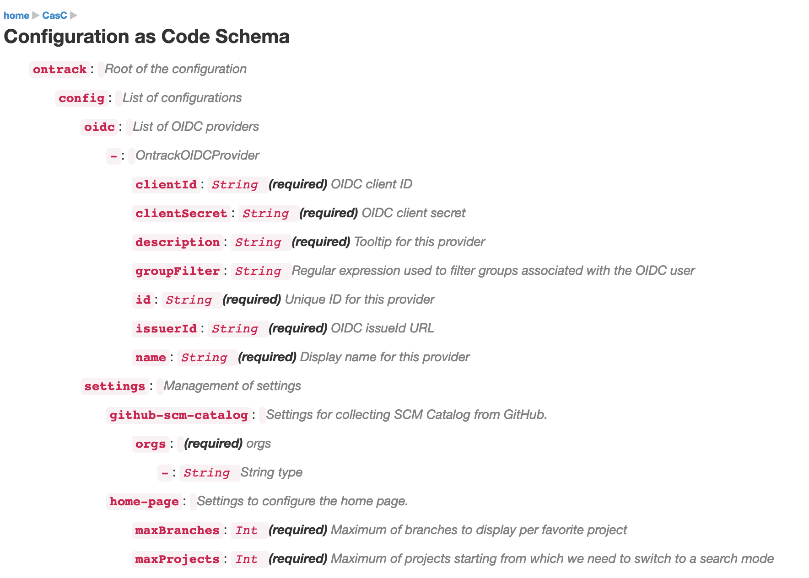

[[setup]]
== Setup

While Ontrack can be configured using the UI, it's recommended to use the <<casc,Configuration as Code (CasC)>> feature.

[[casc]]
=== Configuration as Code

Ontrack supports to be configured as code by default. It uses a set of YAML resources defined as comma-separated list of locations by the `ontrack.config.casc.locations` configuration property. For example, when using the environment variables:

[source]
----
ONTRACK_CONFIG_CASC_LOCATIONS=file:/path/to/file.yaml,https://path.com/file
----

All YAML resources defined by those locations are merged together according to the following rules:

* right-most files take precedence for single values
* arrays are always concatenated to each other

The list of locations can contain path to folders on a file system. In this case, Ontrack will use all the files in this folder.

[[casc-schema]]
==== Casc schema

All those files must comply with the Ontrack CasC format. This schema is available in the UI in the user menu at _Configuration as code_, and by clicking on the _Show_ button right of the _CasC schema_ section:

This goes to the page at http://localhost:8080/#/extension/casc/casc-schema :

[[casc-example]]
==== Examples

To configure the security settings so that all authenticated users have access to all the projects and can participate in all of them:

[source,yaml]
----
ontrack:
  config:
    settings:
      security:
        grantProjectViewToAll: true
        grantProjectParticipationToAll: true
----

To add an OIDC provider (<<authentication-okta,Okta>> for example):

[source,yaml]
----
ontrack:
  config:
    oidc:
      - id: okta
        name: My Okta
        description: The Okta account used by my company
        issueId: https://<okta domain>.okta.com/oauth2/default
        clientId: <Client ID of the application in Okta>
        clientSecret: <Client secret of the application in Okta>
        groupFilter: ontrack-.*
----

[[casc-control]]
==== Controls

The _Configuration as code_ configuration page is available at:

* _user menu_ > _Configuration as code_
* directly at http://localhost:8080/#/extension/casc/casc-schema

On this page, you can:

* display the schema
* see the list of locations where Ontrack fetches its CasC YAML resources
* reload the configuration as code
* display the current configuration as YAML (handy when migrating an existing installation to CasC)

Reloading the configuration as code can be done from the UI as mentioned above but also:

* through a `PUT` REST call at `/extension/casc/reload`:

[source,bash]
----
curl -X PUT --user admin <ontrack>/extension/casc/reload
----

* through the following GraphQL mutation:

[source,graphql]
----
mutation {
    reloadCasc {
        errors {
            message
        }
    }
}
----
