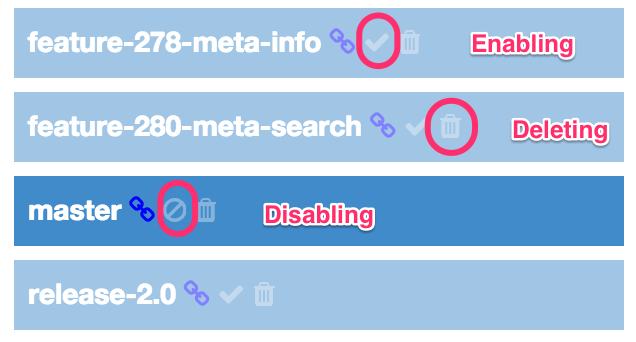
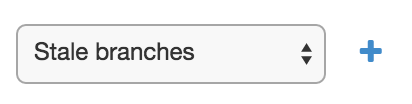
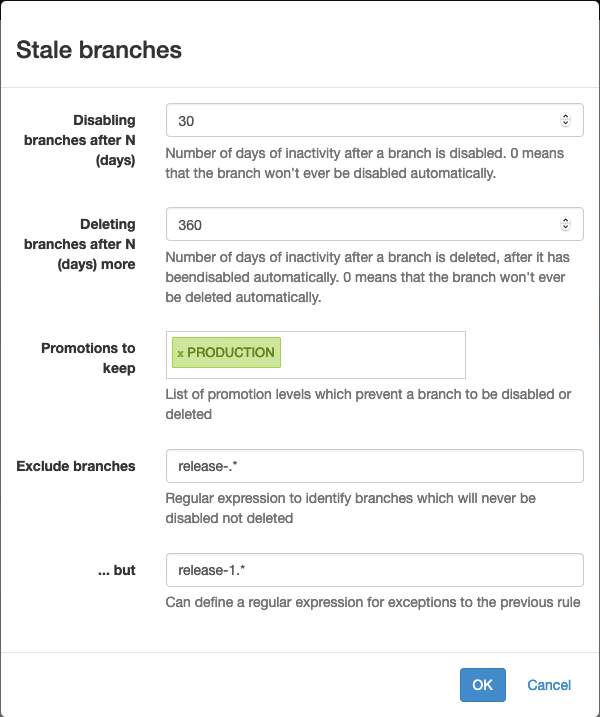

[[branches]]
=== Managing branches

Several <<model,branches>> can be defined per <<projects,project>>.

==== Managing the branches in the project page

If you click on the _Show all branches_ button in the project page, you can
display all the branches, including the ones being disabled and the
<<templates,templates>>.

According to your authorizations, the following commands will be displayed as
icons just on the right of the branch name, following any other decoration:

* disabling the branch
* enabling the branch
* deleting the branch

This allows you to have a quick access to the management of the branches in a
project. Only the deletion of a branch will prompt you about your decision.

==== Branch templating

In a context where branches are numerous, because the workflow you're working
with implies the creation of many branches (feature branches, release branches,
...), each
of them associated with its own pipeline, creating the branches by hand, even
by cloning or copying them would be too much an effort.

Ontrack gives the possibility to create _branch templates_ and to
automatically create branches using this template according to a list of
branches. This list of branches
can either be static or provided by the SCM.

See <<templates>> for details about using this feature.

[[branches-stale]]
==== Managing stale branches

By default, Ontrack will keep all the branches of a project forever. This can
lead to a big number of branches to be displayed.

You can configure a project to _disable_ branches after a given number of
days has elapsed since the last build, and then to _delete_ them after an
additional number of days has elapsed again.

To configure this:

* go to the project page
* select the _Stale branches_ property and add it:

* set the number of days before disabling and the number of days before deleting

If the _disabling_ days are set to 0, no branch will be ever disabled or
deleted.

If the _deleting_ days are set to 0, no branch will ever be deleted.

You can also set a list of <<model,promotion levels>> - a branch which is or has been promoted to such
a promotion level will not be eligible for being disabled or deleted.

In the sample above, the stale branches will be disabled after 60 days (not
shown any longer by default), and after again 300 days, they will be deleted
(so after 360 days in total). Branches which have at least one build being promoted to `PRODUCTION` will not
be deleted or disabled.s

Note that the _Stale branches_ property can also be set programmatically using
the <<dsl-projectproperties-stale,DSL>>.

include::usage-validation-stamp-filters.adoc[]
