[[builds-links]]
=== Build links

A <<model,build>> can be linked to other builds. This is particularly useful
to represent dependencies between builds and projects.

[[builds-links-definition]]
==== Definition of links

If authorized, you'll see a _Build links_ command at the top of the build page:

Clicking on this link will open a dialog which allows you to define the list
of links:

image::images/property-build-links-dialog.png[Build links input,400]

Note that:

* usually, you'll probably edit those links in an automated process using the
<<dsl,DSL>>
* you cannot define or see links to builds for which the project is not
accessible to you

[[builds-links-graph]]
==== Visualising the build graph

From a build page, you can access to the _Build links_ in the top commands:

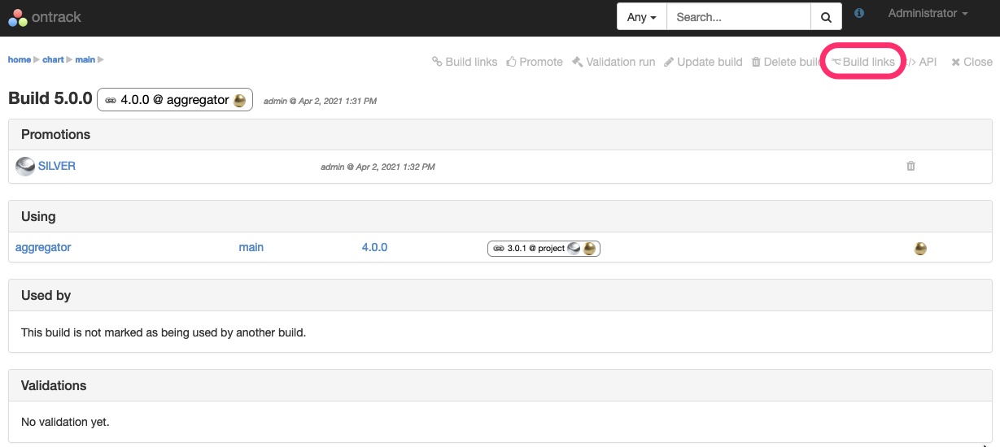

This redirects you to a page showing a graph of all the builds this build _depends on_, together with their highest promotion:

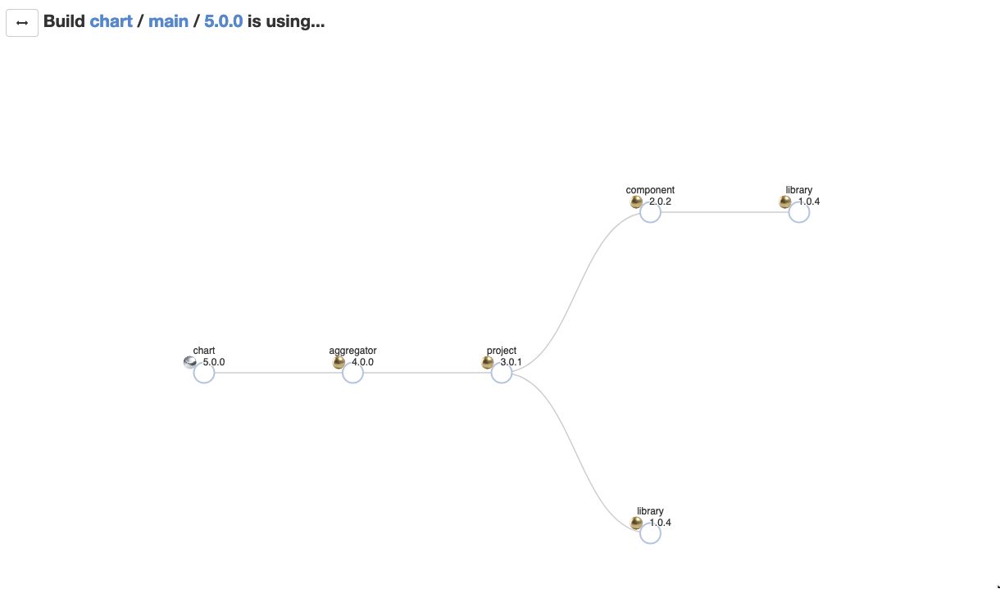

You can double-click on a node to open the corresponding page in the new tab:

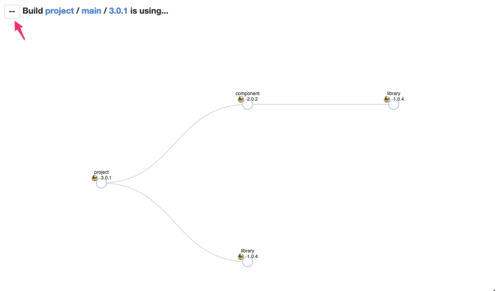

The button left on the title allows to switch between:

* the builds which are _using_ the current build
* the builds which are _being used_ by the current build

In this mode - "used by" - only the first links are shown, and only the last known usages are shown. You can expand in deeper dependencies by clicking on the node:

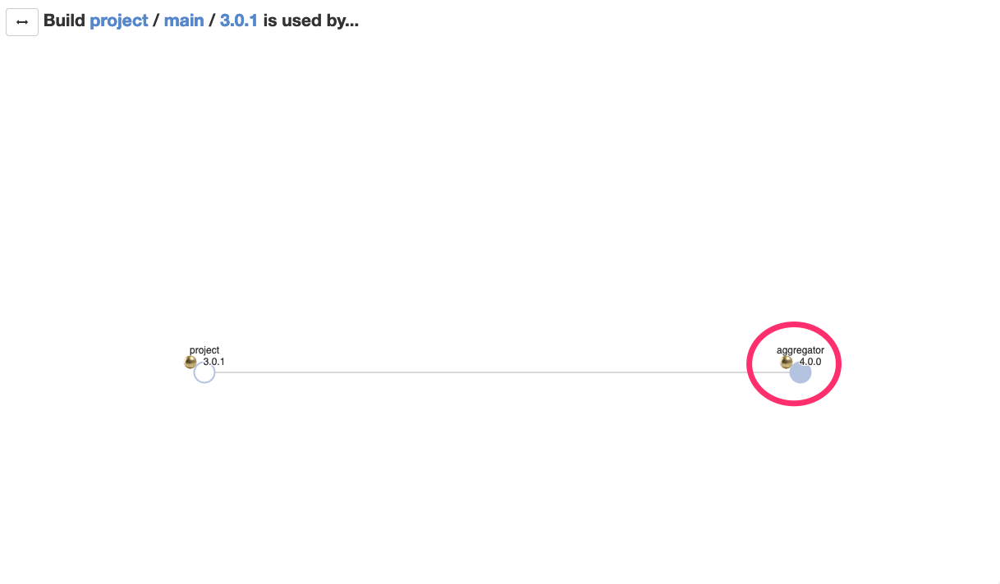

After expansion:

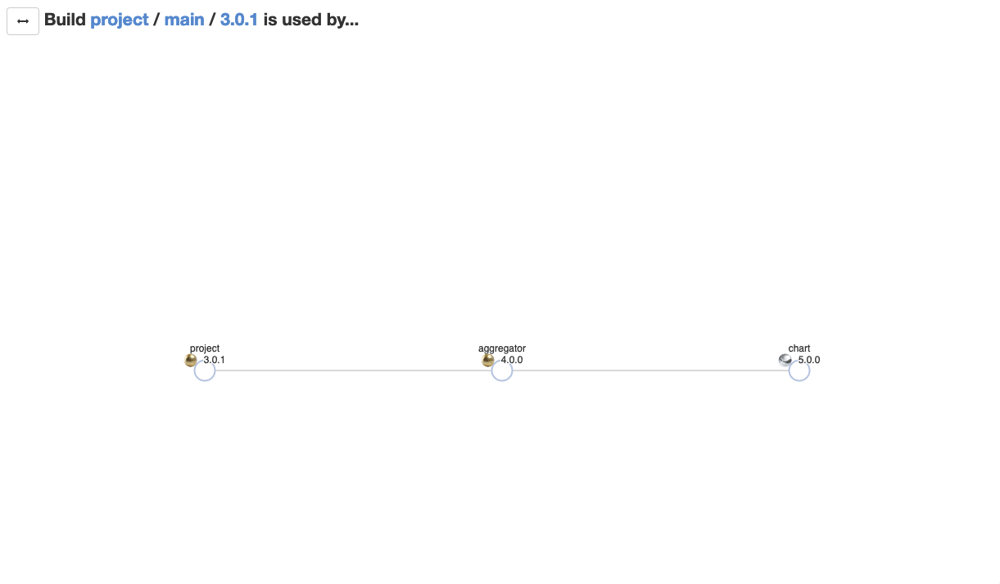

[[builds-links-decorations]]
==== Decorations

The build links are displayed as decorations in the build page header:

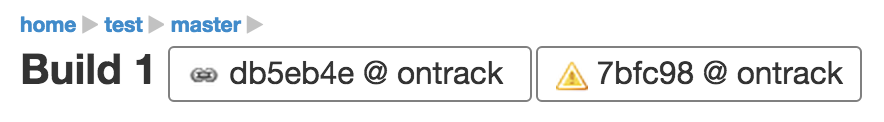

or in the list of builds:

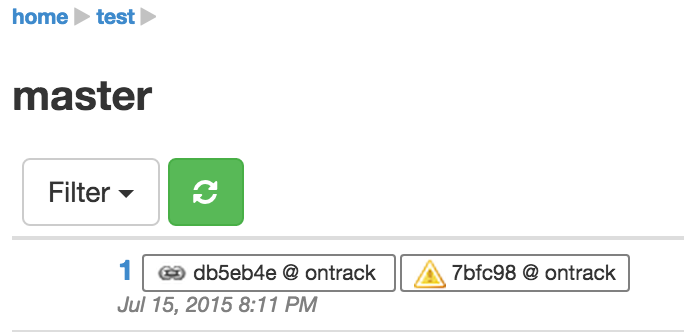

In both cases, the decoration is clickable. If the target build has been
promoted, the associated promotions will also be displayed.

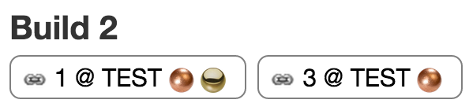

[NOTE]
====
If the target project (the project containing the build targeted by
the link) has been <<property-build-link-display-options,configured accordingly>>,
the _label_ associated to the build will be displayed instead of its
name.
====

[TIP]
====
When the list of dependencies becomes too big, the decoration can
be more cumbersome than useful. See the <<builds-links-filtering>> section
below on tips for customizing the display of the decoration.
====

[[builds-links-information]]
==== Information

The builds which are linked to a given build or which are used
by this build are displayed on the
build page:

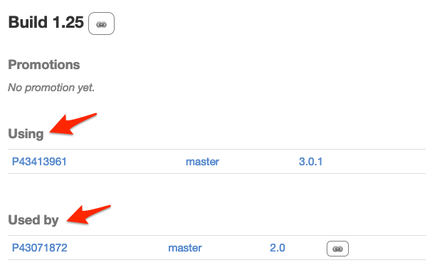

[[builds-links-querying]]
==== Querying

The build links properties can be used for queries:

* in <<builds-filtering,build filters>>
* in build searches
* in global searches

In all those cases, the syntax to find a match is:

* `project`, `project:` or `project:*` - all builds which contain a build link
to the `project` <<projects,project>>
* `project:build` - all builds which contain a link to the build `build` in
the `project` project
* `project:build*` - all builds which contain a link to a build starting with
`build` in the `project` project. The `*` wildcard can be used in any place.

[[builds-links-filtering]]
==== Filtering the build links

Once a build has too many dependencies, the <<builds-links-decorations,decoration>>
is too cluttered and cannot be used correctly:

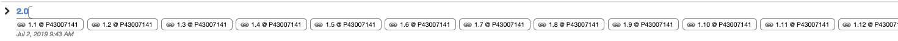

In order to reduce this clutter, you can act at several levels:

* setting some global property to so that only "main" build links are displayed

====
Only the <<security,administrators>> can set those global settings. Navigate to the _Settings_
in the user menu, navigate to _Main build links_ and edit the _Project labels_.

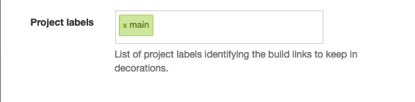

Enter a list of <<projects-labels,project labels>> which will be considered as "main links"
and must _always_ be displayed in the build decoration.
====

* setting the project so that only "main" build links are displayed. Optionally, the global
settings can be overridden.

====
In the source project (the one having the builds with many links to other projects),
add the "Main build links" property and edit the list of the <<projects-labels,labels>> designated the projects
to be always displayed.

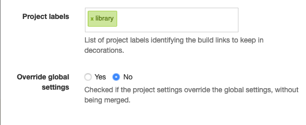

By default, the global settings and the project settings are merged together. You can override this
behaviour and take into account only the project settings by checking the "Override global settings"
checkbox.
====

Given a project `source` whose one build depends on `product`(labeled with `main`),
`library` (labeled `module`) and many other projects, if one sets the following settings:

* global settings: `main`
* project `source` settings: `module` and no override

Then, only the `product` dependency is displayed in the decoration:

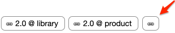

TIP: The last link icon is a link allowing to navigate to the source build and list
all dependencies. If the source build would have dependencies which are not flagged
as "main builds", only this icon would appear.