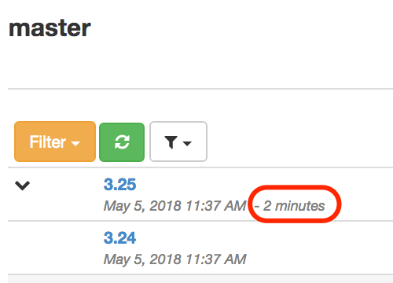
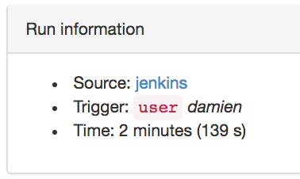

[[builds]]
=== Managing the builds

The builds are displayed for a <<model,branch>>.

[[builds-filtering]]
==== Filtering the builds

By default, only the 10 last builds of a branch are shown but you have the
possibility to create _build filters_ in order to change the list of displayed
builds for a branch.

The management of filters is done using the _Filter_ buttons at the top-left
and bottom-left corners of the build list. Those buttons behave exactly the
same way. They are not displayed if no build has ever been created for the
branch.

Some filters, like _Last build per promotion_, are predefined, and you just
have to select them to apply them.

You can create custom filters using the _build filter types_ which are in the
_New filter_ section at the end of the _Filter_ menu. You fill in the filter
parameters and
apply the filter by clicking on _OK_.

If you give your filter a name, this filter will be saved locally for the
current branch and can be reused later on when using the same browser on the
same machine account. If you are logged, you can save this filter for your
account at _ontrack_ level so you can reuse it from any workstation.

If the filter is not named, it will be applied all the same but won't be
editable nor being able to be saved.

You can delete and edit any of your own filters.

You can disable any filtering by selection _Erase filter_. You would then
return to the default: last 10 builds. Note that the saved filters are not
impacted by this operation.

[[builds-filtering-sharing]]
===== Sharing filters

By selecting the _Permalink_ option in the _Filter_ menu, you update your
browser's URL to include information about the current selected filter. By
copying this URL and send to another user, this other user will be able to
apply the same filter than you, even if he did not create it in the first place.

Even anonymous (unnamed) filters can be shared this way.

[[builds-links]]
==== Build links

A <<model,build>> can be linked to other builds. This is particularly useful
to represent dependencies between builds and projects.

[[builds-links-definition]]
===== Definition of links

If authorized, you'll see a _Build links_ command at the top of the build page:

image::images/property-build-links-command.png[Build links command,400]

Clicking on this link will open a dialog which allows you to define the list
of links:

image::images/property-build-links-dialog.png[Build links input,400]

Note that:

* usually, you'll probably edit those links in an automated process using the
  <<dsl,DSL>>
* you cannot define or see links to builds for which the project is not
  accessible to you

[[builds-links-decorations]]
===== Decorations

The build links are displayed as decorations in the build page header:

image::images/property-build-links-decoration-header.png[Build links decorations in header,400]

or in the list of builds:

image::images/property-build-links-decoration-list.png[Build links decorations in list,400]

In both cases, the decoration is clickable. If the target build has been
promoted, the associated promotions will also be displayed.

image::images/property-build-links-decoration-promotions.png[Build links promotions,400]

[[builds-links-information]]
===== Information

The builds which are linked to a given build are displayed on the
build page, in the information section:

image::images/builds-links-information.png[Build links information,400]

[[builds-links-querying]]
===== Querying

The build links properties can be used for queries:

* in <<builds-filtering,build filters>>
* in build searches
* in global searches

In all those cases, the syntax to find a match is:

* `project`, `project:` or `project:*` - all builds which contain a build link
  to the `project` <<projects,project>>
* `project:build` - all builds which contain a link to the build `build` in
  the `project` project
* `project:build*` - all builds which contain a link to a build starting with
  `build` in the `project` project. The `*` wildcard can be used in any place.

[[builds-run-info]]
==== Run info

Builds can be associated with some <<model,run info>> which contains
details about the source, the trigger and the duration of this build.

Information about the duration of the builds is shown just right
of the build name in the branch page:

or in the list of extensions in the build page:

