[[projects-labels]]
==== Project labels

Projects can be associated with labels. This allows to classify them.

Labels are defined by:

* an optional category
* a name (unique within the category)
* an optional description
* a color (always given using the form `#RRGGBB`, for example black
  is `#000000`)

[[projects-labels-usage]]
===== Using the labels

Project labels are displayed in the home page, in the list of projects:

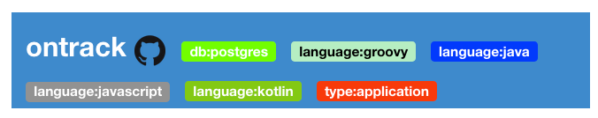

They also appear in the project page, under the project's name:

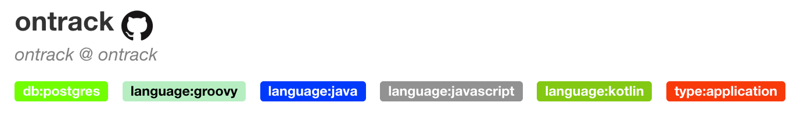

In the home page, projects can be filtered using labels. Several options
are available.

You can type parts of the label in the _Label_ filter box
at the top of the project list. This displays a list
of matching labels from which you can select an actual label:

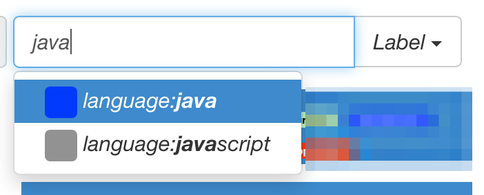

Once the item is selected, the list of projects is filtered
accordingly:

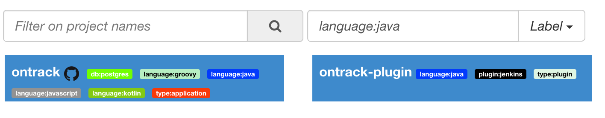

You can also select the label directly from the _Label_ dropdown:

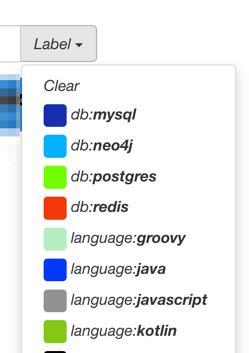

Finally, from the home page or from the project page, clicking on a label
will select this label as a filter.

[NOTE]
====
The selected filter is stored at browser level and is therefore
preselected the next time you go to the home page.

You can clear the selected label by either:

* emptying the _Label_ text box
* select _Clear_ in the _Label_ dropdown

Note that upon a label selection, this selection appears
also in the URL of your browser and can be used as a permalink
to this filter.
====

[[projects-labels-assignment]]
===== Assigning labels to a project

Only some users are allowed to assign labels to projects.

NOTE: See <<security>> for list of available roles.

If the user is authorized to assign labels to a project, a pencil icon
appears close to the list of labels and the _Labels_ command is available
in the page menu. Both commands perform the same operation.

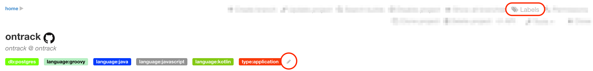

Those commands display a dialog which allows the selection (and unselection)
of labels among a list. When exiting the dialog through the _OK_ button,
the selection of labels is applied to the project and the project page
is reloaded.

The list of available labels can be filtered using the text box at the top
of the list.

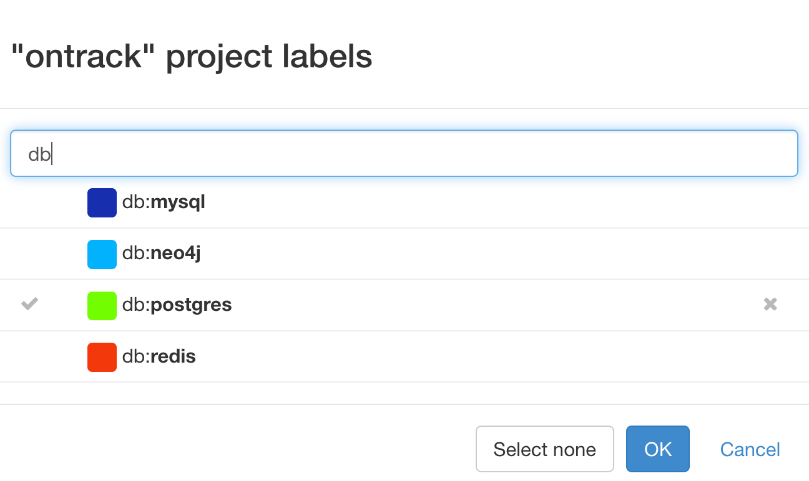

[[projects-labels-management]]
===== Management of labels

Authorized users can manage the list of labels from
their user menu.

The label management page allows the user to

* create
* update
* delete

labels. In the _Projects_ column, the number of projects
associated with the label on the line. If greater than zero,
it is a link to the home page, with the corresponding label
being selected.

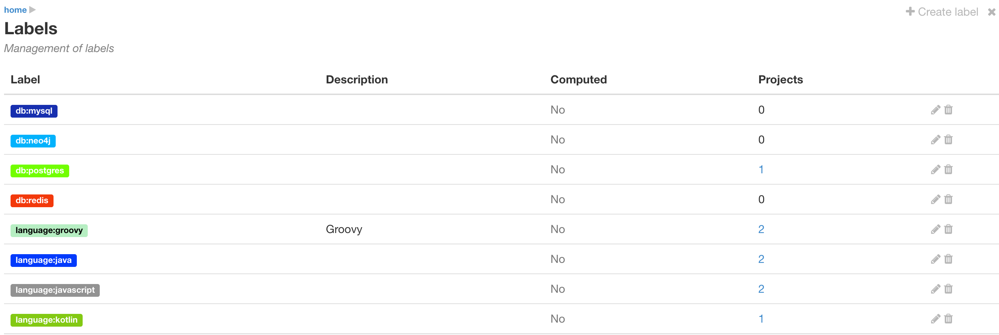

The edition dialog for a label looks like:

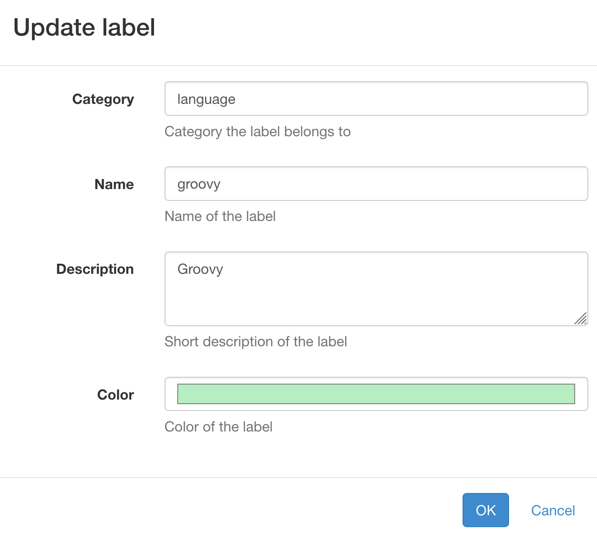

[NOTE]
====
The color editor, as of now, relies on the browser default color editor,
so the rendering might be different from browser to browser.
====

If authorised, the creation of a label is also available from the project
label assignment dialog. If the filter being typed does not match any label,
a button appears which allows the creation of the new label:

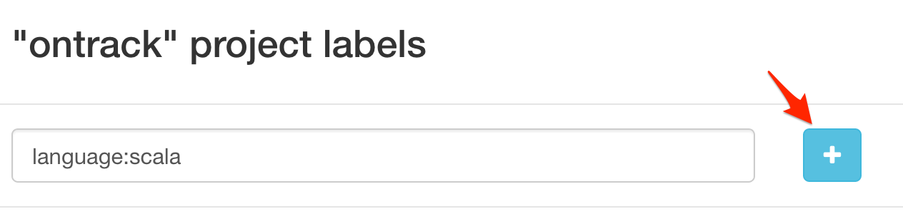

Once the label is created, it's selected and filtered by default:

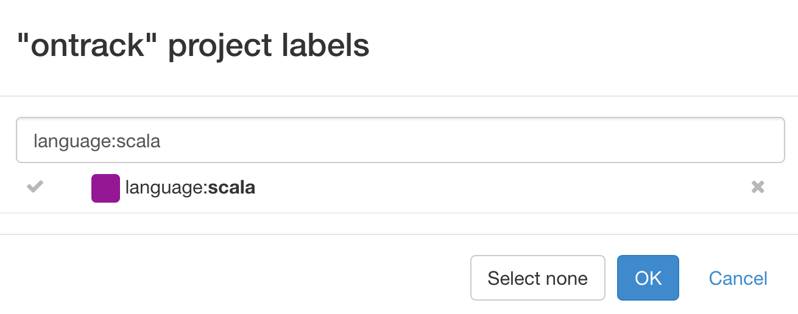
