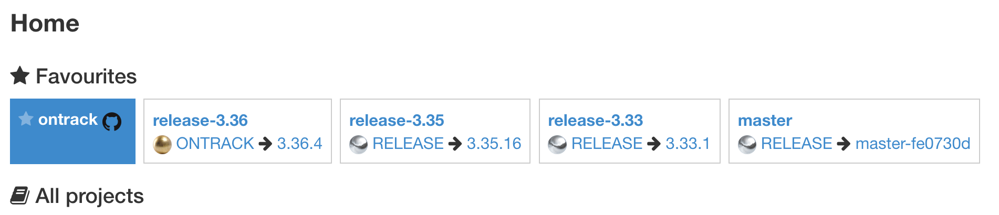
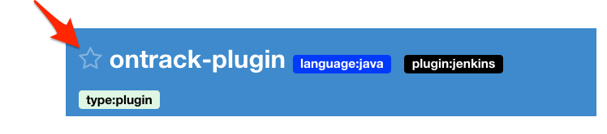
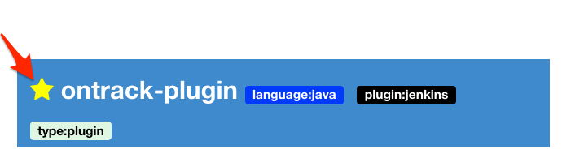
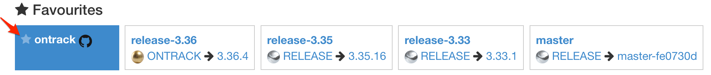

[[projects-favorites]]
==== Project favorites

When the list of projects becomes too important to
be manageable, the user can select some of them
as favorite projects.

NOTE: The user must be logged in to select and see
      his favorite projects.

The list of favorite projects appears at the top of
the home page and each of them displays the status
of its branches:

* name of the branch
* highest promotion for the branch with its associated build

[NOTE]
====
The list of branches, for a <<usage-git,Git-based project>> is restricted
by its associated branching model (only "main" branches are displayed).

For non-Git-based projects, as-of now, no restriction on the branches is
done.
====

In order to make a project a favorite, you have to click on the little
star icon which is on the left of the project name in the list
of all projects:

To unselect a project as favorite, you do the same (this time, the star
   is marked as yellow):

Note that you also unselect a project as favorite from the list of
favorite projects:

[NOTE]
====
Branches of a project can also be selected as favorite - see
<<branches-favorites>>.
====
