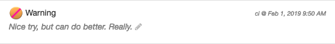
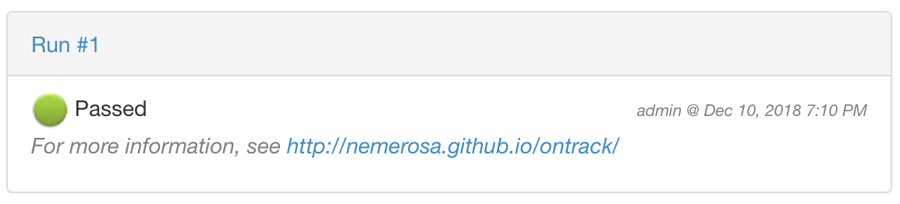
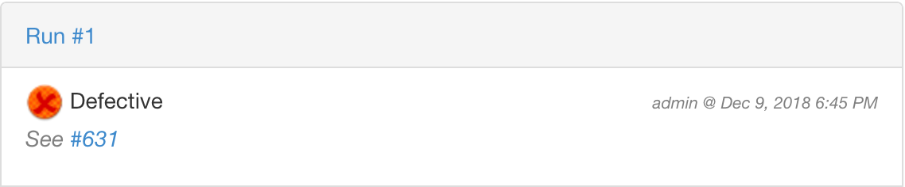

[[validation-runs]]
=== Managing validation runs

<<model,Validation runs>> associate a validation stamp
to a build, and a status describing the validation: passed,
failed, etc.

Additionally, a <<model,run info>> can be associated with
the validation run to show information like a duration,
a source or a trigger.

Validation runs can be created manually, but more often,
they will be created automatically by a CI engine like
<<integration-jenkins,Jenkins>>.

Validation runs can be seen:

* in the branch overview - only their latest status is
  then visible

* in the branch overview, by clicking on a validation run
  (at the intersection of a validation stamp and a build),
  you can either create a new validation run (when there is
  none) or see the list of them and their statuses.

* in the build page

* in the validation stamp page

For one validation run, one can add comments and update
the status to reflect (for example, to mention that
a failure in under investigation).

[[validation-run-status]]
==== Validation run status

[[validation-run-status-comment]]
==== Validation run status comment edition

Authorized users can edit the description entered for a validation run status:



Administrators, project owners & managers, global & project validation managers can edit
any comment. The author of a validation run status change can edit her own comment.

[[validation-run-status-hyperlink]]
==== Hyperlinks in descriptions

The free text which is entered as description for
the validation run statuses can be automatically extended
with hyperlinks.

Such link expansions are done for:

* raw hyperlinks in the text
* issue references, depending on the project configuration

For example, if one enters the following text as
a validation run status:

```
For more information, see http://nemerosa.github.io/ontrack/
```

the link will be rendered as such:



If the project is configured with JIRA, any reference
will be converted to a link to the issue. So a text like

```
See CLOUD-6800
```

would be rendered as:

image::images/extension-free-text-annotations-jira.png[JIRA,400]

Same thing for GitHub or GitLab, a text like:

```
See #631
```

will be rendered as:



See <<extension-free-text-annotations>> for a way to extend
this hyperlinking feature.

[[validation-runs-data]]
==== Validation run data

Some additional data can be associated with a validation run, according
to a format defined by their <<validation-stamps-data,validation stamp>>.
For example, passed and total tests, or a coverage percentage.

When creating a validation run, either though the GUI or through any
of the API, the data will be validated according to the rules defined
by the validation stamp.

In particular, the validation run status (passed, warning, failed, etc.)
will be computed in some cases, when a threshold of quality is associated
with the validation stamp (like a % of passed tests).

In order to use create a validation run with some validation data,
you can also use the <<dsl,DSL>>:

[source,groovy]
----
def build = ...
build.validationWithText("Text data", "PASSED", "Some text")
build.validateWithCHML("CHML data", 1, 10, 100, 1000)
build.validateWithNumber("Number data", 80)
build.validateWithPercentage("Percentage data", 57)
build.validateWithFraction("Fraction data", 99, 100)
build.validateWithMetrics("Metrics data", [
    "js.bundle" to 1500.56,
    "js.error" to 111
])
----

For a custom validation data type, you can use:

[source,groovy]
----
build.validateWithData(
    "Validation stamp name",
    [:] // Validation data
)
----

NOTE: The actual validation data type is taken from the validation stamp.

[[validation-runs-data-metrics]]
===== Run data metrics

While the validation run data is available from Ontrack, it can also be exported to
other databases.

As of today, only InfluxDB is supported.

[NOTE]
====
InfluxDB connector must be enabled - see <<monitoring-metrics-influxdb>>.
====

In order to export Ontrack validation as points into an InfluxDB database,
following elements must be configured:

|===
| Property | Environment variable | Default | Description

| `ontrack.influxdb.validation-data`
| `ONTRACK_INFLUXDB_VALIDATION_DATA`
| `true`
| If `true`, the validation run data is exported to InfluxDB (`true` by default)

|===

Each point contains the following information:

* name: `ontrack_value_validation_data`
* tag `project` - name of the project
* tag `branch` - name of the branch
* tag `build` - name of the build
* tag `validation` - name of the validation
* tag `status` - status of the validation
* tag `type` - FQCN of the <<extending-validation-data,validation data type>>
* field values depend on the type of data
