[[branches-validation-stamp-filters]]
==== Validation stamp filters

When a branch defines many validation stamps, the view can become cluttered
and not really useful any longer, because displaying too much information.

_Validation stamp filters_ can be defined to restrict the view to a set
of known validation stamps.

[[branches-validation-stamp-filters-usage]]
===== Using filters

Validation stamp filters can be selected in the branch view, just on the left
of the list of validation stamp headers:

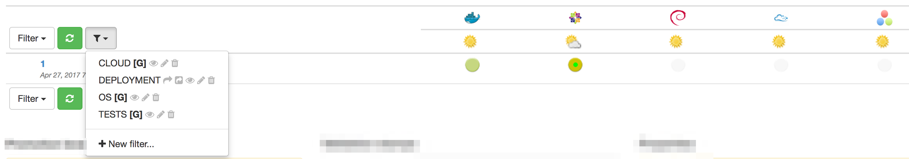

When a filter is selected, it is marked as such and only associated
validation stamp columns are shown in the view:

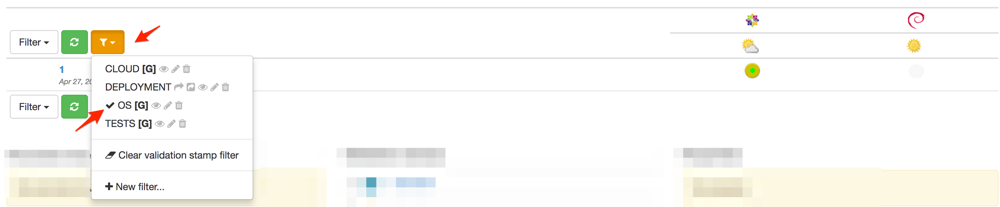

The validation stamp filter menu is also marked in orange to indicate that
a filter has been applied.

When the filter is applied, its name appears also in the URL. This can be used
as a permalink:

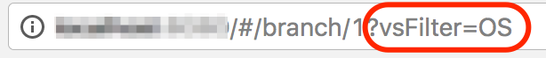

You can remove the filter by selecting _Clear validation stamp filter_ in the
filter menu:

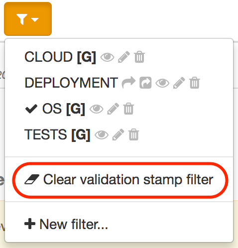

[[branches-validation-stamp-filters-editing]]
===== Editing filters

WARNING: Only authorized users are allowed to edit the validation stamp filters
for a branch.

A validation stamp filter is defined by:

* a name
* a list of validation stamp names to include

While it is possible to edit a filter using a dialog (see later), it is far
easier to use the in-place editor.

Start by creating a validation stamp filter by selecting the _New Filter..._
entry in the filter menu:

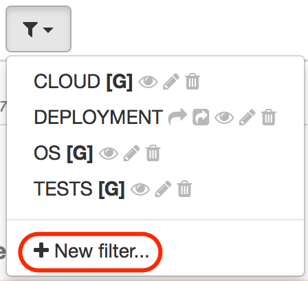

This displays a dialog to create the new filter:

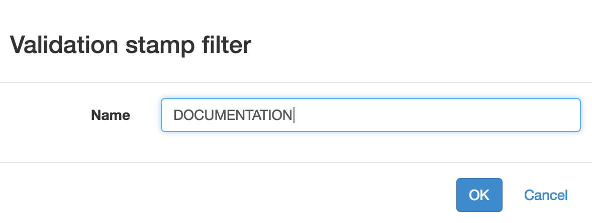

TIP: Only the name is required and all current validation stamps filters are
included by default.

When created, the filter can be directly edited in-place:

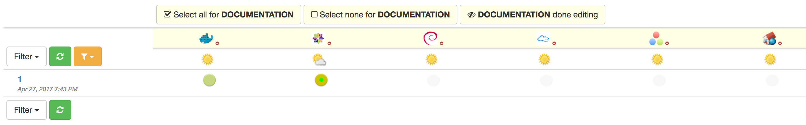

The following actions are possible:

* by clicking on the _Select none_ button, no validation stamps is associated
with the filter.
* by clicking on the _Select all_ button, all validation stamps are associated
with the filter.
* by clicking on the _Done with edition_ button, the in-place edition stops
and the normal display is resumed

You can also click on a validation stamp to remove it or to add it to the
filter.

In case the validation stamp is associated with the filter, a _minus_ icon
appears close to its name. It it is not associated, the icon is dimmed and
a plus icon appears:

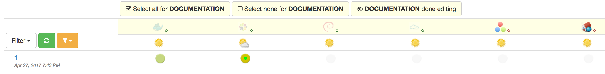

Note that you can also stop the edition by selecting the eye icon in the
menu:

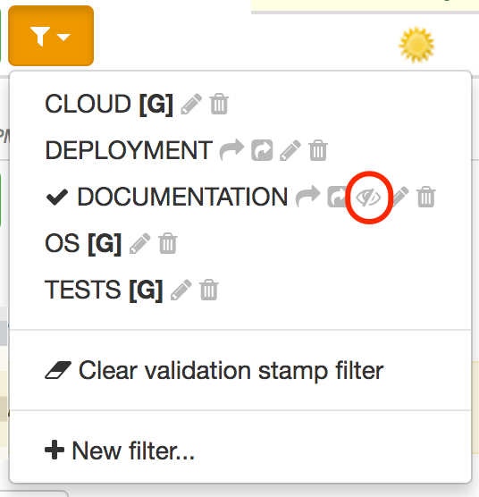

To start editing an existing filter, just click also on the eye icon close
to its name:

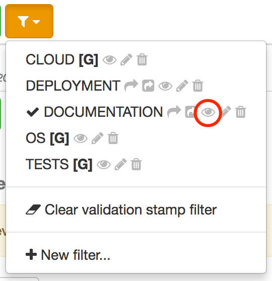

TIP: Select any other filter, or removing the filter, will also
stop the in-place edition.

To edit a filter directly, you can also select the pencil icon and edit the
filter using a dialog:

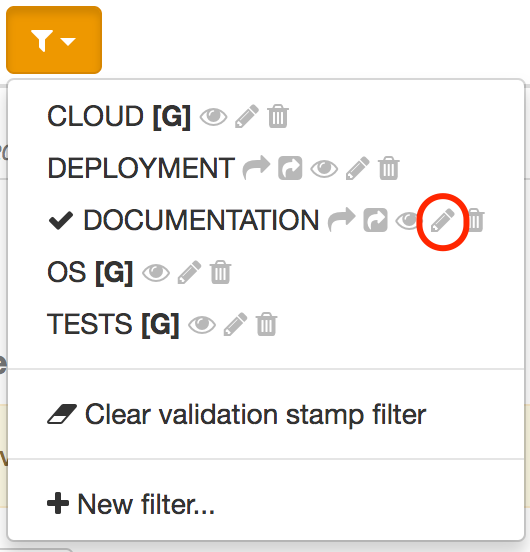

This displays an edition dialog allowing to change the name and the list
of validation stamps.

image::images/vsf-dialog-edit.png[Editing,350px]

[NOTE]
====
For a filter associated with a branch (see below,
   <<branches-validation-stamp-filters-sharing,sharing>>), names can be
   selected among the validation stamps of the branch.

For a filter associated with a project, the list of validation stamps for _all_
the branches is available.

For a _global_ filter, names are no longer selected but must be edited.
====

Finally, to delete a filter, click on the trash icon:

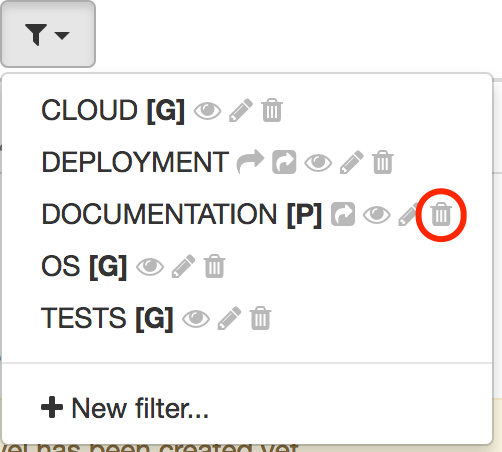

NOTE: A confirmation will be asked before the deletion actually occurs.

[[branches-validation-stamp-filters-sharing]]
===== Sharing

A filter is created by default at branch level and is only visible when the
associated branch is displayed.

An authorized user can:

* share the filter at project level - in this case, the filter is
available for all the branches of the project
* share the filter at global level - in this case, the filter is
available for all projects and all branches

A filter shared at project level is shown with a `[P]` close to its name
and a global filter with a `[G]`:

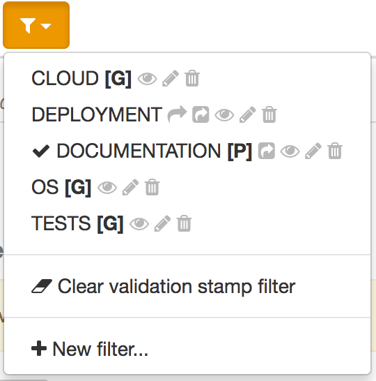

In the screenshot above:

* `DEPLOYMENT` is associated with the current branch
* `DOCUMENTATION` is associated with the project
* the other filters are global

To share a filter at project level, click on the share icon:

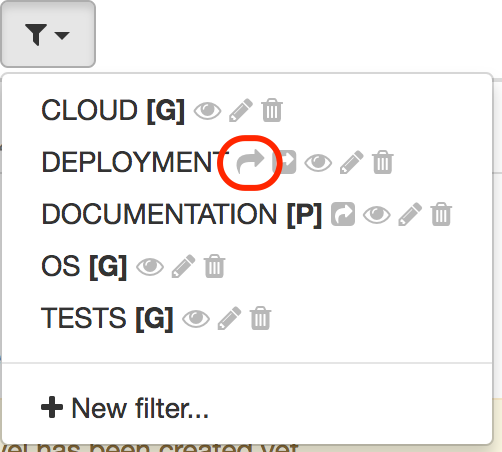

To share a filter at global level, click on the share icon:

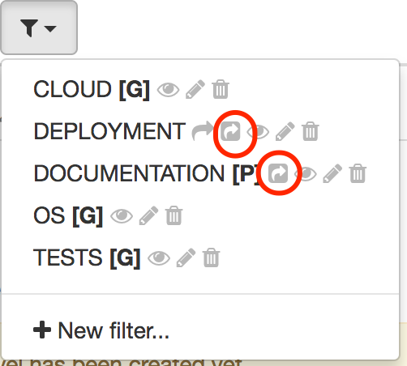
