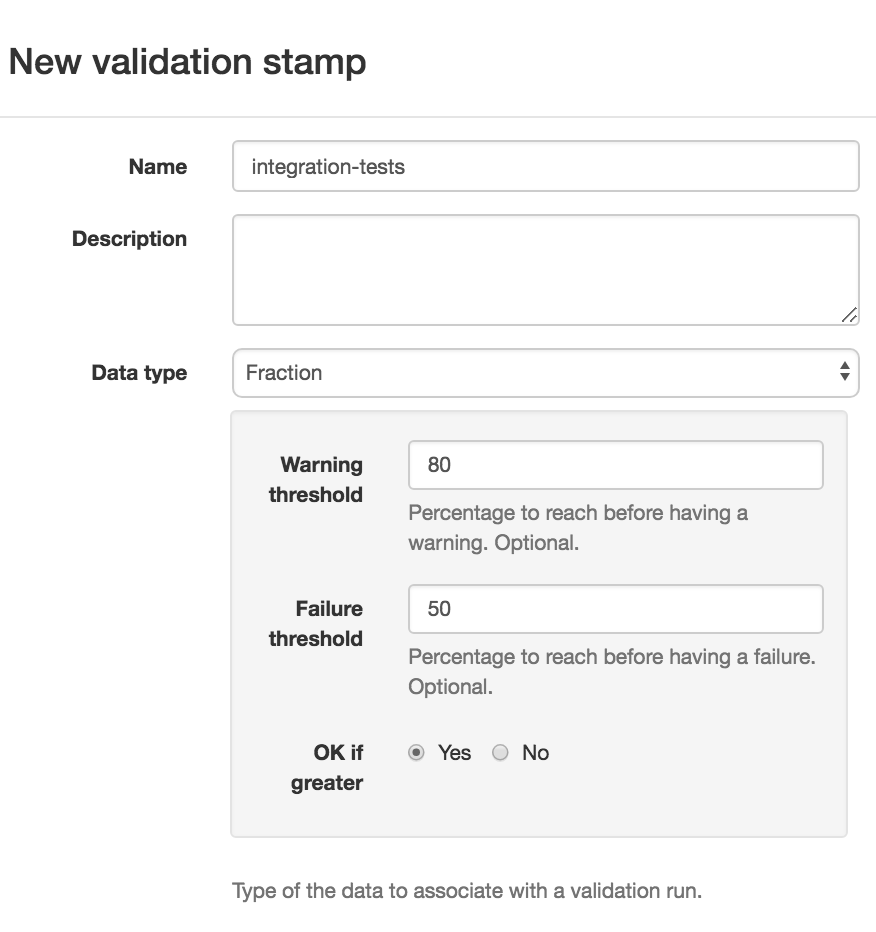

[[validation-stamps]]
=== Managing validation stamps

[[validation-stamps-data]]
==== Validation stamp data configuration

<<model,Validation stamps>> are often created by tests, or scans, or any other
kind of automated process. This is often associated with some metrics. For example:

* a security scan could bring a list of critical and high defects
* a test run has a list of passed and total tests
* a coverage test has a coverage %
* etc.

Ontrack is able to associate such data to a <<model,validation run>> for a given
build and validation stamp.

The only precondition is that the validation stamp must be configured for a given
type of data.

When creating or edition a validation stamp, you can select the type of data
you want to associate with any validation run for this validation stamp.

There is a list of predefined data types:

* plain text
* CHML (Critical / High / Medium / Low)
* Number (with or without threshold)
* Fraction (with or without threshold)
* Percentage (with or without threshold)

NOTE: You can create your own <<extending-validation-data,validation data types>>.

Every type is associated with a configuration. For some of them, nothing is needed.

For data types with threshold, you might want to select threshold for generating
warnings, failures, according to a given direction.

For example, a validation stamp could be associated with a number of passed tests
linked with a total number of tests. This is a "fraction" type, where the numerator
is the number of passed tests, and the denominator is the total number of tests.

The warning and failure thresholds are expressed as percentages, and we can choose a
direction (higher is better by default).

If the failure threshold is 50, and the total number of tests is 200, and the number
of passed tests is 99, then, we're below the threshold of 50 (%) and the validation
run is marked as a failure.

For the creation of data associated with validation runs, see
the <<validation-runs-data,associated documentation>>.

In order to use create a validation stamp with some validation data type,
you can also use the <<dsl,DSL>>:

[source,groovy]
----
def branch = ...
branch.validationStamp("Text data") {
    setTextDataType()
}
branch.validationStamp("CHML data") {
    setCHMLDataType("HIGH", 1, "CRITICAL", 1)
}
branch.validationStamp("Number data") {
    setNumberDataType(10, 100, true)
}
branch.validationStamp("Percentage data") {
    setPercentageDataType(0, 50, false)
}
branch.validationStamp("Fraction data") {
    setFractionDataType(100, 90, true)
}
----

[[validation-stamps-auto]]
==== Auto creation of validation stamps

Creating the validation stamps for each branch, or making sure they are
always up to date, can be a non trivial task. Having mechanisms like cloning
or <<templates,templates>> can help, but then one must still make sure
the list of validation stamps in the template is up to date and than the
template is regularly synchronized.

Another approach is to allow projects to create automatically the validation
stamps on demand, whenever a build is validated. This must of course be
authorised at project level and a list of predefined validation stamps must be
maintained globally.

[[validation-stamps-auto-predefined]]
===== Predefined validation stamps

The management of predefined validation stamps is accessible to any
_Administrator_, in his user menu.

He can create, edit and delete predefined validation stamps, and associate
images with them.

NOTE: Deleting a predefined validation stamp has no impact on the ones which
were created from it in the branches. No link is kept between the validation
stamps in the branches and the predefined ones.

[[validation-stamps-auto-projects]]
===== Configuring projects

By default, a project does not authorise the automatic creation of a validation
stamp. In case one attempts to validate a build using a non existing validation
stamp, an error would be thrown.

In order to enable this feature on a project, add the _Auto validation stamps_
property to the project and set _Auto creation_ to _Yes_.

Disabling the auto creation can be done either by setting _Auto creation_ to
_No_ or by removing the property altogether.

[[validation-stamps-auto-creation]]
===== Auto creation of validation stamps

When the auto creation is enabled, build validations using a validation stamp
name will follow this procedure:

* if the validation stamp is already defined in the branch, it is of
  course used
* if the validation stamp is predefined, it is used to create a new one on
  the branch and is then used
* in any other case, an error is displayed

IMPORTANT: The auto creation of validation stamps is available only through the
<<dsl,DSL>> or through the API. It is not accessible through the GUI, where
only the validation stamps of the branch can be selected for a build validation.

[[validation-stamps-auto-creation-if-not-predefined]]
===== Auto creation of validation stamps when not predefined

You can also configure the project so that validation stamps are created on demand, _even when
no predefined validation stamp is created_.

In this case:

* if the validation stamp is already defined in the branch, it is of
  course used
* if the validation stamp is predefined, it is used to create a new one on
  the branch and is then used
* in any other case, a new validation stamp is created in the branch, with the requested name (and with
  an empty image and a default description)

[[validation-stamps-auto-data]]
===== Predefined validation stamps and validation data

As for validation stamps associated with branches, the predefined
validation stamps can be associated with some
<<validation-stamps-data,validation data>>.

[[validation-stamps-bulk-update]]
==== Bulk update of validation stamps

Validation stamps are attached to a <<model,branch>> but in reality, they are
often duplicated in a project branches and among all the projects. Updating
the description and the image of a validation stamp can fast become cumbersome.

The <<validation-stamps-auto-predefined,predefined validation stamp>> can
mitigate but this won't solve the issue when validation stamps are created
<<validation-stamps-auto-creation-if-not-predefined,automatically>> even when
not predefined.

In order to update all the validation stamps having the same name, across all
branches and all projects, you can use the _Buld update_ command in the
validation stamp page:

A confirmation will be asked and all the validation stamps having the same
name, across all branches and all projects, will be updated with the same
image and the same description.

A <<validation-stamps-auto-predefined,predefined validation stamp>> will
also be updated or created.

NOTE: In order to perform a bulk update, you must be an administrator or
      been granted the <<security-roles-global,global validation manager>> role.

NOTE: Any <<validation-stamps-data,validation data configuration>> is also
part of the bulk update.
